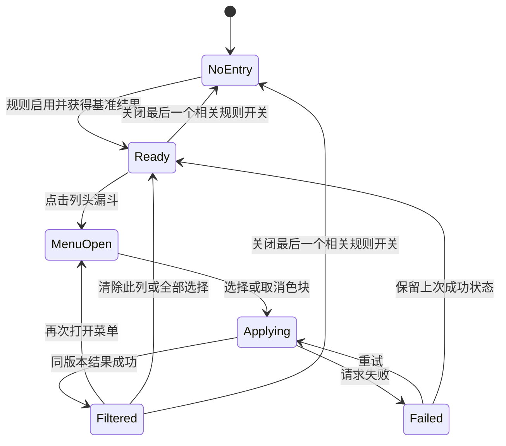
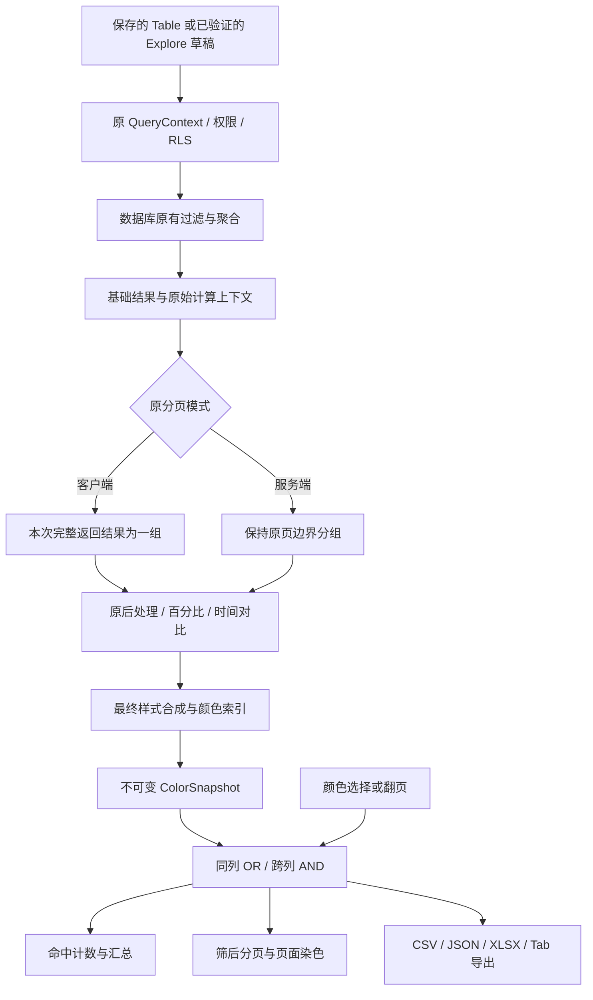
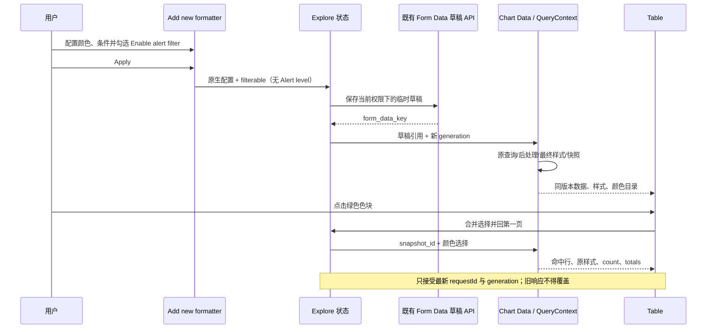
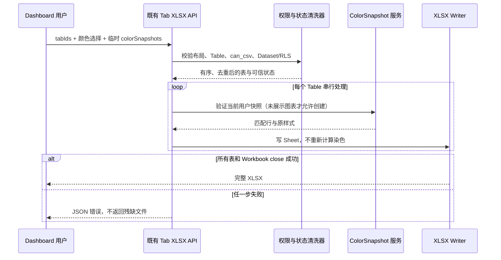

<!--
Licensed to the Apache Software Foundation (ASF) under one
or more contributor license agreements.  See the NOTICE file
distributed with this work for additional information
regarding copyright ownership.  The ASF licenses this file
to you under the Apache License, Version 2.0 (the
"License"); you may not use this file except in compliance
with the License.  You may obtain a copy of the License at

  http://www.apache.org/licenses/LICENSE-2.0

Unless required by applicable law or agreed to in writing,
software distributed under the License is distributed on an
"AS IS" BASIS, WITHOUT WARRANTIES OR CONDITIONS OF ANY
KIND, either express or implied.  See the License for the
specific language governing permissions and limitations
under the License.
-->

# FR-02：按最终染色筛选行——重设计与高保真交互方案

| 属性        | 内容                                                                                                        |
| ----------- | ----------------------------------------------------------------------------------------------------------- |
| 版本 / 日期 | V1.2 / 2026-08-28；默认快照上限 1,000 行，明确当前视图导出投影与降级边界                                    |
| 状态        | Proposed；本文件和交互原型不是已上线功能                                                                    |
| 实现起点    | `dev/6.1`，`9ff15ca9f85beaddfea15283c511022cfa5dd45d`                                                       |
| 用户确认    | 每条规则的 **Add new formatter** 内仅增加 `Enable alert filter`；用户按颜色选行，实现复用产生最终颜色的规则 |
| 界面交付    | [可交互高保真原型](./prototypes/fr02-color-filter.html)，无需后端、不读取真实业务数据                       |
| 本次范围    | 经典 Table 的 Explore / Dashboard、相关查询、分享和导出；保留其他 FR                                        |
| 提交约束    | 设计文档和原型一个独立文档提交；生产实现、测试另行提交                                                      |

## 1. 已确认的目标和边界

**选中绿色后，留下的应当恰好是原本在该筛选列被染为绿色的那些行。**

绿色是否代表成功、亏损、增长或者下降不影响筛选。`success / alert / error`
仍是现有 `Color scheme` 配色选项的名称，不能据此另定义业务条件。
例如 `gross_profit < 0` 被配置为绿色，点击绿色必须保留负数行。

1. 开关位于每条规则的 **Add new formatter / Edit formatter** 内，名称为
   `Enable alert filter`。不是图表级总开关，不新增另一个业务配置项。
2. 删除 `Alert level` 控件、配置类型、必填校验和保存路径。旧 JSON 中的
   `alertLevel` 在读取/保存规范化时丢弃，不能继续控制筛选。
3. 保留 Superset 原生条件、阈值、配色、渐变、格式对象和格式目标。
   不为支持筛选而改变原有染色规则。
4. 点击列头漏斗后显示该列包含的红、黄、绿色块；点击即应用，再次点击取消。
   色块不使用方向箭头或成功/错误图标，不出现任意 RGB 选择器或蓝色告警选项。
5. 客户端与服务端分页均支持；原始列、聚合、临时指标、百分比和时间对比结果
   不得仅因无法转成 SQL `WHERE/HAVING` 而失去筛选能力。
6. 先确定每个单元格**最终实际生效**的染色，再筛行。被覆盖的规则、不可见的
   Cell Bar、自动黑白可读文字都不能造成误选。

用户在本次方案编写中允许：渐变逻辑复杂时可以暂不实现颜色筛选，但必须给出
明确提示，不能让开关消失或 Apply 无法应用。V1 采用该例外：**保留渐变染色，
暂不支持对受渐变规则影响的目标列按颜色筛选**。这是明确的支持边界，不是静默失败。

### 1.1 开关控制入口，颜色决定结果

`Enable alert filter` 的职责是打开该规则**格式目标列**的筛选入口，不改变染色。
该列出现入口以后，按整套条件格式合成的最终颜色筛选，不再按“哪一条规则开启了
开关”额外排除同色行。

例如，同列两条规则 A、B 都染绿，只有 A 勾选开关：点绿色保留 A、B 产生的全部
最终绿色行。否则会违背“这列原本是绿色的行都应留下”的验收标准。
取消该列最后一个相关规则的开关后，移除其入口和该列颜色选择，染色保持原样。

筛选粒度为列：同列多色 OR，不同列 AND。不是“任意列出现绿色就保留整行”的
全表全局搜索。整行染色可以使多个可见目标列出现入口。

### 1.2 回退事实

本地已按用户指定回到 `9ff15ca9`；此前六个提交保存在
`codex/backup-fr02-before-redesign-20260828`，未提交试验实现已另行 stash。
不恢复其中的任意 RGB 原型。本基线**仍包含早期 FR-02**，所以后续要替换它的
旧规则等级/SQL 过滤链路，而不是声称基线已经完全没有 Alert filter。

不修改本地业务数据、`.codex/`、`.npm-cache/` 或 `superset_home/`。
不 reset 到 FR-02 之前的整仓版本，不删除其他 FR，不强推远端。

## 2. 原生 Custom conditional formatting 能力核查

本文不再使用缩写 CCF。以下是代码能力，不是对新实现已经通过的测试声明。

| 场景          | 原生行为与本方案要求                                                               | 主要依据                                                                                                                                                             |
| ------------- | ---------------------------------------------------------------------------------- | -------------------------------------------------------------------------------------------------------------------------------------------------------------------- |
| 数值条件      | None、`>`、`<`、`>=`、`<=`、`=`、`!=`、四种开闭区间均覆盖                          | [constants.ts](../../superset-frontend/src/explore/components/controls/ConditionalFormattingControl/constants.ts)                                                    |
| 字符串条件    | None、等于、前缀、后缀、包含、不包含；沿用原大小写语义                             | 同上及 [getColorFormatters.ts](../../superset-frontend/packages/superset-ui-chart-controls/src/utils/getColorFormatters.ts)                                          |
| 布尔/空值     | is true、is false、is null、is not null；复用原 JS 判断，不替换成 SQL 通用非空判断 | 同上                                                                                                                                                                 |
| 配色          | success、alert、error 三类原生配色；时间对比另有随涨跌变化的红绿配色               | [controlPanel.tsx](../../superset-frontend/plugins/plugin-chart-table/src/controlPanel.tsx)                                                                          |
| 纯色/渐变     | 原生支持数值背景渐变；V1 纯色可筛，渐变保留染色、明确提示筛选暂不支持              | [FormattingPopoverContent.tsx](../../superset-frontend/src/explore/components/controls/ConditionalFormattingControl/FormattingPopoverContent.tsx)                    |
| 格式对象      | 背景色、显式文字色、Cell Bar 均覆盖                                                | 同上                                                                                                                                                                 |
| 格式目标      | 条件列自身、另一列、整行；入口关联被染色的目标，不误挂到条件源                     | 同上及 [TableChart.tsx](../../superset-frontend/plugins/plugin-chart-table/src/TableChart.tsx)                                                                       |
| 原始/聚合字段 | 数据结果列、物理分组列、保存指标、临时指标；不以 `subjectRef` 限制准入             | `controlPanel.tsx`                                                                                                                                                   |
| 百分比字段    | 复用查询后生成的百分比值和实际注入的分母                                           | [buildQuery.ts](../../superset-frontend/plugins/plugin-chart-table/src/buildQuery.ts)、[contribution.py](../../superset/utils/pandas_postprocessing/contribution.py) |
| 时间对比      | Main、历史值、差额、变化率，正向/反向红绿方案；按最终颜色归类                      | [transformProps.ts](../../superset-frontend/plugins/plugin-chart-table/src/transformProps.ts)                                                                        |
| 日期字段      | 普通配置下不是新增日期条件运算符；日期可以作为另一条件染色的目标                   | `controlPanel.tsx` / `FormattingPopoverContent.tsx`                                                                                                                  |
| 重叠规则      | 本列/指定列规则、整行规则、列级时间对比有明确合成顺序                              | `TableChart.tsx`                                                                                                                                                     |
| HTML 单元格   | 尊重真实渲染分支；未渲染的 bar/箭头不算染色，HTML 自带 CSS 不成为新的规则来源      | `TableChart.tsx`                                                                                                                                                     |

需要保持的细节：字符串 `= / begins with / ends with` 大小写敏感，
`containing / not containing` 使用原生不区分大小写逻辑；布尔 `is not null`
的原实现只匹配非空布尔值，不能趁本次变更扩展其语义。

共享条件格式控件还用于 AG Grid Table、Pivot Table 和 BigNumberTotal。
本次通过调用方 `supportsAlertFilter` capability 只向经典 Table 开放入口，
不让其他图表出现无法工作的开关，也不改变它们的染色。

## 3. 高保真前端设计

### 3.1 原型使用方式

打开 [fr02-color-filter.html](./prototypes/fr02-color-filter.html)。原型使用确定性
示例数据，顶部标注“设计预览”，不调用 Superset API，不保存 Slice。
它展示最终交互，而不是用设计稿截图冒充实际服务测试。

原型应可验证以下流程：

1. 打开 `Add new formatter`，查看 Column、Color scheme、Formatting column、
   Formatting object、渐变、条件和唯一的 `Enable alert filter`。
2. Apply 后对应目标列有漏斗；关闭开关仍保留染色，入口按规则集合更新。
3. 打开漏斗，点击绿色，保留原本绿色行；再次点击恢复。
4. 连续选择第三个颜色、同列多色、跨列组合，行数与显示同步。
5. 查看渐变“不支持筛选”的提示和可正常 Apply 的染色，以及文字、Cell Bar、
   空结果、加载、失败和清除状态。

### 3.2 布局和视觉规格

| 区域                | 规格                                                                                       |
| ------------------- | ------------------------------------------------------------------------------------------ |
| 外观                | 沿用 Superset Explore 导航、Chart Source、Customize 配置区和 Table 预览区，不另造管理页面  |
| 字体/尺寸           | 沿用主题 Inter / Helvetica / Arial，正文 14px；不压缩成难读的小字                          |
| Formatter 弹层      | 沿用 450px 宽布局；窄视口内收缩；两列字段分组，底部 Apply 始终可达                         |
| Enable alert filter | 普通 Checkbox，独占一行；聚合、Cell Bar 等可正常开启；有效渐变时仍显示但禁用并紧邻说明     |
| 列头入口            | 标题旁的现有漏斗图标；24px 以上交互区域；不触发行排序/交叉过滤                             |
| 色块                | 使用现有主题/配色对应颜色，约 18–20px 可见块，至少 32px 点击目标；选中用边框与勾选表示     |
| 色块文案            | 默认只显示色块；Tooltip/辅助技术名称为绿色、黄色、红色，不要求理解 success/error           |
| 菜单                | 白色浮层，颜色按绿、黄、红稳定排序；只列基准结果包含的颜色，保留已选颜色；提供清除此列筛选 |
| 激活态              | 漏斗高亮与选择数量可感知；不把三个业务状态图标作为颜色替代                                 |
| 窄屏                | 控制区合理换行，表格容器横滚，菜单与 Apply 不被页面边界裁掉                                |

普通 UI 的主题主色不是告警色；不能因为按钮是蓝色就把蓝色加入筛选目录。
高保真原型中的数据和颜色只用于示范，生产实现必须读取真实规则与主题。

### 3.3 菜单与应用状态

| 状态               | 交互与结果                                                                                     |
| ------------------ | ---------------------------------------------------------------------------------------------- |
| 未勾选任意相关规则 | 不渲染该列漏斗；表格照常染色                                                                   |
| 有入口，未选择     | 显示完整基准结果；打开菜单不发起过滤、不重排                                                   |
| 选择某色           | 立即发起一次状态变化；请求中显示 pending，不虚报已应用                                         |
| 同列选择多色       | OR；第三色和后续重复开关不能丢失前两个选择                                                     |
| 不同列选择         | AND；不会覆盖其他列的选择                                                                      |
| 零匹配             | 表头、菜单、当前选择和清除操作仍存在，不能靠刷新才能退出                                       |
| 有效渐变           | 开关保留、禁用并说明；Apply 保存渐变染色；混合规则列保留可查看原因的漏斗，不给出不完整筛选结果 |
| 请求成功           | 数据、样式、总数、汇总、选中态一次性切换到同一版本                                             |
| 请求失败           | 保留上一次成功数据和 applied selection，显示错误与重试；不把失败状态显示为成功                 |
| 快照过期           | 提示重新加载；新数据/样式一起发布，不偷偷更换筛选基准                                          |

菜单目录来自**颜色过滤前**的结果，不来自已经选中的那一页；否则选绿色后
黄色、红色会消失，用户无法继续多选。主题变化需要重新同步色块和染色上下文。

键盘要求：漏斗可 Enter/Space 打开；菜单可方向键操作；色块使用
`menuitemcheckbox` / `aria-checked`；Escape 关闭并返回漏斗焦点。
红绿色盲场景使用辅助名称与选中标记补足，不能仅靠颜色表达“已选”。

### 3.4 渐变暂不支持时的明确反馈

“有效渐变”指原生实际会使用渐变的数值背景色规则：包括老配置中
`useGradient` 缺失而按原生默认开启的情况。文字色/Cell Bar 中不可见或不生效的
遗留 `useGradient` 字段，不能直接当成不支持依据。

| 用户操作/状态                            | UI、保存与请求行为                                                                                                               |
| ---------------------------------------- | -------------------------------------------------------------------------------------------------------------------------------- |
| 新增规则勾选 Use gradient                | Enable alert filter 保持可见，禁用且未勾选；紧邻提示“渐变染色暂不支持颜色筛选。请关闭 Use gradient 后启用 Enable alert filter。” |
| 已启用筛选后改成渐变                     | 在 Apply 前提示“应用后将关闭本规则的颜色筛选；渐变染色仍会保留”；开关显示禁用/未勾选，不静默变更                                 |
| 点击 Apply                               | 正常保存渐变染色与 `filterable=false`；不增加必填字段、不阻止 Apply                                                              |
| 关闭 Use gradient                        | Enable alert filter 恢复可操作，由用户重新勾选，不自动重新启用                                                                   |
| 旧配置同时有渐变和 filterable=true       | 加载时明确显示不支持状态，后续保存规范化为 false；不删除原渐变规则                                                               |
| 同列纯色规则启用，但另一规则存在有效渐变 | 保留该列漏斗；点击提示“此列包含渐变染色规则，暂不支持颜色筛选”，色块不可选；不是只筛纯色规则的行                                 |
| 整行渐变                                 | 对其可能影响的全部可见目标列应用相同限制；不影响完全无渐变目标的其他列                                                           |
| 已有颜色选择的列改为渐变                 | Apply 后清除此列选择并明确提示原因；其他合法列选择保留，表格正常染色                                                             |

V1 对有效渐变的目标列采用保守限制，即使另一条规则可能把渐变覆盖掉，也不在
首版新增复杂的可达性证明。开关和漏斗的说明必须键盘可达，不能仅给无法聚焦的
disabled 元素放 Tooltip。后端同步校验，绕过前端提交不支持列返回明确错误。



## 4. 唯一语义：合成染色结果后再过滤

### 4.1 可见颜色与来源

提取前端原生纯函数 `resolveTableCellStyle`，一次产生：最终背景、显式文字、
Cell Bar/箭头样式，以及各维度的生效规则来源和颜色族。渲染与筛选不能分别
运行两套“命中某规则就算某色”的逻辑。

颜色族是染色过程的派生信息，**不是新的可编辑 Alert level**。网络协议可以
用 `GREEN / YELLOW / RED` 表示三色，但配置里只有原有 `colorScheme`。

合成顺序严格保留原实现：

1. 原有全局时间对比基础样式，其是否生效仍受普通 formatter 的存在影响。
2. 本列或指定目标列的规则，按保存顺序执行。
3. 整行规则，按保存顺序执行；这一阶段在第 2 步之后。
4. 列级时间对比规则覆盖对应背景/箭头。
5. 应用实际显示约束、文字可读性处理、HTML 分支和 Cell Bar 可见性。

不同样式维度独立。例如红底绿字同时属于红和绿；后来的黄色背景只覆盖背景，
不删除仍可见的绿色文字。旧绿色背景已被红色完全覆盖时，不再命中绿。

| 边界         | 颜色索引处理                                                                       |
| ------------ | ---------------------------------------------------------------------------------- |
| 渐变深浅     | 保留原生显示；受影响目标列 V1 暂不支持筛选且明确提示，不拆成多个色块               |
| 完全透明背景 | 不计入可见颜色；渐变目标在 V1 被明确禁用；文字颜色以规范化后的实际不透明结果判断   |
| Cell Bar     | 只有真实渲染且宽度大于零才计入；关闭、非数值、被背景抑制均不计入                   |
| 时间对比     | 增绿减红、增红减绿都按实际红/绿归类；持平灰色不生成第四类                          |
| 自动可读文字 | 自动黑/白不算新的条件配色；显式规则文字色正常计入                                  |
| 历史自定义色 | 保持原显示；只做明确的原生三色/已知旧三色值兼容，不猜测任意 RGB 的含义，不增加蓝色 |
| 无命中规则   | 不计入红黄绿；无颜色选择时仍正常显示该行                                           |
| 目标列隐藏   | 不显示入口，清理对应选择；不能让用户受不可见筛选长期影响                           |

### 4.2 行选择定义

设 `C(r,c)` 是行 `r` 在目标列 `c` 的最终可见三色集合，`S(c)` 是用户选择：

```text
match(r,c) = S(c) 为空，或者 C(r,c) 与 S(c) 有交集
keep(r)    = 每个已筛选列 c 的 match(r,c) 均为真
```

始终从未应用颜色选择的基准结果求 `C`，不能把上次筛后的结果作为下次染色输入。
`Enable alert filter` 只决定哪些列允许出现 `S(c)`，不额外修改 `C(r,c)`。

### 4.3 全部结果字段，不能只靠 SQL 条件

数据库继续执行已有查询、聚合、基础过滤和 RLS。颜色筛选在原有后处理及最终
样式合成之后执行。百分比和时间对比不能被错误降级成原始列的 SQL 比较。

前端 JS 与后端 Python 不可能仅靠同名函数就“共用一份执行代码”。实际方案是：
前端提取原生纯函数作为参照，后端实现同一声明式规则语义，以共享 golden fixtures
和差分测试逐项证明一致。未通过等价测试的优化不得上线。

V1 不增加第二条 SQL 下推规则引擎。后续若做 SQL 优化，必须证明与这一最终颜色
语义等价，包括覆盖关系、后处理值和汇总，且用户界面/结果不发生变化。

## 5. 分页、百分比和不可变计算快照

### 5.1 必须冻结的原始上下文

基线中的服务端分页先取得某一页，再计算部分后处理、渐变范围及 Cell Bar 尺寸。
客户端模式通常以本次加载的完整结果为计算范围。不能把服务端页长临时扩大成
50,000 后只做一次百分比/渐变计算，并称结果与原表一致。

`ColorSnapshot` 定义：一份当前访问者权限下、按原查询范围形成的有界图表结果及
其不可变计算上下文，不是数据库事务级全库快照。

| 内容                                                          | 作用                                     |
| ------------------------------------------------------------- | ---------------------------------------- |
| 原查询定义、Native/Cross/搜索条件、实际时间范围               | 锁定筛选前数据口径                       |
| 访问者、Dataset、Slice 或 Explore draft、RLS/Jinja 用户上下文 | 防止跨用户和跨权限复用                   |
| 原服务端页长/页边界/排序                                      | 保持每个原始页的分母、极值和显示字段语义 |
| 实际注入的 contribution totals                                | 不能仅凭百分比选项重算另一套分母         |
| 时间对比 offset 查询与 join 结果                              | 保留原缺失值、行限和连接逻辑             |
| 列配置、规则顺序、配色主题、算法版本                          | 冻结最终染色                             |
| 原始行序号、可导出值、显示值、样式、颜色索引                  | 支持稳定筛选、分页、count 和导出         |

现有 `_prepare_contribution_totals / ensure_totals_available` 可能因汇总查询而注入
全局分母，即使界面选择的是 `row_limit`。必须记录实际使用的 totals，而不能根据
这个选项单独推断。时间对比 offset 子查询的现有 `ROW_LIMIT` 和 join 语义也不改。

### 5.2 创建和读取

启用相关规则后，图表结果须与其颜色快照共同建立；首个可点击的筛选按钮所对应的
数据，必须来自同一快照。不能先展示一份数据，等点击时另查一份变化后的数据，
却仍声称精确筛出了原来看到的绿色行。

1. 沿用 `QueryContext` 权限、查询规范化、已有 totals 和 time offset 处理。
2. 获取图表原始允许范围内的基础结果。聚合仍在数据库内执行，不把事实明细
   全部拉到 Python 再聚合。
3. 客户端按原完整返回结果形成一个计算组；服务端按原页边界形成计算组。
4. 每组使用原始上下文做后处理和样式合成；合并成不可变结果和颜色索引。
5. 将快照写入共享缓存，返回其 ID、第一页数据、样式、完整颜色目录和总数。
6. 后续颜色多选、取消、翻页只对快照索引做掩码运算，不再次改变分母和染色。

快照命中分派必须位于 `QueryContextProcessor.get_payload` 的
`ensure_totals_available` **之前**。仅在 `get_df_payload` 接入会让热缓存点击仍然
执行 totals 查询，既浪费资源也可能混入另一时刻的分母。首次构建正常使用现有
totals 准备流程，后续 data/count/totals/export 只读同一个已完成快照。

V1 虽不允许对渐变目标列筛选，其他纯色列的筛选仍可能改变剩余行数。因此未筛选
的渐变列也必须沿用原始样式/原始极值上下文；不能用筛后 data 重新拉伸渐变。

数据范围定义为：`R` 使用保存 Slice / 已验证草稿的 `form_data.row_limit`，经原
`QueryObjectFactory` 的缺省值及 `apply_max_row_limit` 规范化；服务端分页沿用
现有 count 查询的这一范围，不能把本次展示页长当成总范围。基础 offset 为 0，
排序使用启用前实际排序。设其返回的有序序列为 `D`，原服务端页长 `P` 取实际
`ownState.pageSize`，缺省才取 `server_page_length`，第 i 组为
`D[i*P : min((i+1)*P, len(D))]`。

选择后的展示 offset/当前页码、导出 result_format 不是数据来源身份，不能进入
基础快照指纹导致每次翻页或导出都判为上下文变化。资源预算检查针对实际结果，
不能只因配置 R 大于 1,000 就拒绝实际只有 97 行的查询；用原 count 或 K+1 探测
证明超限，失败时恢复原查询页，不展示 K 行的部分结果为完整结果。

基础查询可以按证明等价的方式批量取数，但必须保持原页切片后的计算等价性。
对含页相关变换或时间对比的路径，先用原分页 QueryContext 建立正确性参照；
任何批量复用优化须用相同输入逐页对比。不能为了性能复制一个近似计算公式。

生产路径不允许按每页重新执行基础慢 SQL：原页长 20、快照 1,000 行不能变成
50 次完整查询。基础结果批量获取，随后按原页边界复用后处理上下文；已有 totals、
count 和 offset 查询优先复用。不得只为探测超限额外执行一次完整 COUNT；可复用
已有有效计数，或在基础查询内采用 K+1 探测。探测失败时不自动重跑完整慢 SQL，
应复用已取得的原页/可证明等价的原页结果；无法复用时明确报告失败，保留页面上
最后一次成功的普通视图，由用户主动刷新。K+1 仅限制返回候选数，不限制数据库扫描。

普通服务端页本身超过 K，或首次访问已有较大 offset 时，候选获取范围为
`min(R, max(K + 1, offset + P))`，以便同一次基础查询提供原本就需要展示的完整页。
这不扩大颜色快照预算：实际超过 K 仍只能普通浏览，不发布可筛选的部分快照。
已知超限的上下文缓存无敏感值的原因，后续普通翻页沿原分页查询执行，不重复探测。
单元格字节、累计行/单元格数增量检查；不能对每个原始页重新遍历此前所有页。
加入快照 ID/到期信息后的最终字节检查同样必须保留首次普通浏览降级能力。

多次 SQL 查询不构成数据库一致性事务保证。动态数据刷新明确开启新快照版本；
同一快照一旦发布不可追加或替换其中某一页，避免旧页与新页拼接。



### 5.3 上下文变更策略

| 操作                                            | 快照/选择策略                                                                  |
| ----------------------------------------------- | ------------------------------------------------------------------------------ |
| 多选、取消颜色、翻页                            | 保持快照，只变选择/展示页；筛选变化回第一页                                    |
| 清空全部颜色                                    | 恢复该快照的基准行，不重新查询并替换颜色                                       |
| 改原服务端页长、排序、搜索、Native/Cross Filter | 创建新快照，保留仍有效的颜色选择，整体更新；不得混用旧响应                     |
| 改规则条件、配色、目标、规则顺序或可见列        | 重建样式上下文；清理已不存在目标/颜色，显示清理提示；新增渐变时按第 3.4 节处理 |
| 关闭该列最后一个 Enable 开关                    | 清除该列选择、移除入口；其他列选择保留                                         |
| 强制刷新、主题改变、快照过期                    | 新版本整体加载，保留合法选择；失败时保留最后成功视图并提示                     |

客户端搜索仍使用 DataTable 全行匹配语义；服务端搜索仍使用原列/前缀语义。
颜色筛选不得偷偷把客户端搜索改成 SQL 搜索。搜索相对于快照的计算顺序必须在
差分测试中与原染色输入保持一致；客户端仅展示层搜索不反向改变原染色基准。

## 6. 接口、类型与配置

### 6.1 Formatter 配置

保留原生字段，新增能力仅使用已存在的 `filterable` 标识：

```typescript
interface AlertFilterFormattingExtension {
  ruleId?: string; // 规则身份，不代表等级或 SQL 字段
  filterable?: boolean; // Enable alert filter，默认 false
}
```

`ruleId` 编辑/重排保持稳定，复制生成新 ID。`subjectRef` 不再作为染色/筛选
准入条件；旧 `alertLevel/subjectRef` 不写入新配置。原 `operator`、阈值、
`colorScheme`、`useGradient`、`columnFormatting`、`objectFormatting` 等保持不变。
Shared control 新增显式 capability，由经典 Table 提供；不能仅凭全局 flag 判断。

### 6.2 前端运行状态

```typescript
type TablePaintColor = 'GREEN' | 'YELLOW' | 'RED';

interface TableColorSelection {
  column: string; // 真实结果列 key，不使用可编辑显示标题
  colors: TablePaintColor[];
}

interface TableColorFilterState {
  version: 2;
  selections: TableColorSelection[];
  snapshotId?: string; // 临时运行状态；禁止写入 Slice / Permalink
}
```

建议 `dataMask[chartId].ownState.alertFilter` 保存这个 versioned 对象。
旧 `alertFilters: [{ruleId, level}]` 不是新状态；读取时清理并提示筛选需重新选择。
不能将旧独立等级直接迁移成新颜色，否则会保留用户要求删除的第二套语义。

### 6.3 Chart Data

复用 `POST /api/v1/chart/data`，在主查询中增加可选 `table_color_filter`。
已有 query 字段仍沿原 schema 验证。示意请求：

```json
{
  "datasource": { "id": 7, "type": "table" },
  "form_data": {
    "slice_id": 3,
    "viz_type": "table",
    "server_pagination": true
  },
  "queries": [
    {
      "columns": ["region"],
      "metrics": ["gross_profit"],
      "row_limit": 20,
      "row_offset": 0,
      "table_color_filter": {
        "version": 2,
        "snapshot_id": "server-generated-opaque-id",
        "selections": [{ "column": "gross_profit", "colors": ["GREEN"] }]
      }
    }
  ],
  "result_format": "json",
  "result_type": "full"
}
```

初次创建省略 `snapshot_id`，`selections` 可为空。未保存 Explore 通过已有
`POST /api/v1/explore/form_data` 创建当前用户的草稿，颜色请求额外引用
`form_data_key`；服务端读取草稿，不把浏览器提交的阈值直接当成可信筛选表达式。
Dashboard 只使用保存的 Slice，不接受 Explore 草稿覆盖其规则。

注意：现有 `GetFormDataCommand.run()` 校验 Dataset/Chart 访问，但**不校验
TemporaryExploreState.owner**。新颜色草稿解析器需要单独验证 owner、数据集、
图表绑定以及访问权；不能声称直接调用 GetFormData 就已经实现用户隔离。
不修改全局 GetFormData 的共享语义。Dashboard 上下文须由服务端验证的
dashboard ID、图表布局和权限确定，不能信任 Referer 或浏览器自报的 mode。

`table_color_filter` 的新增字段契约：

| 字段          | 约束                                                                                                               |
| ------------- | ------------------------------------------------------------------------------------------------------------------ |
| version       | 必须为 2；未提供整个对象时保持原查询路径                                                                           |
| selections    | 默认空；按列去重；每列 1–3 个已知颜色；最多 100 个目标列                                                           |
| column        | 结果列 key，最长 1,024 字符；必须存在、可见且有有效入口                                                            |
| colors        | 仅 GREEN/YELLOW/RED；不接受任意 RGB、业务等级、SQL 或阈值                                                          |
| snapshot_id   | 可选、不透明、最大 256 字符；归属、上下文及权限均需验证                                                            |
| form_data_key | 仅 Explore；最大 256 字符；沿用草稿访问控制；不得进入分享状态                                                      |
| theme_mode    | default 或 dark，缺省 default；只选择服务端可信主题，不接受客户端 CSS/RGB                                          |
| view_rows     | 仅当前视图导出可选；已存在快照的非负整数行号数组，保持顺序；重复、越界或非当前颜色命中行返回 400；空数组表示空结果 |

新增独立的嵌套 Marshmallow schema，并设置 `unknown=RAISE`；整个新增对象最大
64 KiB。重复目标列先合并，颜色去重并按固定顺序规范化；不再静默截断选择列表。
旧 `alert_filters` / `is_table_alert_totals` 与新对象混传返回 400。发布开关关闭时
统一移除颜色专属请求字段，走普通 Table；新对象缺省也只走普通路径，不回落旧
Alert level SQL 引擎。基础 QueryObject 的合法字段继续遵守原 schema。

结果增加 `table_color_metadata`，原 `data/colnames/coltypes` 保持兼容：

```json
{
  "status": "ready",
  "snapshot_id": "server-generated-opaque-id",
  "generation": "opaque-context-fingerprint",
  "baseline_rowcount": 16,
  "filtered_rowcount": 5,
  "source_page_size": 20,
  "row_offset": 0,
  "row_indices": [1, 4, 7, 10, 13],
  "theme_mode": "default",
  "catalog": { "gross_profit": ["GREEN", "YELLOW", "RED"] },
  "capabilities": { "gross_profit": { "enabled": true, "supported": true } },
  "styles": [],
  "expires_in": 300
}
```

`styles` 与本页数据逐行对齐，含必要的背景/文字/bar/箭头样式及颜色族；不包含
SQL、规则表达式或其他用户数据。空数组只是结构示意，实际响应长度必须与行数
一致。count / totals 查询在同一 QueryContext 中引用同一快照，不再次执行完整查询。
`row_indices` 指向未筛选快照的全局行号，与本页 `data/styles` 逐行对齐；不是业务
主键，也不授予额外访问权。客户端只能在当前颜色命中集合中选择导出投影。

响应采用判别联合；TypeScript 与 Python 类型同构，不能用一个无结构的 `any`：

```typescript
interface TableCellPaint {
  backgroundColor?: string;
  textColor?: string;
  cellBar?: {
    color: string;
    width: number;
    offset: number;
    min: number;
    max: number;
  };
  arrow?: { color: string; symbol: string };
  colors: TablePaintColor[]; // 实际可见色族，非配置等级
}

interface ColumnFilterCapability {
  enabled: boolean;
  supported: boolean;
  reason?: { code: string; message: string };
}

type TableColorMetadata =
  | {
      status: 'ready';
      snapshot_id: string;
      generation: string;
      baseline_rowcount: number;
      filtered_rowcount: number;
      source_page_size: number;
      row_offset: number;
      row_indices: number[];
      theme_mode: 'default' | 'dark';
      catalog: Record<string, TablePaintColor[]>;
      capabilities: Record<string, ColumnFilterCapability>;
      styles: Record<string, TableCellPaint>[];
      expires_in: number;
    }
  | {
      status: 'unavailable';
      capabilities: Record<string, ColumnFilterCapability>;
      reason: { code: string; message: string };
    };
```

混合表中 A 列为纯色、B 列为渐变时，可以是整体 `ready`，但 B 的
`capabilities.supported=false`，带渐变原因；不能把 A 的合法筛选一并隐藏。
仅当无法准备任何可用筛选或快照资源失败时采用整体 `unavailable`。

### 6.4 错误和降级

| HTTP | 稳定错误码                              | 行为                                                                |
| ---- | --------------------------------------- | ------------------------------------------------------------------- |
| 400  | TABLE_COLOR_FILTER_INVALID              | 伪造颜色/列/版本/不匹配查询；不执行旧 SQL alert 分支                |
| 403  | TABLE_COLOR_FILTER_ACCESS_DENIED        | 当前访问者无权；不泄漏对象是否存在或内部 SQL                        |
| 409  | TABLE_COLOR_FILTER_CONTEXT_CHANGED      | 规则/查询/主题已变化，要求整体重建                                  |
| 410  | TABLE_COLOR_FILTER_SNAPSHOT_EXPIRED     | 不静默换基准；提示重载并保留合法选择                                |
| 422  | TABLE_COLOR_FILTER_LIMIT_EXCEEDED       | 超资源边界；不输出截断结果、假的完整 rowcount                       |
| 422  | TABLE_COLOR_FILTER_GRADIENT_UNSUPPORTED | 目标列受有效渐变规则影响；明确指出暂不支持，普通染色与 Apply 不受阻 |
| 422  | TABLE_COLOR_FILTER_QUERY_FAILED         | 原查询失败，使用脱敏说明，不输出部分结果或 SQL                      |
| 422  | TABLE_COLOR_FILTER_THEME_UNSUPPORTED    | 无法解析可信主题，要求使用受支持主题并重载                          |
| 503  | TABLE_COLOR_FILTER_CACHE_UNAVAILABLE    | 共享存储不可用；保留普通表，不伪装颜色筛选成功                      |
| 503  | TABLE_COLOR_FILTER_BUILD_IN_PROGRESS    | 同一上下文已有构建，避免并发重复执行慢 SQL；提示稍后重试            |
| 504  | TABLE_COLOR_FILTER_TIMEOUT              | 停止未完成构建，不发布半成品快照                                    |

服务端使用标准 Superset 错误响应包裹上述 message/code，不返回 SQL、过滤值、
数据库连接细节。UI 明确区分“未应用”和“已应用”。

初次准备快照但尚未应用任何颜色时，资源/缓存/渐变能力不足不得让普通表消失。
该请求可返回原有分页查询结果及
`table_color_metadata: {status: "unavailable", capabilities, reason: {code, message}}`，无有效
`snapshot_id`，UI 明确禁用筛选并展示原因。这不是颜色筛选成功。已提交选择、
读取快照或执行导出的失败才使用上表 HTTP 错误，并保留最后成功视图。

## 7. 前端状态与 Apply 修复设计

使用唯一状态来源，`pendingSelection` 与 `appliedSelection` 分开。一次用户操作
只产生一次完整 ownState 更新，合并保留其他列、分页、搜索相关状态；纯
`buildQuery` 不在组装过程中反向调用 `setDataMask` 清空选择。

原先客户端分页 hooks、第二个 Chart Data 请求、旧闭包和服务端 page reset 都可能
覆盖 ownState。重设计须用真实 Chart/Explore/Dashboard 数据链路验证，不能只 mock
`setDataMask` 就宣称请求正确。



Apply 更新 Explore 草稿即可生效，不要求先 Save chart。关闭/取消弹层不修改已提交
草稿。Save chart 才将规范化规则写入 Slice；新草稿不得污染已有 Dashboard。
相关规则或数据变化时统一触发重建，不产生“先带 alert 请求、后不带 alert 请求”
的竞态。每条响应同时校验 requestId、generation 和 snapshotId。

## 8. 分享、导出和汇总

### 8.1 Permalink

继续复用现有 Dashboard Permalink 和状态清洗器，只保存 version、目标列和颜色
选择，以及原有合法 Native/Cross/Tab 状态。不保存快照 ID、查询结果、样式、草稿
或用户令牌。接收者按自己的 Dashboard/Dataset/RLS/Guest 权限建立新快照。

过期列、已关闭的入口、删除规则对应的不可用颜色等需清理；首屏 hydration 完成
后才查询。分享恢复的是“按哪些颜色筛”，不是跨用户分享同一批受限数据。

### 8.2 页面与导出

颜色筛选激活后，CSV / JSON results / XLSX / Dashboard Tab 导出使用同一快照的
命中索引，不重新把规则编译成 HAVING，也不为了 XLSX 改算百分比或渐变。
导出包含所有匹配行，不只是当前展示页；仍遵守既有导出权限和范围限制。

既有 **Export Current View** 是显式例外：客户端分页下保留用户的本地搜索结果和
排序，包含搜索后的全部匹配行，而不是当前可见的单页。DataTable 用原始行索引
映射 `row_indices`，在临时 `ownState.clientView` 中只保存快照引用与行号，不把
客户端行值或样式作为服务端可信输入。CSV/JSON/XLSX 共用 `view_rows` 投影；
服务端验证后复用原值和原样式。投影缺失、快照不匹配或请求仍在更新时阻止导出，
不得悄悄退回全部数据。空投影必须导出空结果。普通 Export All Data / Tab 不携带
该投影；客户端搜索不反向改变染色分母。未启用本功能时保留原客户端导出路径。

首次发布 `clientView` 与之后搜索/排序更新都不能触发 Chart Data：Explore 将
`undefined` 与移除投影后的空对象规范成相同查询态；Dashboard 排除空的 ownState
和没有 `extraFormData` 的纯图表交互状态，避免把它误认为 Cross Filter 广播。
真实 Native/Cross 条件及颜色选择改变仍必须触发各自原有查询流程。

若同一快照的命中行数超过该导出路径允许的保护上限，返回 422 并拒绝本次完整
导出；不得先截基础查询到旧 exporter 的 `ROW_LIMIT` 再计算，也不得悄悄导出
部分命中行。管理员扩大快照预算不等于自动扩大导出上限。

单表命名、Tab 选择/去重/顺序、原子失败、公式注入防护、长整数文本化均保留。
XLSX 使用快照的原样式；原生 Excel Data Bar 不能承诺像素级等于网页 CSS，
但行集合、数值、色族和原有 min/max 必须一致。

分享清洗状态与导出临时上下文不能共用一份对象。Tab 导出请求在既有
`tabIds/dataMask` 外增加可选 `colorSnapshots` 映射：

```json
{
  "tabIds": ["TAB-example"],
  "dataMask": {},
  "colorSnapshots": {
    "3": {
      "snapshot_id": "server-generated-opaque-id",
      "generation": "opaque-context-fingerprint"
    }
  }
}
```

映射仅为本次导出请求服务，不写进 Slice/Permalink；每个 ID 都必须与当前用户、
目标 Chart、有效查询/颜色状态及规则指纹一致，不能作为跨用户 bearer token。
当前已展示并筛选的 Table 必须传其快照，才能保留用户运行时页长、搜索、排序
和真实分母。若其快照过期，导出明确失败并提示重载，不悄悄按保存的 Slice 重算。
从未展示、未建立快照的 Table 才可按保存配置和清洗后的 Native/Cross 状态建立
快照；导出说明标注数据时点。若有颜色选择但没有合法快照上下文，要求先加载该
图表，不能猜测源分页口径。

未携带颜色选择且没有快照引用的表保留既有普通导出路径；它不声称复用某个已
展示视图的冻结样式。已选色的表绝不能通过这个兼容分支重算或扩大导出范围。

汇总明确为筛后显示行的数值合计，非数值留空；不能重新对筛后原始明细聚合。
百分比列合计使用原百分比值之和，不重算成 100%；时间比较汇总按展示列的合计
并明确标注，不偷换成另外一种“总额增长率”。无颜色选择时保持原汇总语义。



## 9. 性能、资源、安全与数据库影响

### 9.1 首次成本与容量预算（实施评审项）

**完整颜色筛选和精确 count 需要知道图表范围内所有行的最终颜色。** 不能承诺
对任意后处理字段既不扫描图表结果，又立即获得正确全量筛选总数。

建议 V1 使用有界结果快照：首次启用/重建有额外成本，后续点击和翻页只读取
缓存索引。没有启用任何规则时，SQL、请求数、渲染路径和缓存行为保持基线。

以下是新增保护预算的建议值，不是原有 Superset 行限，也不是已通过的压测结果：

| 配置建议                          | 初值                                    | 超限处理                                        |
| --------------------------------- | --------------------------------------- | ----------------------------------------------- |
| TABLE_ALERT_FILTER_MAX_ROWS       | 1,000 个染色前的图表结果行              | 超限明确提示并保留普通浏览；不得仅筛前 1,000 行 |
| TABLE_ALERT_FILTER_MAX_CELLS      | 1,000,000 个单元格                      | 同上                                            |
| TABLE_ALERT_FILTER_MAX_BYTES      | 64 MiB 序列化结果及样式                 | 同上                                            |
| TABLE_ALERT_FILTER_MAX_CELL_BYTES | 1 MiB                                   | 同上                                            |
| TABLE_ALERT_FILTER_TIMEOUT        | 不高于现有 Chart Data 超时，初步 30 秒  | 超时后不发布快照、不接收该构建的迟到结果        |
| TABLE_ALERT_FILTER_SNAPSHOT_TTL   | 300 秒，且不超过有效数据/权限上下文寿命 | 到期后显式重建                                  |
| 同一用户/同一基础查询构建         | 单飞合并，至多一个有效构建              | 取消过时请求或复用构建                          |

原 `ROW_LIMIT=50,000` 是默认值；普通查询和服务端分页还有不同上限
`SQL_MAX_ROW` / `TABLE_VIZ_MAX_ROW_SERVER`。不能错误地一律取
`min(saved row_limit, ROW_LIMIT)` 作为原有结果范围。用户看到的表格范围和颜色
快照的资源预算必须分开解释。

超限时正常染色/浏览仍可用，颜色筛选明确标记不可用并提示缩小查询范围；
不得悄悄变成“只筛当前页”。用户已确认 1,000 行默认预算及超限不提供完整颜色筛选
的边界；这是颜色快照的独立保护，不修改全局 ROW_LIMIT 或页长。其余容量/超时
保护仍适用，不因行数少就忽略宽表、大单元格和复杂 SQL 成本。

1,000 行指图表范围内、颜色筛选前的结果，不是事实表行数、数据库扫描行数，
也不是筛后匹配数。百万事实行聚合为 97 行可以筛；图表范围为 1,001 行时不能
以“只有 10 行绿色”为由跳过完整染色基准校验。首次 SQL 的 JOIN、聚合、排序及
原有统计仍可能很慢，不能宣称降低快照上限就能同比例降低数据库耗时。

数据源接口已物化 DataFrame，事后检查 `memory_usage()` 或 JSON 字节数不能
证明进程 RSS 的硬上界。测试记录峰值 RSS；必要时限制 worker 并发，不能把
“64 MiB 序列化限制”写成“进程最多使用 64 MiB 内存”。

同步 HTTP 超时不等于数据库 SQL 已终止。实际取消复用各驱动已有 timeout/cancel
能力；无法取消的查询必须记录未结束资源占用并受并发保护。V1 的原子保证是
不发布不完整/超时快照，不承诺在第 30 秒强制杀死所有数据库后台查询。

### 9.2 缓存与权限

- 优先复用配置好的共享 `DATA_CACHE_CONFIG` 后端，定义独立命名空间与 TTL。
  不把大结果写进 Permalink/Explore 的元数据库临时状态。
- `NullCache` 或生产多 worker 的进程内缓存不能实现可靠快照读取。此时返回明确
  cache unavailable；单机开发若使用内存缓存，只能作为显式开发配置，不可冒充生产验证。
- token 不是权限凭证。创建和每次读取均重新校验用户/Guest、Dataset、Dashboard、
  RLS 和查询上下文；缓存键包括实际用户/Jinja/RLS 指纹、规则、列配置、排序、
  原页长、主题、算法版本。
- 不接受客户端 SQL、阈值、RGB、样式数组或筛后行值作为可信筛选输入。
- 列名和三色数组都有结构/长度限制；不允许通过私有 extras 绕过服务端解析。
- 日志只记录耗时、行/列/字节数、命中/失败类型和哈希，不记录 SQL 或业务值。

### 9.3 ClickHouse 21.3 / MySQL / PostgreSQL

新筛选发生在 Superset 查询后阶段，不增加数据库专用 SQL 函数，不升级 SQLGlot，
不改变 ClickHouse dialect、日期单位、现有 WHERE/HAVING 或连接驱动。
MySQL/PostgreSQL 的功能风险主要是结果类型、数值/日期归一化、缓存及查询性能，
不能只因未改 dialect 就宣称没有影响；必须做相同结果的差分测试。

数据库负责原有聚合，不要求修改 StarRocks/ClickHouse 服务端，也不混入 JWT 工作。

## 10. 实施步骤和影响文件

| 步骤          | 实现内容                                                                                         | 完成证据                                                                     |
| ------------- | ------------------------------------------------------------------------------------------------ | ---------------------------------------------------------------------------- |
| D0 设计       | 本文、可交互高保真原型、评审结论；独立文档 commit                                                | 文档/原型检查通过；不含功能代码                                              |
| I1 提取参照   | 从 `getColorFormatters`、`transformProps`、`TableChart` 提取最终样式纯函数；保留原渲染输出       | Feature Flag 关闭时新旧样式逐行等价                                          |
| I2 清理旧配置 | 移除 Alert level、subjectRef 准入；保留 filterable/稳定 ruleId；增加 Table capability 和渐变提示 | 所有 formatter 类型开关都可见；有效渐变明确禁用但 Apply 正常，旧字段不再保存 |
| I3 结果执行   | 后端语义解析、页上下文、快照、索引、schema、资源/缓存/权限校验                                   | 前后端 golden 差分、页面/count/汇总一致                                      |
| I4 交互链路   | 色块菜单、ownState 合并、Explore draft、request generation、防竞态                               | 真实请求载荷、三色连续点击、Apply 未保存均通过                               |
| I5 联动       | Permalink 清洗、单表/Tab 导出使用同一行集和样式                                                  | 分享首屏与导出回归                                                           |
| I6 验证       | 本机 ClickHouse、浏览器功能、性能、安全、自审和复审                                              | 留存用例结果，不用原型测试代替真实服务测试                                   |
| I7 提交发布   | 功能代码/测试独立 commit，核对文档状态，再按授权推送                                             | 全仓门禁执行；不混入未跟踪本地目录                                           |

仅在 I1–I3 实现 FR-02 时提取必要公共能力，不提前建设与本需求无关的公共框架。
不从 stash 批量恢复先前原型，不把多个不相关 bug 合并进本次实现。

主要影响范围：

- 前端：`plugin-chart-table/src/{TableChart,buildQuery,transformProps,controlPanel,types}`，
  DataTable ownState 更新点，共享 formatter 控件及工具类型，QueryResponse 类型。
- 后端：`charts/schemas.py`、`common/query_context_factory.py`、
  `common/query_context_processor.py`，新增职责清晰的样式求值/快照模块。
- 联动：Dashboard `sanitizeShareableState.ts`、`commands/dashboard/export_xlsx.py`、
  `utils/styled_excel.py`；只改颜色筛选相关分支。
- 清理旧 `table_alerts.py` SQL 过滤分支和 `models/helpers.py` 中 alert 专属逻辑。
  **不能整文件删除**：FR-04 的 `resolve_styles` 等样式能力仍被导出复用。
- 保留 FR-01 Drill Detail、ClickHouse 21.3 适配、虚拟表格对齐、FR-05 导航、
  单表 XLSX 文件名和无 Tab 导出的既有修复。

## 11. 测试方案与逐项验收

### 11.1 判定方法

先在颜色筛选未应用时取得逐行值与最终样式，人工/独立 oracle 标注目标颜色行集；
之后点击色块，比较稳定行 ID 集合、每个值和最终样式。不能只断言 setter 被调用、
请求返回 200，或使用被测求值器自身生成期望结果。

前端原生纯函数是兼容性参照，Python 结果是差分对象；关键边界另外有手算 fixtures。
本机浏览器测试检查真实 Chart Data 请求和最终表格，不只测试孤立的菜单组件。

| 用例组    | 输入/操作                                                       | 预期                                                                        |
| --------- | --------------------------------------------------------------- | --------------------------------------------------------------------------- |
| UI-01     | Add/Edit 每类 formatter，切换原始/保存/临时/百分比/时间对比字段 | 唯一 Enable 开关始终可见；非渐变可用，无 Alert level DOM/必填校验           |
| UI-02     | 只 Apply 不保存 Slice，然后点色块                               | 最新草稿规则生效，已保存 Dashboard 不变                                     |
| UI-03     | 开关关/开/关，删除/复制/重排规则                                | 染色不因开关变化；入口/选择按有效目标清理；复制 ID 不重复                   |
| UI-04     | 同列 A/B 均绿，仅 A 启用                                        | 选绿保留 A+B 最终绿色行                                                     |
| UI-05     | 连续选绿、黄、红，再取消黄，再清除                              | 每次 payload 与行集一致，第三色不失效，不覆盖其他列                         |
| UI-06     | 双列组合、空结果、最后一页                                      | 同列 OR/跨列 AND；回第一页；清除入口可用                                    |
| UI-07     | 色块点击、键盘、排序图标、Cross Filter                          | 无误触排序/交叉筛选；辅助状态、焦点正确                                     |
| RULE-01   | 全部数值运算符，阈值相等、负数、0、None                         | 与原生判断逐行一致                                                          |
| RULE-02   | 所有字符串/布尔运算符；空串、null、CJK、大小写                  | 不把 JS 语义替换为 SQL 语义                                                 |
| RULE-03   | 勾选渐变、新/旧规则、切回纯色、Apply、混合列、整行渐变          | 开关不消失、提示清晰、Apply 正常；不支持列无法伪造筛选，其他纯色列可用      |
| RULE-04   | 本列/另一列/整行，冲突覆盖、红底绿字                            | 只筛最终有效维度；目标列入口正确                                            |
| RULE-05   | Cell Bar 开/关、零宽度、负值、背景覆盖、HTML                    | 只索引实际可见 bar，不因“命中过规则”误选                                    |
| RULE-06   | 正向/反向时间对比，增/减/持平/缺失                              | 颜色而非业务意义决定行；灰色不产生新色块                                    |
| RULE-07   | 默认 bars、自动可读文字、历史蓝色                               | 不扩大成任意颜色系统，不改既有显示                                          |
| DATA-01   | 原始、分组、保存指标、临时 SQL 指标、重复显示标题               | 按真实结果 key 筛，不受字段来源限制                                         |
| DATA-02   | 百分比 row_limit/all_records × show_totals 开/关 × 两种分页     | 使用实际分母；筛前筛后值/色逐行相同                                         |
| DATA-03   | 同一值在原服务端第 1/2 页但极值、分母不同                       | 保留各自原始值和 Cell Bar 上下文；未被筛选的渐变列原显示也不重算            |
| DATA-04   | 15 位以上整数、浮点边界、NaN/Infinity、日期、null               | 渲染判断遵循原 JS 值，导出原值精度不被破坏                                  |
| PAGE-01   | 客户端分页/搜索/排序；服务端分页/前缀搜索/排序                  | 原搜索语义不变，颜色结果全范围一致，不仅当前页                              |
| STATE-01  | 两次 Chart Data 请求、反序返回、快速连续点击                    | 旧 generation 不覆盖最新状态，请求不丢颜色选择                              |
| STATE-02  | 编辑规则/Native/Cross/页长/主题时已有筛选                       | 整体重建，合法选择保留，无半新半旧页面                                      |
| API-01    | 伪造颜色/列/版本/SQL/阈值/extras，重复或超长字段                | 确定性 400，不执行不可信表达式                                              |
| API-02    | 旧 ruleId/level 状态、旧 Slice、flag 关闭                       | 旧状态明确清理；普通图表不进入新路径                                        |
| SHARE-01  | 保存/恢复新选择、失效规则/列/Tab、不同 RLS 用户                 | 首屏即带正确状态，失效项清理，无数据跨权限共享                              |
| EXPORT-01 | CSV、JSON、普通/样式 XLSX、Tab 多 Sheet                         | 与页面全体匹配行相同，值/配色范围不重算                                     |
| EXPORT-02 | 部分 Table 失败、重名 Sheet、公式/长整数                        | 原子失败与既有安全防护、文件名规则不回归                                    |
| SEC-01    | 两用户/Guest、权限撤销、跨用户 token、RLS 改动                  | 每次访问重新校验，缓存不可越权                                              |
| CACHE-01  | 多 worker、Redis 丢失/超时、过期 token、NullCache               | 有清晰失败/重建，无本机正常生产随机丢状态                                   |
| LIMIT-01  | 行/单元格/字节/单元格字节边界 N-1/N/N+1                         | 边界可重复，超限拒绝、不截断、不返回半成品                                  |
| PERF-01   | 999/1,000/1,001 结果行；10k/20k/50k 底层数据；冷/热缓存         | 记录 SQL 次数、时延、RSS；热选择/翻页不重跑基础查询，超限不重复执行完整 SQL |
| DB-01     | ClickHouse 21.3 + MySQL + PostgreSQL 等价小 fixtures            | 结果类型差异不改变行集；无新 dialect SQL                                    |
| REG-01    | flag 关闭、所有 Enable 关闭                                     | 原 SQL/请求数/颜色/分页/导出一致；其他 FR 和其他图表不回归                  |

### 11.2 本机数据盘点与构造

2026-08-28 只读检查：本机 ClickHouse `version()` 返回 `21.3.20.1`。
`superset_quality_21_3` 的 `system.tables.total_rows` 显示下列已有物理表；这些是
元数据盘点，不等同于业务用例已经测试通过。实施前再运行精确 `count()` 和
[既有 validate.sql](../../tests/testdata/clickhouse_21_3/validate.sql)。

| 已有表            | 元数据行数 | 新用例用途                              |
| ----------------- | ---------: | --------------------------------------- |
| fact_sales        |     20,000 | 聚合、保存/临时指标、百分比、跨列条件   |
| fact_events       |     12,000 | 字符串、布尔/空值、时间对比输入         |
| fact_inventory    |     10,000 | 正负数、阈值边界、Cell Bar              |
| dim_customer      |     10,000 | 字符串等于/包含/大小写、维度组合        |
| dim_product       |     10,000 | 关联后的显示列与跨列染色                |
| drill_wide        |     10,000 | 宽表、目标列/整行、容量和性能           |
| export_edge_cases |     10,000 | 长整数、公式注入、Unicode/控制字符      |
| complex_sql_cases |     10,000 | 虚拟数据集和 FR-05 回归，不混入功能改造 |

至少五张、10k 量级数据已经具备基础。不要无条件重跑
[seed.sql](../../tests/testdata/clickhouse_21_3/seed.sql) 覆盖现有数据。
先检查列和边界样本，缺失的新场景用独立前缀测试表/确定性脚本补充：
`fr02_color_numeric`、`fr02_color_text`、`fr02_color_time`、`fr02_color_overlap`、
`fr02_color_export`，每张不少于 10,000 行；只有缺口确实存在时才创建。
脚本参数固定 seed、表前缀、行数，默认不删除现有表，运行和清理需记录准确对象。

测试 Chart/Dashboard 使用独立名称，记录 ID，测试后只清理本次创建的对象。
不通过修改用户原有表/规则/配色让验收“变绿”。MySQL/PostgreSQL 环境未准备时
标记未执行，不把 mock 测试写成真实连接验证。

## 12. 验证记录、发布与回滚

### 12.1 设计阶段

- 已完成：回退基线核对、原生条件格式静态审查、本机 Explore 布局检查、
  ClickHouse 版本和表规模只读盘点。
- 原型验证：真实浏览器完成下表交互；仅证明设计交互可演示。
- 设计提交时尚未完成：新功能实现、真实颜色快照、端到端数据一致性、安全/性能/多数据库验收。
  不能把原型演示写成新功能已部署。

| 设计验证项   | 2026-08-28 结果                                                                        |
| ------------ | -------------------------------------------------------------------------------------- |
| 基本筛选     | 原型 16 行；选绿后 5 行，均为原本染绿的负数，已比对保留行值和背景色                    |
| 连续多选     | 绿 + 红为 11 行，三色全选为 16 行；三个选中状态同时保留                                |
| 跨列与空结果 | 冲突组合为 0 行，表头和清除操作仍可用；清除恢复 16 行                                  |
| 开关职责     | 关闭最后一个 gross_profit 规则开关后，仅移除该列漏斗；首行绿色及另一列漏斗保留         |
| 渐变与 Apply | 混合列漏斗显示原因，色块禁用；编辑中 Enable 可见、禁用且未勾选，Apply 正常保存         |
| 恢复纯色     | 关闭 Use gradient 后 Enable 恢复可操作且不自动勾选；手动启用并 Apply 后可重新筛出 5 行 |
| 其他列筛选   | 渐变列存在时按 quality_score 筛绿，逐行比对共有的 4 个原可见行，渐变背景保持不变       |
| 布局与脚本   | 桌面浏览器截图检查通过；原型脚本语法检查和 DOM 交互检查通过                            |
| 文档结构     | 4 张 Mermaid 图语法通过；12 个本地链接目标均存在；独立只读设计复核通过                 |

提交门禁：本文与原型的定向 pre-commit、`git diff --cached --check` 已通过。
未执行推送，不声称全仓门禁已通过。

窄视口真实浏览器、完整键盘/屏幕阅读器体验仍列入实施验收；存在响应式样式不等于
这些场景已经通过实测。此处浏览器数据均为原型示例，不是 Superset Chart Data 响应。

设计提交前执行：

```bash
pre-commit run --files docs/designs/fr02-color-driven-filter-redesign.md docs/designs/prototypes/fr02-color-filter.html
git diff --check
```

同时检查所有本地链接、Mermaid 语法、原型脚本语法/交互；视口与可访问性覆盖情况
如实记录，未实测项不能标记通过。
推送前必须执行 `pre-commit run --all-files`；若命中既有全仓问题，明确记录而不
关闭 checker 或混入无关修复。文档提交不表示获得覆盖远端历史的授权。

### 12.2 上线条件

继续沿用 `TABLE_ALERT_FILTERS` 发布开关（默认关闭），它是部署级开关，不是
用户 formatter 面板中的第二个业务选项。部署前确认共享缓存、超时、预算和
前后端同一版本；不修改其他五个 FR 开关默认值。

灰度顺序：不开颜色筛选的回归 → 单规则/单列 → 多列多色 → 后处理/分页 →
分享与导出 → 多用户/多 worker → 性能。任一数据/染色差分不一致即停止扩量。

功能失败时可关闭 `TABLE_ALERT_FILTERS`，恢复普通 Table 染色/查询，保留原有
formatter 配置。新状态会被忽略/清理，不能回落到旧独立 Alert level SQL 逻辑。
快照版本使用独立缓存命名空间，回滚时自然失效；不需要数据库迁移或批量改表。

实现代码提交前须完成代码审查、定向单测、本机 Superset 实测与请求观察。
设计和实现不同 commit；实现完成后再单独更新本文“已验证/未验证”记录。
