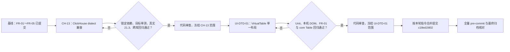
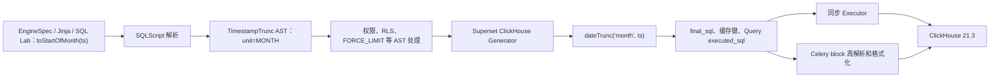
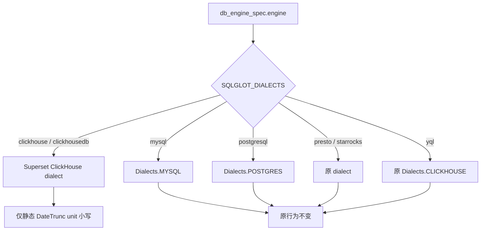
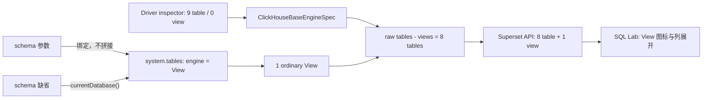
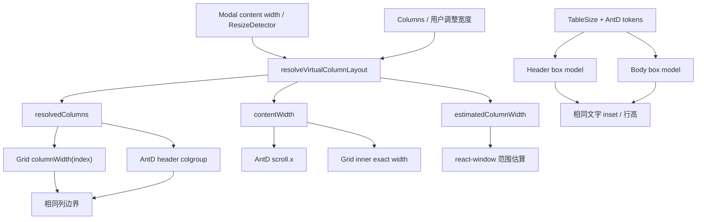

<!--
Licensed to the Apache Software Foundation (ASF) under one
or more contributor license agreements.  See the NOTICE file
distributed with this work for additional information
regarding copyright ownership.  The ASF licenses this file
to you under the Apache License, Version 2.0 (the
"License"); you may not use this file except in compliance
with the License.  You may obtain a copy of the License at

  http://www.apache.org/licenses/LICENSE-2.0

Unless required by applicable law or agreed to in writing,
software distributed under the License is distributed on an
"AS IS" BASIS, WITHOUT WARRANTIES OR CONDITIONS OF ANY
KIND, either express or implied.  See the License for the
specific language governing permissions and limitations
under the License.
-->

# Superset ClickHouse 21.3 兼容与 Drill Detail 表格对齐补充设计

| 属性          | 值                                                                                                                       |
| ------------- | ------------------------------------------------------------------------------------------------------------------------ |
| 文档版本      | V1.3                                                                                                                     |
| 文档状态      | Implemented（发布前补充门禁见第 7 节）                                                                                   |
| 日期          | 2026-08-24                                                                                                               |
| 原始需求基线  | 数据质量 BI 增强需求 V1.4                                                                                                |
| 原始代码基线  | `c83fb2bb1dcf`（Superset 6.1.0 RC3）                                                                                     |
| 增量审计基线  | `dev/6.1`，`5f4c1760262a`                                                                                                |
| As-built 基线 | `dev/6.1`，`c18ed1fd02`                                                                                                  |
| 依赖基线      | SQLGlot `28.10.0`、Ant Design `5.27.6`、react-window `1.8.11`                                                            |
| 数据库基线    | 本机 ClickHouse `21.3.20.1`，数据库 `superset_quality_21_3`                                                              |
| 关联文档      | [详细设计](./superset-data-quality-bi-detailed-design.md)、[实施计划](./superset-data-quality-bi-implementation-plan.md) |
| 文档目标      | 确认两项待改进问题的实现方案、影响范围、测试门禁、发布与回滚边界                                                         |

## 1. 结论摘要

FR-01～FR-05 已分别落在独立提交中。本补充设计不重新打开原需求，也不新增 FR-06；
两项改进作为实现后发现的兼容性修正和 UI 缺陷修正单独追踪：

| ID          | 待改进项                                                  | 已确认方案                                                                        | 是否新增 Flag |
| ----------- | --------------------------------------------------------- | --------------------------------------------------------------------------------- | ------------- |
| `CH-13`     | Superset 重生成的时间粒度 SQL 无法在 ClickHouse 21.3 执行 | 自有 ClickHouse dialect 生成小写静态单位；Code 36 映射为无 SQL/服务详情的固定错误 | 否            |
| `UI-DTD-01` | Drill to Detail 表头、正文滚动宽度和单元格间距不一致      | 由 core `VirtualTable` 计算唯一列布局，同时驱动 AntD header 与 react-window body  | 否            |

两项修正都不改变 REST API、`form_data`、数据库结构、权限、RLS 或数据结果。原设计建议
拆为两个独立提交；实施时按本轮明确指令先完成并审查 `CH-13`，再完成并审查
`UI-DTD-01`，最终合并归档为提交 `c18ed1fd02`。缺陷修正不通过 Feature Flag 保留两套
长期实现；如需回滚，应整体 revert 该提交，或先拆分补丁后分别回滚。

## 2. 基线与已验证证据

### 2.1 实施现状

当前 `dev/6.1` 已包含：

| 范围                 | 提交         | 状态                 |
| -------------------- | ------------ | -------------------- |
| FR-01                | `de65297208` | 已提交               |
| FR-02                | `a8b507c29a` | 已提交               |
| FR-03                | `f02a5937b4` | 已提交               |
| FR-04                | `8e7dcabcd7` | 已提交               |
| FR-05                | `5f4c176026` | 已提交               |
| FR-01 分页可见性修正 | `dee7616f21` | 已提交               |
| CH-13、UI-DTD-01     | `c18ed1fd02` | 已实现并完成本机验收 |

`CH-13` 和 `UI-DTD-01` 不改变 AC-01～AC-17 的原始含义。本文同时记录原设计约束、
实际落地差异和仍待补充的跨平台验收，避免把尚未固化的测试写成已完成自动化。

### 2.2 ClickHouse 21.3 失败证据

仓库和本机环境已经对齐到 SQLGlot `28.10.0`。同一时间粒度链路的结果如下：

| 检查                         | 结果                                             |
| ---------------------------- | ------------------------------------------------ |
| SQLGlot 输入                 | `toStartOfMonth(toDateTime(event_time))`         |
| SQLGlot 28.10 输出           | `dateTrunc('MONTH', toDateTime(event_time))`     |
| ClickHouse 21.3 执行小写单位 | `dateTrunc('month', ...)` 成功                   |
| ClickHouse 21.3 执行大写单位 | Code 36：`MONTH doesn't look like datepart name` |

仓库在 `pyproject.toml` 和 lock 文件中固定 `sqlglot>=28.10.0,<29`。SQLGlot 28.10 的
ClickHouse Generator 对 `TimestampTrunc` 使用通用 `timestamptrunc_sql()`，不会根据
dialect version 把单位转为小写。因此只设置 `version=21.3` 不能解决问题。

### 2.3 Drill Detail 修复前本机量测

本机 Superset、前端和 ClickHouse 21.3 已启动，使用 1k 行 Drill Detail 数据进行 DOM
几何量测：

| 项目                                         |                实测值 |
| -------------------------------------------- | --------------------: |
| Browser viewport                             |                1280px |
| Drill modal                                  |                 900px |
| Table / Grid `clientWidth`                   |                 828px |
| 列数与定义宽度                               |      9 列，每列 150px |
| 理论内容总宽                                 |                1350px |
| AntD header 首次 `scrollWidth`               |                1350px |
| react-window Grid 首次 inner / `scrollWidth` |                1150px |
| Grid 首次横向滚动后 inner / `scrollWidth`    |                1350px |
| Header / body padding                        | `8px 8px` / `8px 4px` |

首屏已渲染列和横向滚动后的可见列，其 `left` 与 `width` 实测一致，列宽均为 150px。
因此本设计不宣称“每个可见列始终错位”。已经确认的是：

1. 首次渲染时 header 与 body 的完整横向滚动范围相差 200px；
2. 第一次横向滚动会触发 Grid 重新估算并发生宽度变化；
3. header 与 body 的右侧 padding 和垂直盒模型不一致；
4. 少列、宽屏、Modal resize 和非 overlay scrollbar 会放大结构性错位风险。

截至本次审计，没有找到精确针对 Drill Detail 的上游修复。相似的
[Superset PR #36190](https://github.com/apache/superset/pull/36190) 和
[PR #36891](https://github.com/apache/superset/pull/36891) 修改经典 Table Chart 的
`useSticky.tsx`，不经过 core `VirtualTable`，不能直接 cherry-pick。

### 2.4 修复后本机验收

提交 `c18ed1fd02` 后，在 Dashboard 2 的保存图表上重新打开 Drill Detail 并量测：

| 项目                                                     | 修复后证据                                                 |
| -------------------------------------------------------- | ---------------------------------------------------------- |
| 首次 header / Grid `scrollWidth`                         | `1350px / 1350px`                                          |
| 首次可见列 header/body `left`、`right`、`width` 最大差值 | `0px`                                                      |
| 最大横滚位置                                             | `scrollLeft=522px`，header 与 Grid 同步，最大差值 `0px`    |
| Modal 缩小后                                             | Grid `clientWidth=750px`、最大横滚 `600px`，最大差值 `0px` |
| Small 单元格盒模型                                       | 高 `39px`，左右 padding 均为 `8px`                         |
| 分页                                                     | 按钮可见，可进入第 2 页；纵向归零且横向位置保留            |
| 虚拟化                                                   | 1k 行数据仅渲染 30 个 cell / 5 行                          |

本机 macOS 使用 overlay scrollbar。classic scrollbar 和 legacy
`clickhouse-sqlalchemy` driver 尚未获得真实环境证据，继续作为发布前补充门禁，不在
本文中宣称通过。

### 2.5 非目标

- 不升级 SQLGlot、Ant Design 或 react-window 来顺带解决问题。
- 不用正则表达式修改最终 SQL，不修改注释、普通字符串或用户任意函数参数。
- 不自动纠正 SQL Lab 中显式输入的匿名 `dateTrunc('MONTH', ...)`；数据库仍负责校验
  用户原始 SQL。本修正覆盖 Superset/SQLGlot 标准 AST 的生成结果。
- 不改变 ClickHouse EngineSpec 已保存的 `toStartOf*` 和 `intDiv` 时间粒度表达式。
- 不关闭 Drill Detail virtualization，也不在 `DrillDetailPane` 增加局部 CSS 偏移。
- 不改经典 Table Chart 的 sticky header 实现。

## 3. 实施顺序与提交边界



原建议提交标题与实际提交如下：

```text
fix(clickhouse): generate legacy-compatible date trunc units
fix(drill-detail): align virtual table header and body

# As-built
fix: support ClickHouse 21.3 and align drill detail
```

实施过程中仍遵循 `CH-13` 先完成方案、测试和审查，再修改 `VirtualTable`；
`UI-DTD-01` 没有夹带 ClickHouse、FR-01 查询或后端改动。提交合并是版本管理边界偏差，
不是实现依赖或代码职责的混合。

## 4. CH-13：ClickHouse 21.3 时间粒度兼容

### 4.1 根因与数据流

ClickHouse EngineSpec 有意使用原生 `toStartOf*`。当 Superset 为安全校验、RLS、LIMIT、
格式化或异步执行重新解析 SQL 时，SQLGlot 会把该函数规范成 `TimestampTrunc` AST，再
生成不兼容 21.3 的大写单位。



修复必须放在 AST Generator 层。这样安全检查、缓存、审计 SQL 和最终送到 cursor 的 SQL
保持一致；在执行前做字符串替换会破坏这一保证。

### 4.2 自定义 dialect

新增 `superset/sql/dialects/clickhouse.py`，其中的 `SupersetClickHouse` 类继承
SQLGlot 28.10 的 `ClickHouse`，只覆盖 `exp.TimestampTrunc` 和 `exp.DateTrunc` 的
Generator transform。

算法契约：

```python
def legacy_date_trunc_sql(generator, expression):
    unit_expression = expression.args.get("unit")
    if type(unit_expression) not in (exp.Literal, exp.Var):
        if isinstance(expression, exp.TimestampTrunc):
            stock_transform = SQLGlotClickHouse.Generator.TRANSFORMS[
                exp.TimestampTrunc
            ]
            return stock_transform(generator, expression)
        return generator.function_fallback_sql(expression)

    unit = unit_to_str(expression)
    if isinstance(unit, exp.Literal) and unit.is_string:
        unit = exp.Literal.string(unit.name.lower())

    return generator.func(
        "dateTrunc",
        unit,
        expression.this,
        expression.args.get("zone"),
    )
```

约束：

- `unit_to_str()` 只处理标准 AST 中的静态 `Var` / `Literal`；
- 只有静态字符串 literal 执行 `lower()`；Placeholder 或 Parameter 委托 stock
  TimestampTrunc transform / `function_fallback_sql()`，保持 SQLGlot 原语义；
- timezone 第三个参数存在时必须保留；
- 不覆盖 Parser、Tokenizer、标识符规则、表提取或通用 Generator；
- 自有类必须命名为 `SupersetClickHouse`，避免 SQLGlot dialect metaclass 把 stock
  `clickhouse` registry 覆盖，进而污染 YQL；
- 已是小写的单位二次 format 必须幂等。

### 4.3 engine 映射隔离



`superset/sql/parse.py` 只替换以下两个映射：

```text
clickhouse  -> Superset ClickHouse dialect
clickhousedb -> Superset ClickHouse dialect
```

`yql` 必须继续使用 stock `Dialects.CLICKHOUSE`。现有
`SQLGLOT_DIALECTS_EXTENSIONS` 仍在应用初始化时覆盖默认映射；部署配置若覆盖上述两个
key，应明确其优先级高于本修复。

### 4.4 文件与实现内容

| 文件                                                  | As-built 实现内容                                     |
| ----------------------------------------------------- | ----------------------------------------------------- |
| `superset/sql/dialects/clickhouse.py`                 | 新增最小 Generator override，包含类型标注和 docstring |
| `superset/sql/dialects/__init__.py`                   | 导出 `SupersetClickHouse`                             |
| `superset/sql/parse.py`                               | 仅替换 `clickhouse`、`clickhousedb` 两个 map value    |
| `superset/db_engine_specs/clickhouse.py`              | 两个 ClickHouse key 共用精准 Code 36 安全错误映射     |
| `tests/unit_tests/db_engine_specs/test_clickhouse.py` | 错误映射正向、脱敏与非目标错误回归                    |
| `tests/unit_tests/sql/dialects/clickhouse_tests.py`   | AST、七种粒度、动态表达式、负向和映射隔离测试         |

不新增 REST、Marshmallow、TypeScript、Feature Flag 或数据库迁移。

`parse_tests.py`、`transpile_to_dialect_test.py` 继续作为既有回归套件执行；
`test_clickhouse.py` 在验证债务阶段补充 Code 36 安全映射用例。Executor、Celery、SQL Lab
integration 与 `validate.sql` 是增强门禁，其通过状态以验证执行计划的逐项证据为准。

### 4.5 影响与兼容性

| 范围                                      | 影响                                                |
| ----------------------------------------- | --------------------------------------------------- |
| ClickHouse 图表与虚拟 Dataset             | 时间截断静态单位生成为小写                          |
| SQL Lab 同步、异步和 Celery               | 最终 cursor SQL 与 `executed_sql` 统一为小写        |
| LIMIT / RLS / sanitize / transpile        | AST 处理流程不变，最终生成阶段使用新 dialect        |
| ClickHouse 缓存                           | canonical SQL 改变，发布后可能出现一次性 cache miss |
| `Query.sql` 用户原文                      | 继续遵循现有保存语义，不伪造用户输入                |
| Parser、权限、RLS、表识别                 | 不变                                                |
| MySQL、PostgreSQL、Presto、StarRocks、YQL | 映射和 Generator 不变，无直接运行时影响             |
| 新版 ClickHouse                           | 小写单位继续合法，不产生语义差异                    |

legacy `clickhouse` 与 ClickHouse Connect `clickhousedb` 两个 engine key 都必须有单元和
执行链测试。本机主 venv 继续使用 `clickhousedb+connect`；legacy
`clickhouse-sqlalchemy 0.2.9` 通过一次性 shadow target 连接本机 21.3 native 端口完成七粒度、
反射、View 与 Code 36 实测，不用映射单测冒充双驱动实测。同步跨层测试覆盖两个 engine key；
真实异步/Celery 链路在隔离 metadata、Redis DB 和 worker 中使用 active Connect 完成。

### 4.6 安全、缓存与可观测性

- 不新增 SQL 正文日志；沿用现有 SQL Lab、Chart 和数据库错误指标。
- 允许记录 engine、执行阶段、成功/失败和耗时，不记录 SQL、时间字段或筛选值。
- 缓存键使用最终 canonical SQL；同一输入重复执行的 key 必须稳定。
- 不能让失败的大写 SQL 与成功的小写 SQL共享错误缓存结果。
- Code 36/date-trunc datepart 错误使用精确特征匹配并返回固定安全消息；前端、
  `Query.error_message`、API 错误和 `DEBUG=false` 下的 application INFO 日志不得保留表达式、
  server version、URL 或 raw driver stack/details。框架错误处理仍可记录只含固定消息的应用栈；
  `DEBUG=true` 和显式 `QUERY_LOGGER` 属于单独的调试/审计契约，不在匿名遥测保证范围；其他
  错误沿用既有映射，不扩大行为变更。

### 4.7 测试矩阵

| ID           | 层级        | 场景                                                    | 通过标准                                                    |
| ------------ | ----------- | ------------------------------------------------------- | ----------------------------------------------------------- |
| `TC-CH13-01` | Unit        | 两个 ClickHouse key 与其他 dialect 映射                 | 两个 key 使用新类；MySQL/PostgreSQL/YQL identity 不变       |
| `TC-CH13-02` | Unit        | 两个 key × minute/hour/day/week/month/quarter/year      | 全部输出小写 unit，无大写 unit                              |
| `TC-CH13-03` | Unit        | 标准 `DATE_TRUNC` AST、已小写 AST、timezone             | 生成合法 `dateTrunc`，二次 format 幂等，timezone 保留       |
| `TC-CH13-04` | Unit        | 动态单位、普通字符串、alias、comment、quoted identifier | 非目标内容逐字/AST 等价，不被 lower                         |
| `TC-CH13-05` | Unit        | EngineSpec PT1M～P1Y 与 PT5/10/15/30M                   | `toStartOf*`、`toMonday` 和 `intDiv` 模板不变               |
| `TC-CH13-06` | Unit        | FORCE_LIMIT、已有 LIMIT、CTE、multi-statement、Jinja    | unit 小写且 LIMIT/statement 语义不变                        |
| `TC-CH13-07` | Integration | SQLExecutor 与 Celery 单/多 block                       | 送 cursor 和 `executed_sql` 都为小写                        |
| `TC-CH13-08` | Integration | SQL Lab sync / async                                    | `Query.sql` 语义不变；`executed_sql` 小写并成功             |
| `TC-CH13-09` | Real DB     | 21.3 七粒度聚合                                         | 结果与 `toStartOf*` 基线一致；大写直接 SQL 稳定返回 Code 36 |
| `TC-CH13-10` | Regression  | MySQL/PostgreSQL 代表日期 SQL + LIMIT                   | 输出与修改前 snapshot / AST 等价                            |
| `TC-CH13-11` | Regression  | parse、transpile、executor、celery 全文件               | 锁定 SQLGlot 28.10.0 下全部通过                             |
| `TC-CH13-12` | Runtime     | 本机 Superset API 与 ClickHouse 21.3                    | 图表及 SQL Lab 七粒度成功，无 SQL 泄漏                      |
| `TC-CH13-13` | Security    | connect/legacy 的 Code 36 与非目标 Code 36              | 目标错误固定脱敏；其他 ClickHouse 错误保持原映射            |

As-built `c18ed1fd02` 未修改 `validate.sql`；后续验证债务实现已将门禁从 25 项扩展为
恰好 26 项。第 26 项在 12,000 行 `fact_events` 上分别输出 minute、hour、day、week、
month、quarter、year 的 mismatch，其中 week 以 `toMonday` 为基线，其余粒度以对应
`toStartOf*` 为基线。Shell 门禁还会独立校验四列协议、1～26 顺序、非空唯一名称和全
`PASS`，`--validate-only` 不运行 seed 或 DDL。大写 Code 36 是预期失败测试，应由独立
helper/API 测试捕获，不能放进会中止的普通 multiquery PASS 门禁。

### 4.8 Code 36 安全错误映射（验证债务）

ClickHouse 21.3 的 raw 大写 datepart 会在错误中携带表达式片段、server version 和连接 URL。
共享 `ClickHouseBaseEngineSpec.extract_error_message()` 仅在 `[SQL: ...]` 上下文之前的
`DB::Exception` 错误段同时满足 Code 36 与
`doesn't look like datepart name in date_trunc` 特征时返回固定消息：
`ClickHouse rejected the date truncation unit. Use a lowercase unit.`。匹配不依赖驱动异常
类型，因此覆盖 connect `0.13.0`、`0.15.1` 和 legacy `0.2.9`；非目标 Code 36 及其他错误
继续委托 Base EngineSpec。该方法只在 `clickhouse`/`clickhousedb` 继承链中生效，不影响
MySQL、PostgreSQL 或 YQL。

### 4.9 驱动反射归一化（验证债务）

connect `0.13.0` 与 `0.15.1` 的 SQLAlchemy inspector 都把普通 View 包含在
`get_table_names()` 中，同时让 `get_view_names()` 返回空集合。Superset 不能把这一驱动
限制暴露成 9 table/0 view，因此在共享 `ClickHouseBaseEngineSpec` 沿用 Presto 的关系
归一化模式：显式 schema 通过 `%(schema)s` 绑定查询 `system.tables`，缺省 schema 使用
`currentDatabase()`；`get_table_names()` 再扣除查得的普通 View。



实现放在共享基类后只影响 `clickhouse` 与 `clickhousedb`；MySQL、PostgreSQL 和 YQL 的
继承链不经过该逻辑。只把 `engine='View'` 归类为普通 View，`MaterializedView` 保持既有
Table 行为，避免扩大本补丁范围。元数据查询失败必须走现有 DBAPI 异常映射，不能静默退回
错误的 9/0 分类。

真实 ClickHouse `21.3.20.1` 上，active `0.15.1` 与 shadow `0.13.0` 均得到 8/1，
`drill_wide_flat` 的 10,000 行查询和 52 列展开成功；tables API 返回 count=9、8 table、
1 view 且 relation name 无重复。EngineSpec 的五个安装承载点与生成数据库快照同步为
`clickhouse-connect>=0.13.0,<1.0`，并由单测与 `pyproject.toml` 做语义比对。
legacy `clickhouse-sqlalchemy 0.2.9` 的 raw inspector 本身为 8/1，Superset 共享归一化后仍
保持 8/1；该差异不改变 Connect 驱动需要修正 9/0 的结论。

### 4.10 发布与回滚

`CH-13` 不设 Feature Flag。由于 As-built 与 UI-DTD-01 合并在 `c18ed1fd02`，直接
revert 会同时撤销两项修正；仅回滚 ClickHouse 时应先拆出该提交中的四个后端/测试文件
形成反向补丁。紧急止损可在
`superset_config.py` 中通过现有 `SQLGLOT_DIALECTS_EXTENSIONS` 同时把两个 ClickHouse
key 覆盖回 stock `Dialects.CLICKHOUSE` 并重启服务；该操作会恢复 ClickHouse 21.3 的
Code 36 故障，只能作为明确知情的应急措施。

本修正无 schema 或数据回滚。缓存不需要清理；回滚前后只会因 canonical SQL 改变出现
可预期的 cache miss。

## 5. UI-DTD-01：Drill Detail 表头与正文对齐

### 5.1 根因

Drill Detail 在 `DrillDetailPane.tsx` 中使用 `TableSize.Small`、`resizable` 和
`virtualize`。Ant Design `<table>` 渲染 header，react-window `VariableSizeGrid` 渲染
body，两者必须显式共享几何契约。

已确认三项根因：

1. `VariableSizeGrid` 没有传 `estimatedColumnWidth`。react-window 1.8.11 对未量测列
   默认估算 50px；首屏只量测前 7 列时，`7 × 150 + 2 × 50 = 1150`，与实测完全一致。
2. `Table/index.tsx` 把 header `scroll.x` 硬编码为 `100vw`，body 却使用 Modal 内
   ResizeDetector 得到的 `tableWidth`。少列、宽屏和 resize 时会使用不同拉伸基准。
3. AntD Small header 实测水平 padding 为 `8px 8px`，body 为 `8px 4px`；另有一份
   未可靠生效的 `.virtual-table-cell { padding: 16px; }` 重复样式，存在未来覆盖风险。

### 5.2 唯一列布局模型

在 `VirtualTable` 内建立纯函数 `resolveVirtualColumnLayout()`。输入为 columns、容器宽度
和默认/最小列宽，返回新的列数组与单一内容宽度，不修改调用方对象。

```text
1. 复制 columns。
2. 累加固定宽度，统计缺省宽度列数。
3. 缺省列宽 = max(floor((containerWidth - fixedWidth) / missingCount), 50)。
4. 对每列写入有限且不小于最小值的 resolved width。
5. 求 resolved width 总和。
6. 若总和小于 containerWidth，只把差额加到最后一列。
7. 再次求和得到精确 contentWidth。
8. estimatedColumnWidth = contentWidth / columnCount。
9. 空列返回空数组、contentWidth=0，不做除零或访问最后一列。
```

同一布局结果必须驱动：

```text
AntD header scroll.x       = contentWidth
AntD header columns        = resolvedColumns
Grid columnWidth(index)    = resolvedColumns[index].width
Grid inner exact width     = contentWidth
Grid estimatedColumnWidth  = contentWidth / columnCount
```

不能只设置 `estimatedColumnWidth=150`：异构列宽和用户 resize 后，一个平均值无法保证
浏览器滚动范围始终精确。应使用稳定的 `innerElementType` 把 react-window inner div 的
`width` 固定为 `contentWidth`，同时传平均估值供内部范围计算使用。

### 5.3 修复后数据流



容器宽度、resolved column width signature 或 Table size 变化时，主动执行：

```tsx
gridRef.current?.resetAfterIndices({
  columnIndex: 0,
  rowIndex: 0,
  shouldForceUpdate: true,
});
```

当前 `useEffect(() => resetVirtualGrid, dependencies)` 实际返回 cleanup，不应继续使用。
effect 需要显式调用 reset。不得使用 `contentWidth - tableWidth` 手工 clamp
`scrollLeft`：classic scrollbar 会让实际 `clientWidth` 与布局宽度不同，应由浏览器原生
滚动边界和 react-window `scrollTo()` 处理合法范围。

### 5.4 单元格盒模型

- 删除或收敛 `StyledVirtualTable` 中重复的 `.virtual-table-cell` padding 声明；
- body 使用 Ant Design token 和 `padding-inline`，避免写死左右方向；
- Small：水平/垂直 padding 使用 `paddingXS`，行高使用主题 line-height；
- Middle：垂直 padding 使用 `paddingSM`；
- 保留 `box-sizing: border-box`、ellipsis 和 1px bottom border；
- header 与 body 的文字起始 inset、行高和总 cell height 差值不得超过 1 CSS px。

Small 目标盒模型为：

```text
22px line-height + 8px top + 8px bottom + 1px border = 39px
```

Middle 目标盒模型为：

```text
22px line-height + 12px top + 12px bottom + 1px border = 47px
```

非 overlay scrollbar 不在本层再次手工加减宽度。rc-table 已根据自定义 body 回传的
scrollbar size 处理 header spacer；重复补偿会制造新的末列错位。必须在 Windows/Linux
classic scrollbar 环境通过浏览器测试验证该假设。

### 5.5 文件与实现内容

| 文件                                                                   | As-built 实现内容                                       |
| ---------------------------------------------------------------------- | ------------------------------------------------------- |
| `packages/superset-ui-core/src/components/Table/VirtualTable.tsx`      | 唯一布局、inner exact width、主动双向 reset、统一盒模型 |
| `packages/superset-ui-core/src/components/Table/index.tsx`             | 删除 `x: '100vw'` 与重复 virtual cell padding           |
| `packages/superset-ui-core/src/components/Table/VirtualTable.test.tsx` | 纯布局和组件契约测试                                    |

不修改 Samples API、分页/搜索状态、`form_data`、FR-01 Feature Flag 或后端查询。

既有 `Table.test.tsx` 与 `DrillDetailPane.test.tsx` 已作为回归套件执行但没有产生 diff。
真实浏览器几何检查通过本机交互和 DOM 数值量测完成；仓库尚未新增
`drill-to-detail-alignment.spec.ts`，该 Playwright 固化项与 classic scrollbar 场景仍是
后续增强门禁。

### 5.6 影响与兼容性

仓库检索显示，`virtualize` 的生产调用方只有 Drill Detail；其余命中是 core Table 本身和
Storybook。core Table 是共享导出组件，因此仍需覆盖第三方调用兼容性。

| 范围                                 | 影响                                 |
| ------------------------------------ | ------------------------------------ |
| Drill Detail server / bounded client | 首次滚动范围、resize 和视觉间距修正  |
| FR-01 分页、搜索、容量和权限         | 不变                                 |
| 非虚拟 core Table                    | 不进入新布局分支，行为不变           |
| 经典 Table Chart                     | 使用独立 DataTable，不受影响         |
| 数据库与 SQL                         | 无影响                               |
| API、缓存、Permalink、XLSX           | 无影响                               |
| 用户列宽调整                         | header/body 改用同一 resolved width  |
| 第三方 `virtualize=true` 消费者      | 获得修正后的宽度、滚动范围和 padding |

关闭 `DRILL_DETAIL_CONFIGURABLE_TABLE` 不是回滚手段，因为旧 Drill Detail 同样使用
virtualized core Table。

### 5.7 测试矩阵

浏览器几何 oracle：对每个可见列读取 header `th` 与第一行 body cell 的
`getBoundingClientRect()`，要求 `left`、`right`、`width` 差值均不超过 1 CSS px；文字
inset 差值也不超过 1px。截图只作为失败附件，不能替代 DOM 数值断言。

| ID          | 层级         | 场景                                   | 通过标准                                                     |
| ----------- | ------------ | -------------------------------------- | ------------------------------------------------------------ |
| `TC-DTD-01` | Unit         | 828px、9 × 150px                       | `contentWidth=1350`，estimated width=150                     |
| `TC-DTD-02` | Unit         | 828px、3 × 150px                       | 最后一列补足到 528px，总宽 828px                             |
| `TC-DTD-03` | Unit         | 固定、缺省、混合、0/1/52 列            | 无 mutation、NaN、Infinity；每列不小于 50px                  |
| `TC-DTD-04` | Unit         | ResizeObserver 与列宽变化              | 主动 reset 一次，scrollLeft 合法，无 render loop             |
| `TC-DTD-05` | Unit         | Small / Middle box model               | padding、line-height、height 与 header 契约一致              |
| `TC-DTD-06` | Component    | FR-01 server/client/search/reload 状态 | 只重算布局，不增加 Samples 请求或改变数据顺序                |
| `TC-DTD-07` | Browser      | 首次打开 9 列且不横滚                  | header/Grid 初始 `scrollWidth` 都为 1350px                   |
| `TC-DTD-08` | Browser      | 1/3/52 列，x=0/50%/max                 | 所有可见列几何差值 ≤1px，最右列可达                          |
| `TC-DTD-09` | Browser      | 50/1000 行，纵向/双向快速滚动          | 回收后仍对齐，header 只跟随 x                                |
| `TC-DTD-10` | Browser      | Modal 与首/中/末列 resize              | settle 后 ≤1px，无空白、重叠或越界 scrollLeft                |
| `TC-DTD-11` | Browser      | overlay=0 与 classic scrollbar>0       | spacer 不缺失、不双重补偿，末列 ≤1px                         |
| `TC-DTD-12` | Browser/A11y | light/dark、200% zoom、keyboard        | dialog/table/header role 与焦点顺序不变，可访问全部列        |
| `TC-DTD-13` | Performance  | 52列 × 1000行、resize burst            | 保持虚拟化；无 observer loop；p95 frame/layout 不退化超过10% |
| `TC-DTD-14` | Regression   | 非虚拟 Table 与 Storybook              | pagination、selection、sort、resize 行为不变                 |

JSDOM 不提供可靠布局；RTL 单测只能验证 props、DOM 契约和计算函数，不能宣称真实几何
通过。Playwright 必须先量测首次 `scrollWidth`，再执行横向滚动，否则会触发剩余列量测并
掩盖 1150→1350 的现有缺陷。不新增 Cypress 测试。

### 5.8 性能、可访问性与可观测性

- 52 × 1000 场景的 DOM cell 数继续受 virtualization 上界约束，不得接近 52,000。
- ResizeObserver burst 应合并到稳定布局，不新增数据请求、listener 泄漏或长循环。
- 不新增 cell 内容日志；测试附件只记录 viewport、DPR、scrollbar width、column count、
  max geometry delta 和失败截图。
- table、columnheader、搜索、分页和关闭按钮的 role/name 与 Tab 顺序保持不变。
- 200% zoom 下由表格自身横向滚动，不允许整个 dialog 横向溢出或裁剪 focus ring。

### 5.9 发布与回滚

`UI-DTD-01` 不设 Feature Flag。发布前必须在至少一个 overlay scrollbar 和一个
占宽 scrollbar 环境完成 Playwright。由于 As-built 与 CH-13 合并在 `c18ed1fd02`，直接
revert 会同时撤销两项修正；如需仅回滚 UI，应先从该提交拆出 VirtualTable 的三个文件
形成反向补丁。无持久化数据、API 或数据库回滚。回滚后必须记录恢复了已知的首次滚动
范围和 cell spacing 缺陷。

## 6. 分项实现步骤与完成定义

### 6.1 CH-13

1. 在锁定 SQLGlot 28.10.0 环境复现大写 unit 的 ClickHouse 21.3 Code 36。
2. 新增 `SupersetClickHouse` 和两个 engine 映射。
3. 完成 AST、七粒度、动态表达式、stock registry 与 YQL 隔离单测。
4. 执行 parse、transpile、ClickHouse EngineSpec、MySQL/PostgreSQL 既有回归。
5. 使用 `clickhousedb+connect` 对本机 ClickHouse 21.3 执行七种小写粒度。
6. 完成独立代码审查并归档到 `c18ed1fd02`。

As-built 状态：实现与本机 connector 验收完成。后续 V3 验证又完成 legacy
`clickhouse-sqlalchemy 0.2.9` 真实 21.3、两个 engine key 同步跨层，以及隔离
SQL Lab async/Celery 单、多 statement 运行时验收。仓库内仍未固化 legacy 专用 Celery
端到端自动化，不能把 active Connect 的异步实测解释为 legacy 异步实测。

### 6.2 UI-DTD-01

1. 新增纯布局和组件测试，锁定首次 `scrollWidth` 的布局契约。
2. 实现唯一 resolved layout，删除 `100vw` 宽度来源。
3. 固定 Grid inner width、主动 reset，并统一 Small/Middle cell box model。
4. 覆盖空/1/3/9/52 列、异构/非法宽度、余数、resize 与 Small/Middle cache reset。
5. 回归 FR-01 Drill Detail 和非虚拟 Table，并在真实 Modal 验证首屏、最大横滚、
   resize、分页和虚拟化。
6. 完成独立代码审查并归档到 `c18ed1fd02`。

As-built 状态：macOS overlay scrollbar 下最大几何差值为 `0px`，功能与虚拟化回归通过。
classic scrollbar、52 列真实浏览器、200% zoom 和 Playwright spec 固化仍是发布前补充项。

## 7. 增量验收追踪

| 验收 ID     | 需求                         | 已完成证据                                                                                                                      | 待补门禁                                        |
| ----------- | ---------------------------- | ------------------------------------------------------------------------------------------------------------------------------- | ----------------------------------------------- |
| `ADD-AC-01` | ClickHouse 21.3 时间粒度兼容 | 两个 engine 映射与七粒度单测；Connect/legacy 真实 21.3；双 key 同步跨层；active Connect async/Celery；MySQL/PostgreSQL/YQL 回归 | legacy 专用 Celery 端到端自动化固化             |
| `ADD-AC-02` | Drill Detail 对齐            | 纯布局/组件测试；overlay 环境首屏、max、resize 几何差值 `0px`；分页与虚拟化通过                                                 | classic scrollbar、52 列浏览器、Playwright 固化 |

原 AC-01～AC-17 不重新编号。“Implemented”表示代码已落地，不等同于上述跨平台发布门禁已经
全部关闭；待补项完成后才能标记为 Fully Verified。

## 8. 验证命令与交付门禁

本次实际执行的最低命令集合：

```bash
# 环境门禁
venv/bin/python -c "import sqlglot; assert sqlglot.__version__ == '28.10.0'"

# ClickHouse dialect、SQL 格式化与跨库回归：669 + 87 passed
venv/bin/pytest -q tests/unit_tests/sql/dialects/clickhouse_tests.py \
  tests/unit_tests/sql/parse_tests.py \
  tests/unit_tests/sql/transpile_to_dialect_test.py \
  tests/unit_tests/db_engine_specs/test_clickhouse.py
venv/bin/pytest -q tests/unit_tests/db_engine_specs/test_mysql.py \
  tests/unit_tests/db_engine_specs/test_postgres.py

# VirtualTable、core Table 与 Drill Detail：18 passed；全量 TypeScript 通过
cd superset-frontend
npm run test -- \
  packages/superset-ui-core/src/components/Table/VirtualTable.test.tsx \
  packages/superset-ui-core/src/components/Table/Table.test.tsx \
  src/components/Chart/DrillDetail/DrillDetailPane.test.tsx
npm run type
cd ..

# Push 前仓库强制门禁
pre-commit run --all-files
git diff --check
```

此外已通过本机 ClickHouse `21.3.20.1` 的 Connect/legacy 七粒度执行、active Connect
同步/异步/Celery 链路和 Dashboard Drill Detail DOM 几何量测。待补项仅为仓库内尚未固化的
legacy 专用 Celery 端到端自动化，以及 UI 的 classic scrollbar、52 列浏览器和 Playwright
自动化；不以人工量测或其他测试结果替代这些门禁。
