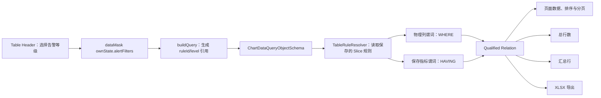
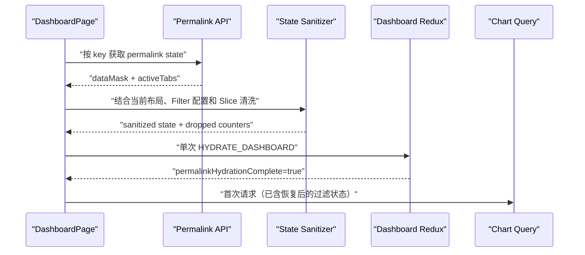
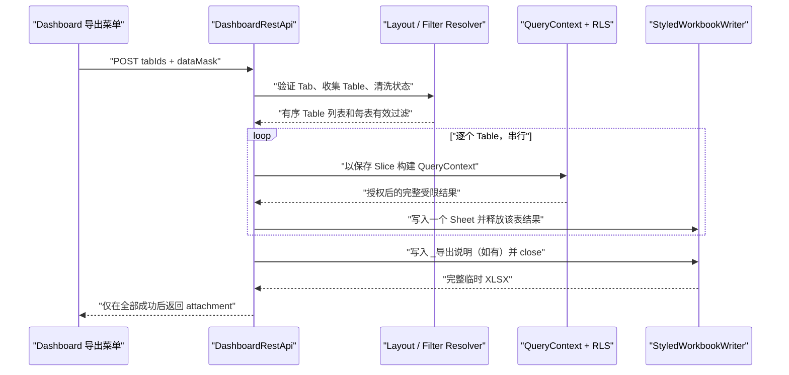

<!--
Licensed to the Apache Software Foundation (ASF) under one
or more contributor license agreements.  See the NOTICE file
distributed with this work for additional information
regarding copyright ownership.  The ASF licenses this file
to you under the Apache License, Version 2.0 (the
"License"); you may not use this file except in compliance
with the License.  You may obtain a copy of the License at

  http://www.apache.org/licenses/LICENSE-2.0

Unless required by applicable law or agreed to in writing,
software distributed under the License is distributed on an
"AS IS" BASIS, WITHOUT WARRANTIES OR CONDITIONS OF ANY
KIND, either express or implied.  See the License for the
specific language governing permissions and limitations
under the License.
-->

# Superset 数据质量 BI 增强详细设计

| 属性          | 值                                                                                                          |
| ------------- | ----------------------------------------------------------------------------------------------------------- |
| 文档版本      | V1.4                                                                                                        |
| 文档状态      | Implemented（验收持续补充）                                                                                 |
| 日期          | 2026-08-24                                                                                                  |
| 输入需求      | 《Superset 6.0 数据质量 BI 增强需求分析与设计文档》V1.4                                                     |
| 需求来源      | [共享聊天交付件](https://chatgpt.com/share/6a7ec819-69f4-83ec-ad1e-83377e0b86dd)                            |
| 原始设计基线  | `dev/6.1`，`c83fb2bb1dcf`（Superset 6.1.0 RC3）                                                             |
| 增量审计基线  | `dev/6.1`，`5f4c1760262a`                                                                                   |
| As-built 基线 | `dev/6.1`，`ac5b40bb36`                                                                                     |
| 补充设计      | [ClickHouse 21.3 兼容与 Drill Detail 表格对齐](./superset-clickhouse-21-3-drill-detail-alignment-design.md) |
| 目标读者      | 负责该 Superset 分支实现、评审、测试与发布的工程师                                                          |

## 1. 摘要

本文将需求文档 V1.4 中的五项需求细化为可实施的前后端设计，并以当前
Superset 6.1 代码为事实基线。V1.4 以 Superset 6.0 为基线，因此本文不照搬其
现状判断：已经存在的能力直接复用，只针对 6.1 仍然存在的缺口设计增量。

设计严格限定为以下五项：

1. FR-01：下钻详情分页与搜索；
2. FR-02：Table 告警颜色筛选；
3. FR-03：分享链接携带筛选状态；
4. FR-04：带格式 Excel 与 Dashboard Tab 多 Sheet 导出；
5. FR-05：复杂 SQL 可靠传输。

Sparkline 与多级下钻不在范围内。本文不要求数据库迁移；新增配置均保存在
Slice `form_data`、Chart Data 请求或 Dashboard Permalink 状态中。所有新能力
由默认关闭的 Feature Flag 控制。

FR-01～FR-05 提交后的 ClickHouse 21.3 时间粒度兼容和 Drill Detail 虚拟表格对齐
问题，使用增量 ID `CH-13`、`UI-DTD-01` 单独归档在[补充设计](./superset-clickhouse-21-3-drill-detail-alignment-design.md)，
不改变本文件的五项 FR 范围或 AC-01～AC-17 含义。

## 2. 范围、术语与约束

### 2.1 范围

- 经典 Table 插件的 Explore 配置、查询构造、渲染与导出。
- Chart Drill Detail 的服务端分页、有界客户端分页和搜索。
- Dashboard Native Filter、Chart-ID Cross Filter、Table 告警筛选与活动 Tab 的
  Permalink 保存和首屏恢复。
- 单 Table 带样式 XLSX，以及选定 Dashboard Tab 的多 Sheet XLSX。
- Explore 查看 SQL 后进入 SQL Lab 的同窗口与新窗口传输。

### 2.2 非目标

- 不支持非 Table 图表的 Excel 数据 Sheet。
- 不把复杂条件格式表达式变成任意 SQL；告警筛选只支持本文定义的确定性规则。
- 不改变 RLS、Dataset、Dashboard、Guest Token 等现有权限语义。
- 不增加异步 Dashboard XLSX 任务；第一阶段使用同步、串行、受限导出。
- 不改变旧 XLSX 请求的默认无样式行为。
- 不为 SQL Lab 引入新的查询保存协议或服务端临时状态。

### 2.3 术语

| 术语               | 定义                                                                   |
| ------------------ | ---------------------------------------------------------------------- |
| 经典 Table         | `superset-frontend/plugins/plugin-chart-table` 提供的 Table 图表       |
| 告警规则           | 带 `ruleId`、`subjectRef`、`alertLevel` 和 `filterable` 的条件格式规则 |
| 告警筛选           | 用户在 Table Header 选择红、黄、绿等级后形成的服务端过滤条件           |
| 有界客户端模式     | 一次取全量详情，但必须同时满足行、单元格、总字节和单元格字节上限       |
| Shareable State    | 允许写入 Permalink 或 Dashboard 导出请求的白名单状态                   |
| Qualified Relation | 应用维度 WHERE、聚合和指标 HAVING 后形成的告警过滤结果关系             |

### 2.4 强制约束

- 客户端只能提交规则引用，不得提交可信阈值、SQL、颜色或服务端表达式。
- 所有数据读取继续执行 Superset 的 Dashboard、Chart、Dataset、数据库和 RLS 权限。
- 任何容量上限都采用“拒绝并提示”，不得静默截断后伪装成完整结果。
- 新 TypeScript 不使用 `any`，新 Python 代码提供类型标注和 docstring。
- 新 UI 使用 `@superset-ui/core/components`，测试使用 Jest 与 React Testing Library。
- 错误日志、事件日志和指标不得记录 SQL 正文或筛选值。

## 3. 当前代码基线与差距

| 领域         | Superset 6.1 已有能力                                                                  | 主要代码位置                                                                    | 本设计需要补齐的缺口                                                   |
| ------------ | -------------------------------------------------------------------------------------- | ------------------------------------------------------------------------------- | ---------------------------------------------------------------------- |
| Table 查询   | 已支持主表服务端分页、客户端分页、服务端前缀搜索、客户端全行搜索                       | `plugin-chart-table/src/buildQuery.ts`、`TableChart.tsx`                        | Drill Detail 尚无独立配置和搜索                                        |
| Drill Detail | 固定 50 行服务端分页；聚合图表准入已校验；Samples 与 Count 都调用 `raise_for_access()` | `components/Chart/DrillDetail/DrillDetailPane.tsx`、`views/datasource/utils.py` | 缺少模式选择、容量保护、稳定排序和搜索协议                             |
| 条件格式     | 支持背景、文字、整行、Cell Bar 和渐变，规则在前端对结果集求值                          | `getColorFormatters.ts`、Table `transformProps.ts`                              | 无稳定规则 ID、告警级别、服务端可信筛选和导出复用                      |
| Query Filter | 物理列进入 WHERE；匹配保存指标名的过滤可进入 HAVING                                    | `superset/models/helpers.py`                                                    | 缺少告警规则解析、组合、缓存指纹和一致的汇总关系                       |
| Permalink    | 已保存 `dataMask`、`activeTabs`、`chartStates`，并在 Dashboard hydrate 前读取          | `dashboard/permalink`、`DashboardPage.tsx`                                      | reducer 只可靠恢复 Native Filter，Chart-ID 状态会丢失                  |
| XLSX         | Chart Data 支持 XLSX；已防护公式注入和 15 位以上整数                                   | `common/query_context_processor.py`、`utils/excel.py`                           | 没有条件格式样式、Cell Bar、Dashboard Tab 多 Sheet                     |
| SQL 传输     | Dataset 保存使用 PUT JSON，SQL Lab 执行使用 POST JSON                                  | Dataset Modal、`SqlLab/actions/sqlLab.ts`                                       | `ViewQuery` 新窗口仍把 SQL 放在 URL；一个 Footer POST 载荷与后端不匹配 |

结论：6.1 已包含 V1.4 所依赖的访问校验、主 Table 搜索/分页、条件格式基础和
Permalink 存储框架。实施时不得复制这些能力，而应抽取共享组件并修正状态、可信
边界与多模块一致性。

## 4. 总体架构

### 4.1 新增的共享服务

#### `TableRuleResolver`

服务端新增无状态规则解析器，建议放在 `superset/common/table_alerts.py`。输入为保存
的 Slice 与告警规则引用，输出为经过验证的规范化规则：

```python
@dataclass(frozen=True)
class ResolvedAlertRule:
    rule_id: UUID
    subject_kind: Literal["physical_column", "saved_metric"]
    subject_key: str
    level: Literal["RED", "YELLOW", "GREEN"]
    operator: str
    lower_value: Decimal | None
    upper_value: Decimal | None
    style: ResolvedCellStyle
    saved_order: int
```

职责如下：

- 只从 `slice_.form_data["conditional_formatting"]` 读取阈值与样式；
- 验证 `ruleId` 唯一、`subjectRef` 存在、等级一致且 `filterable=true`；
- 验证 subject 是该 Dataset 的物理列或保存指标；
- 将支持的比较符规范化为查询过滤表达式；
- 为缓存生成与选择顺序无关的规则指纹；
- 为 Excel 返回与前端相同顺序的样式求值器输入。

直接 Chart Data 请求中的无效引用返回 400。Permalink 恢复中的无效引用被状态清洗器
静默删除。两种行为不同，是因为前者是显式 API 错误，后者必须兼容对象删除和配置
变更后的旧链接。

#### Dashboard 状态清洗器

前端和服务端各实现同一份 `ShareableDashboardState` 契约，并使用共享 JSON fixtures
做契约测试：

- 前端清洗器负责 Permalink 保存和 hydrate 前的白名单裁剪；
- 服务端清洗器负责 Dashboard XLSX 请求的权威验证；
- 服务端告警规则仍由 `TableRuleResolver` 二次验证，不能信任前端清洗结果。

允许保存的状态只有：

```ts
type AlertLevel = 'RED' | 'YELLOW' | 'GREEN';

interface AlertFilterRef {
  ruleId: string;
  level: AlertLevel;
}

interface ShareableChartOwnState {
  alertFilters?: AlertFilterRef[];
}

interface ShareableDashboardState {
  dataMask: Record<
    string,
    {
      extraFormData?: ExtraFormData;
      filterState?: FilterState;
      ownState?: ShareableChartOwnState;
    }
  >;
  activeTabs: string[];
}
```

分页页码、页长、Table 搜索、Table 排序、查询结果、缓存键、加载状态和临时 UI 状态
均不属于 Shareable State。

### 4.2 Table 查询与告警过滤数据流



### 4.3 Feature Flag

| Flag                               | 默认值  | 控制范围                            | 依赖                 |
| ---------------------------------- | ------- | ----------------------------------- | -------------------- |
| `DRILL_DETAIL_CONFIGURABLE_TABLE`  | `false` | FR-01 Explore 配置和新 Samples 模式 | 无                   |
| `TABLE_ALERT_FILTERS`              | `false` | FR-02 规则扩展、Header 与查询字段   | 无                   |
| `DASHBOARD_CROSS_FILTER_PERMALINK` | `false` | FR-03 Chart-ID 状态恢复             | 无                   |
| `STYLED_XLSX_EXPORT`               | `false` | FR-04 单 Table 带样式导出           | 无                   |
| `DASHBOARD_TAB_XLSX_EXPORT`        | `false` | FR-04 Dashboard Tab 导出菜单和 API  | `STYLED_XLSX_EXPORT` |
| `LONG_SQL_POST_NAVIGATION`         | `false` | FR-05 SQL Lab 新窗口 POST           | 无                   |

后端默认值放入 `superset/config.py` 的开发/测试阶段 Feature Flag 区域；前端枚举按
字母顺序加入 `superset-ui-core/src/utils/featureFlags.ts`。Flag 关闭时不得发送新字段，
确保混合版本部署安全。

## 5. FR-01：下钻详情分页与搜索

### 5.1 Explore 配置与类型

只在以下条件同时满足时展示配置：

- 图表类型是经典 Table；
- `query_mode` 是 aggregate；
- 图表至少包含一个 metric；
- `DRILL_DETAIL_CONFIGURABLE_TABLE` 已开启。

新增 `TableChartFormData` 字段：

| 字段                              | 类型      | 默认值  | 校验         | 说明                                          |
| --------------------------------- | --------- | ------- | ------------ | --------------------------------------------- |
| `drill_detail_server_pagination`  | `boolean` | `true`  | 必填布尔值   | `true` 为服务端模式，`false` 为有界客户端模式 |
| `drill_detail_server_page_length` | `number`  | `50`    | 整数，1～200 | 服务端每页行数                                |
| `drill_detail_client_page_length` | `number`  | `50`    | 整数，1～200 | 客户端展示页长，不改变获取上限                |
| `drill_detail_include_search`     | `boolean` | `false` | 必填布尔值   | 是否渲染搜索 UI                               |

旧 Slice 缺少字段时使用上述默认值，因此行为继续是 50 行服务端分页且无搜索。
主 Table 的 `server_pagination`、`server_page_length`、`page_length` 和
`include_search` 不作为下钻默认值，也不会被下钻交互修改。

### 5.2 Samples API 契约

保留现有 `POST /datasource/samples`，扩展查询参数和 JSON body：

```http
POST /datasource/samples?datasource_type=table&datasource_id=7
  &dashboard_id=12&detail_mode=server&page=2&per_page=50
Content-Type: application/json
```

```json
{
  "filters": [],
  "granularity": null,
  "time_range": "No filter",
  "extras": {},
  "search": {
    "column": "customer_name",
    "value": "Acme"
  }
}
```

`SamplesRequestSchema` 增加可选 `detail_mode`：

- 未传：走现有 legacy 分支，不改变现有调用方和 `SAMPLES_ROW_LIMIT` 行为；
- `server`：必须提供合法 `page` 与 `per_page`，`per_page` 最大 200；
- `bounded_client`：忽略 `page`，服务端固定使用 `K+1=1001` 作为查询上限。

`SamplesPayloadSchema` 增加可选 `search`，其中：

- `column` 必须是当前 Dataset 可见的物理文本字段；
- `value` trim 后为空时等同于未搜索；
- 服务端将其转换成标准 `ILIKE value%` filter，不接受 SQL 表达式；
- 非文本字段、未知字段或过长输入返回 400；搜索值上限为 1,024 个 Unicode 字符。

成功响应沿用现有 Sample 数据结构，并增加：

```json
{
  "page": 2,
  "per_page": 50,
  "total_count": 486,
  "detail_mode": "server",
  "bounds": {
    "row_count": 50,
    "cell_count": 600,
    "serialized_bytes": 18432,
    "largest_cell_bytes": 248
  }
}
```

bounded client 模式不执行独立 Count 查询：查询 K+1 行，若取到第 1001 行直接返回
`DRILL_DETAIL_ROW_LIMIT_EXCEEDED`；否则 `total_count` 等于返回行数。这避免 Count 与
明细之间的时间窗口不一致，也能证明结果没有被截断。

### 5.3 稳定排序

服务端模式必须在 OFFSET/LIMIT 前建立确定性顺序：

1. 有搜索字段时优先按该字段升序并显式规定 NULL 顺序；
2. 再按投影中的其余可排序物理字段，以规范列名升序排列；
3. 完全相同的重复行视觉上不可区分，无需额外伪造主键；
4. 如果投影中没有任何可排序标量字段，返回
   `DRILL_DETAIL_STABLE_ORDER_UNAVAILABLE`（422），不得执行不稳定分页。

可排序标量限于 string、numeric、temporal 和 boolean。Array、JSON、binary 或引擎声明
不可排序的类型不进入稳定排序键。

### 5.4 有界客户端模式

返回完整数据前，服务端按 UTF-8 JSON 表示检查：

| 维度         | 上限   | 失败代码                              |
| ------------ | ------ | ------------------------------------- |
| 行数         | 1,000  | `DRILL_DETAIL_ROW_LIMIT_EXCEEDED`     |
| 数据单元格   | 50,000 | `DRILL_DETAIL_CELL_LIMIT_EXCEEDED`    |
| 数据总字节   | 8 MiB  | `DRILL_DETAIL_PAYLOAD_LIMIT_EXCEEDED` |
| 单单元格字节 | 1 MiB  | `DRILL_DETAIL_CELL_SIZE_EXCEEDED`     |

列名元数据不计入单元格数量，但计入总序列化字节。任一维度超限时不返回部分数据。
前端收到成功结果后再做同样校验，防止代理或兼容后端遗漏服务端限制。

### 5.5 前端状态与交互

- Server 模式状态为 `pageIndex`、`pageSize`、`searchColumn`、`searchText`；任一搜索
  条件或页长变化都把 `pageIndex` 置为 0。
- Client 模式只缓存一次完整结果，使用现有 DataTable `match-sorter` 全行匹配，再进行
  本地分页；搜索变化同样回到第一页。
- 模式切换清空旧模式缓存、页码和未完成请求，并通过 `AbortController` 取消请求。
- `drill_detail_include_search=false` 时不创建 Select、Input 或隐藏搜索 DOM。
- 搜索开启时，Server 模式展示文本字段选择器；Client 模式不展示字段选择器。
- 请求错误保留 Drawer 和当前配置，显示可操作错误，不退回静默截断模式。

### 5.6 FR-01 主要改动点

| 层           | 现有位置                                           | 设计改动                                    |
| ------------ | -------------------------------------------------- | ------------------------------------------- |
| Explore      | Table `controlPanel.tsx`、`types.ts`               | 增加四个受 Flag 和 aggregate 条件控制的字段 |
| Drill UI     | `components/Chart/DrillDetail/DrillDetailPane.tsx` | 抽出请求/分页状态，增加两种模式与搜索       |
| Frontend API | `components/Chart/chartAction.ts`                  | 类型化 `detailMode` 和 `search` 参数        |
| Schema       | `views/datasource/schemas.py`                      | 增加 mode/search 校验                       |
| Query        | `views/datasource/utils.py`                        | 稳定排序、K+1、容量检查；保留现有访问校验   |

## 6. FR-02：Table 告警颜色筛选

### 6.1 规则模型

扩展现有 `ConditionalFormattingConfig`，不建立第二份告警样式配置：

```ts
type AlertSubjectRef =
  | { kind: 'physical_column'; key: string }
  | { kind: 'saved_metric'; key: string };

interface AlertRuleExtension {
  ruleId?: string;
  subjectRef?: AlertSubjectRef;
  alertLevel?: 'RED' | 'YELLOW' | 'GREEN';
  filterable?: boolean;
}
```

- 新建规则时生成 UUID v4 `ruleId`；编辑、复制之外的排序和样式修改不改变 ID。
- 复制规则生成新 ID，防止同一 Slice 内重复引用。
- `subjectRef.key` 使用物理 `column_name` 或保存指标名，不使用 verbose label。
- 现有 `column` 继续作为前端结果列/兼容字段；新规则保存时同时写入稳定
  `subjectRef`。
- 旧规则没有扩展字段时仍按原逻辑着色，但 Header 不显示其告警等级入口。

只有满足以下条件的规则可设置 `filterable=true`：

- subject 是数值物理分组列或保存指标；
- operator 属于 `=`, `<`, `<=`, `>`, `>=`, `between`, `not between`；
- 阈值能规范化为有限 Decimal；
- 不使用渐变作为筛选语义；
- `objectFormatting` 不是 `CELL_BAR`；
- 结果不是 adhoc metric、时间比较、客户端后处理或字符串格式化产物。

`filterable` 的含义只是允许用同一谓词筛选；背景色、文字色、整行和 Cell Bar 仍由
现有字段决定。

### 6.2 Header 状态和 QueryObject

Table Header 按 subject 展示三个无方向性颜色块式多选项，不直接显示内部枚举文字。没有对应可筛选
规则的等级 disabled。三个等级采用统一尺寸和形状的无方向性色块，映射如下：

> FR-02 原提交 `a8b507c29a` 把 `RED/YELLOW/GREEN` 作为菜单可见文字；
> `FR2-UI-FOLLOWUP-01` 由 `0da4a89de1` 将文字替换为可访问状态图标；
> `FR2-UI-FOLLOWUP-02` 由 `ac5b40bb36` 将状态图标替换为无方向性色块。两次展示层调整均不
> 改变内部枚举、DataMask、QueryObject 或服务端协议。

| 内部等级 | 可见色块           | 主题色               | Tooltip / 可访问语义 |
| -------- | ------------------ | -------------------- | -------------------- |
| `RED`    | `AlertLevelSwatch` | `theme.colorError`   | 严重告警             |
| `YELLOW` | `AlertLevelSwatch` | `theme.colorWarning` | 警告告警             |
| `GREEN`  | `AlertLevelSwatch` | `theme.colorSuccess` | 正常状态             |

- `AlertLevelSwatch` 是统一的 16×16 px 圆角方块，使用 `borderRadiusXS` 和
  `colorBorderSecondary`；不使用 Stop、Warning、CheckCircle 等带状态导向的 glyph，
  不新增 SVG，也不直接导入 Ant Design。
- 色块使用 `theme.colorError`、`theme.colorWarning`、`theme.colorSuccess`，disabled 使用
  `theme.colorTextDisabled`，不硬编码颜色并随明暗主题切换。
- 色块本身设为 `aria-hidden`；本地化隐藏文本和 hover/focus Tooltip 提供
  `Critical alert`、`Warning alert`、`Normal status` 语义，使状态理解不只依赖颜色。
- 菜单项保持 AntD multiple menu 的 `menuitemcheckbox`、选中勾、`aria-checked` 和键盘行为；
  右侧勾只表达菜单选中状态，不表达告警等级。
- Header 触发器继续使用 `Icons.FilterOutlined`；无选择时为 link 样式，有选择时为
  primary 样式，并保持“按该列告警等级筛选”的本地化 `aria-label`。
- Explore 条件格式编辑器保留 Red/Yellow/Green 的本地化文字选项，避免规则作者只凭
  颜色理解配置；色块化只作用于 Table Header 运行时筛选菜单。

色块化只改变展示层。内部 `AlertLevel`、DataMask、QueryObject、Permalink、缓存键和
服务端可信校验继续使用稳定枚举。选择结果保存为：

```json
{
  "alertFilters": [
    { "ruleId": "ecb91a4e-...", "level": "RED" },
    { "ruleId": "67d1345d-...", "level": "YELLOW" }
  ]
}
```

`buildQuery.ts` 将其映射到每一个 Table 数据、rowcount 和 totals QueryObject：

```json
{
  "alert_filters": [
    { "rule_id": "ecb91a4e-...", "level": "RED" },
    { "rule_id": "67d1345d-...", "level": "YELLOW" }
  ]
}
```

`ChartDataQueryObjectSchema` 使用 `unknown=EXCLUDE` 的现状意味着旧后端会丢弃新字段，
因此前端只有在 Flag 开启时才能发送。新后端增加严格嵌套 schema：每次最多 50 个
唯一 UUID，level 只允许三个枚举值，重复引用规范化为一条。

### 6.3 可信解析与布尔语义

QueryContext 创建期间，使用 `form_data.slice_id` 加载保存 Slice，并调用
`TableRuleResolver`。客户端规则引用与保存规则必须完全匹配：

- UUID 存在且在该 Slice 内唯一；
- 请求 level 等于保存的 `alertLevel`；
- 规则仍是 `filterable=true`；
- subject 仍属于该 Slice 的 Dataset；
- operator 和阈值仍可被安全编译。

规则按 subject 分组：同一 subject 的所有选中规则用 OR，不同 subject 组用 AND。
例如 `(revenue > 100 OR revenue < 0) AND margin <= 0.1`。选择顺序不影响语义。

物理分组列规则编译为 WHERE；保存指标规则编译为 HAVING。`between` 被编译为包含
端点的范围，`not between` 编译为两个范围的 OR。所有值继续走 SQLAlchemy 表达式和
数据库参数绑定，禁止拼接 SQL 字符串。

### 6.4 Qualified Relation 与一致性

告警筛选激活时，Table 的所有派生结果共享同一逻辑关系：

```sql
WITH qualified_rows AS (
  SELECT <groupby>, <saved metrics>
  FROM <dataset relation>
  WHERE <native/cross filters> AND <physical alert groups>
  GROUP BY <groupby>
  HAVING <metric alert groups>
)
```

- 页面数据：从 `qualified_rows` 排序并分页；
- rowcount：`COUNT(*) FROM qualified_rows`；
- totals：对 `qualified_rows` 中展示的数值指标求和，维度和非数值列为空；
- XLSX：从同一关系读取，不重新解释客户端样式或阈值。

因此，告警筛选激活时 totals 表示“过滤后可见分组数值之和”，不是对原始事实表重新
计算指标。这个定义对 count-distinct、ratio 等非可加指标同样稳定且可解释；UI tooltip
需标注“过滤后分组汇总”。未激活告警筛选时保留现有 totals 语义。

### 6.5 样式一致性

前端当前按保存顺序遍历 formatters，同一样式维度的后命中规则覆盖前规则。Python
XLSX evaluator 必须采用相同规则：

- background、text color、entire row 和 cell bar 分别解析；
- 同一维度最后命中规则生效；
- 文字色未显式配置时，屏幕可以继续使用可读性算法，XLSX 使用同一算法的固定结果；
- Cell Bar 只决定显示，不生成告警筛选条件；
- 前后端用同一批值边界、NULL、boolean 和规则重叠 fixtures 做一致性测试。

### 6.6 缓存键

解析器按 `subject.kind`、`subject.key`、保存顺序、`ruleId` 排序后生成规范 JSON，包含
operator、阈值和 level，再计算 SHA-256 指纹。QueryObject cache key 同时包含规范化的
标准 filter/HAVING 和该指纹，保证：

- 选择顺序不同但语义相同可命中同一缓存；
- 保存规则阈值改变后不会复用旧结果；
- 客户端无法通过自造指纹影响缓存。

## 7. FR-03：分享链接携带筛选状态

### 7.1 保存协议

继续使用现有 Dashboard Permalink POST 和 `DashboardPermalinkStateSchema`。后端存储
结构不变，`dataMask` 仍是对象，`activeTabs` 仍是字符串数组；新增的是保存前和恢复前
的语义清洗，不创建新 endpoint。

前端保存时执行以下白名单：

1. Native Filter ID 必须存在于 Dashboard `native_filter_configuration`；
2. Cross Filter 的 key 必须是当前布局中的 Chart ID，且 chart configuration 允许其
   发出 Cross Filter；
3. `extraFormData` 和 `filterState` 只保留已有 Cross Filter 使用的允许字段；
4. `ownState` 只保留 `alertFilters`，规则引用必须存在于对应保存 Slice；
5. `activeTabs` 只保留布局中存在的 `TAB` ID，并保持从外到内的顺序；
6. 空对象从 payload 中删除，控制 Permalink 大小。

### 7.2 首屏恢复时序



`DashboardPage` 在获取 Permalink 后、调用 `hydrateDashboard` 前完成清洗。Reducer 的
`HYDRATE_DASHBOARD` 分支需要：

- 先为当前 Chart Configuration 建立空 `DataMask`；
- 恢复有效 Native Filter；
- 恢复有效 Chart-ID Cross Filter；
- 恢复有效 Table `ownState.alertFilters`；
- 最后设置 `permalinkHydrationComplete=true`。

Chart 容器只有在 Dashboard ready 且 `permalinkHydrationComplete` 为 true 后才能发出
首个请求。无 Permalink 时 hydrate 仍需显式把该字段设为 true，避免引入额外等待。

### 7.3 失效与权限处理

| 场景                                 | 行为                                             |
| ------------------------------------ | ------------------------------------------------ |
| Chart、Native Filter 或 Tab 已删除   | 丢弃对应状态                                     |
| Cross Filter source 不再允许 emit    | 丢弃 source 状态                                 |
| 告警规则删除或不再 filterable        | 丢弃该规则引用                                   |
| 用户无 Dashboard 访问权              | 沿用 Permalink/Dashboard 403                     |
| 用户能看 Dashboard 但无 Dataset 权限 | Chart 查询按现有权限失败，不从链接继承创建者权限 |
| RLS 或 Guest Token 改变              | 使用访问者实时权限重新查询                       |

清洗不向终端用户弹出旧状态错误。前端仅记录被丢弃状态的分类计数，服务端只记录
Dashboard ID、状态类型和数量，不记录过滤值。

### 7.4 兼容性

- 旧 Permalink 只含 Native Filter 时行为不变。
- Flag 关闭时仍使用当前恢复路径，不恢复新的 Chart-ID 状态。
- Permalink 不保存分页、搜索、排序、查询数据或权限结果。
- 分享链接的 URL 长度不受状态大小影响，状态继续由服务端 key 引用。

## 8. FR-04：带格式 XLSX 与 Tab 多 Sheet 导出

### 8.1 单 Table 带样式导出

Chart Data QueryContext 顶层 schema 增加：

```json
{
  "result_format": "xlsx",
  "result_type": "full",
  "result_format_options": {
    "styled": true
  }
}
```

`styled` 默认 `false`。只有以下条件全部满足时进入带样式路径：

- `STYLED_XLSX_EXPORT` 开启；
- `result_format=xlsx`；
- `styled=true`；
- `form_data.slice_id` 指向用户可访问的保存 Chart；
- Chart 的 `viz_type` 是经典 Table。

不满足后两项时返回 `STYLED_XLSX_UNSUPPORTED`（400），不得信任请求中的
`conditional_formatting`。Flag 关闭或没有 `styled=true` 时继续调用现有
`df_to_excel`，保证旧 API 完全兼容。

### 8.2 Dashboard Tab 导出 API

新增：

```http
POST /api/v1/dashboard/{id}/export_xlsx/
Content-Type: application/json
Accept: application/vnd.openxmlformats-officedocument.spreadsheetml.sheet
```

```json
{
  "tabIds": ["TAB-a1b2", "TAB-c3d4"],
  "dataMask": {
    "NATIVE_FILTER-x": {
      "extraFormData": {},
      "filterState": {}
    },
    "42": {
      "ownState": {
        "alertFilters": [{ "ruleId": "ecb91a4e-...", "level": "RED" }]
      }
    }
  }
}
```

Schema 约束：

- `tabIds` 必填，至少包含一个唯一字符串；不单独限制 Tab 数量，最终解析出的 Table
  独立限制为 10 个；
- `dataMask` 可选，缺省为空；只接受对象；
- 拒绝未知顶层字段；
- 请求体仍受部署层和 Flask 的统一大小限制，不增加 SQL 或原始数据字段。

响应成功为 XLSX attachment。API 使用 Dashboard read 权限装饰器，并额外验证
`can_csv`。Dashboard 不存在返回 404；无权限返回 403；业务校验失败返回 400/422；
Chart 查询失败返回 422，并只包含 Chart ID、标题和通用错误码。

### 8.3 Tab 与 Chart 解析

服务端从保存的 `Dashboard.position_json` 解析，绝不接受客户端提供 Chart 清单：

1. 校验每个 `tabId` 指向 `type=TAB` 的当前节点；
2. 按请求中的 Tab 顺序，分别对其子树做布局 children 顺序的深度优先遍历；
3. 收集 `type=CHART` 节点对应的保存 Slice；
4. 父 Tab 和子 Tab 同时选择时，以 Slice ID 去重并保留首次出现位置；
5. 经典 Table 加入导出列表，非 Table 加入跳过说明；
6. Table 超过 10 个时整体返回 `DASHBOARD_XLSX_TABLE_LIMIT_EXCEEDED`；
7. 没有经典 Table 时返回 `DASHBOARD_XLSX_NO_TABLE`。

根级别、未位于所选 Tab 子树的 Chart 不导出。重复摆放同一 Slice 只生成一个 Sheet。

### 8.4 Dashboard 状态解析

服务端 `DashboardFilterStateResolver` 加载 Dashboard 的
`native_filter_configuration`、`chart_configuration` 和布局：

- 根据 Native Filter scope 为每个目标 Chart 生成有效 `extra_form_data`；
- 根据 Cross Filter source 和 scope 生成目标 Chart 的有效过滤；
- 忽略客户端自报的 target Chart 范围；
- 仅把目标 Table 自身的 `ownState.alertFilters` 交给 `TableRuleResolver`；
- 不接受 Table 搜索、分页、排序或临时 chart state；导出排序使用保存的 Chart 配置。

该解析器与前端 scope 算法使用相同布局 fixtures 做契约测试，避免 Native/Cross Filter
在屏幕和导出中作用于不同 Chart。

### 8.5 查询和 Workbook 流程



建议新增 `superset/commands/dashboard/export_xlsx.py` 编排命令，以及
`superset/utils/styled_excel.py` 负责 Workbook。实现要求：

- 查询串行执行，不在内存同时保留多个 DataFrame；
- 每个 Chart 继续遵循保存的 `row_limit` 和全局 `ROW_LIMIT`；
- XlsxWriter 使用 `constant_memory` 和显式临时文件路径；
- Workbook 成功 close 后才创建 HTTP response；
- 任何失败关闭并清理临时文件，返回 JSON，不输出部分 XLSX；
- response 完成或客户端断开后均在 `finally` 清理临时文件。

### 8.6 Sheet 内容和样式

每个 Table 对应一个 Sheet：

- Header 使用稳定粗体样式；数据保持 numeric、datetime、boolean 和 text 类型；
- 条件背景色、文字色、整行样式由 `TableRuleResolver` 对最终值求值；
- Cell Bar 对有限 numeric 单元格使用 Excel 原生 data bar，范围基于该 Sheet 的导出值；
- 同一维度多个规则命中时，最后一个保存规则生效；
- 颜色解析失败只忽略该样式并计数，不改变数据值；非法规则已在查询前失败；
- 普通 D3 number format 能无歧义映射时转换为 Excel format code，否则使用 General；
- 超过 15 位的整数以文本写入，保留全部数字；
- 以 `=`, `+`, `-`, `@`, tab 或 carriage return 开头的字符串沿用现有公式注入防护；
- 清除 Excel 禁止的控制字符，保留换行和合法 Unicode。

Sheet 名处理顺序：

1. 使用 Slice name；为空时使用 `Table <slice_id>`；
2. 将 `[]:*?/\\` 替换为空格并 trim；
3. 截断到 31 个 Unicode code points；
4. 冲突时添加 ` (2)`、` (3)`，并为后缀预留长度；
5. 名称最终为空时回退到 `Table <slice_id>`。

只要存在非 Table、重复 Slice、名称改写或其他非致命跳过，就增加 `_导出说明` Sheet，
列出 Chart ID、标题和原因。该说明 Sheet 不计入 10 个 Table 上限。

### 8.7 权限与失败原子性

每个 Table 必须通过：

- Dashboard read；
- `can_csv`；
- Chart read；
- Dataset/database access；
- RLS、Guest Token 和当前用户上下文；
- Chart Data QueryContext 的既有访问检查。

只要任一 Table 无权访问或查询失败，整个导出失败。混合 Dashboard 中“非 Table”是
预期跳过，不视为失败；“Table 无权限”不是跳过项，防止利用说明 Sheet探测受限数据。

## 9. FR-05：复杂 SQL 可靠传输

### 9.1 现状边界

- Dataset Modal 的保存请求已经使用 `SupersetClient.put` JSON，不修改。
- SQL Lab 执行请求已经使用 `SupersetClient.post` JSON，不修改。
- `ViewQuery.tsx` 的 modifier-click 新窗口路径仍将 SQL 放到 query string，需要替换。
- `ViewQueryModalFooter.tsx` 已调用 `postForm`，但当前 payload 没有包装为后端
  `request.form["form_data"]`，需要修正。
- 虚拟数据集编辑器 `DatasourceEditor.tsx` 的顶部按钮和预览区文本链接仍通过
  `getSQLLabUrl()` 把 `datasource.sql` 放入 query string，属于 FR5-05 的漏迁移入口。
- `DatasourceControl` 和 chart action 中已有正确 `safeStringify` 示例，应统一复用。

### 9.2 统一导航帮助函数

建议新增 `superset-frontend/src/SqlLab/utils/openSqlLabQuery.ts`：

```ts
interface OpenSqlLabQueryOptions {
  requestedQuery: RequestedQuery;
  target: 'same-tab' | 'new-tab';
  navigate?: (pathname: string, state: SqlLabLocationState) => void;
}

export async function openSqlLabQuery(
  options: OpenSqlLabQueryOptions,
): Promise<void>;
```

行为固定为：

- `same-tab`：调用传入的 React Router navigate/history，将 `requestedQuery` 放在 location
  state，URL 只有 `/sqllab`；
- `new-tab`：调用
  `SupersetClient.postForm('/sqllab/',
{form_data: safeStringify(requestedQuery)})`；`SupersetClient` 在内部且仅执行一次
  `appRoot` 拼接，调用方不得预先调用 `ensureAppRoot()`；
- `new-tab` 不回退到 GET URL；隐藏表单构造、认证准备或 `submit()` 抛错时显示 toast，
  用户仍停留在当前页。返回的 Promise 只覆盖发起表单提交，不代表新标签页的目标 HTTP
  请求已经返回 200，403/500 必须在目标页验证；
- 帮助函数和事件日志不记录 SQL，只可记录字符数、UTF-8 字节数、SHA-256 前 12 位和
  结果状态。

所有 Explore “查看查询/在 SQL Lab 打开”入口以及虚拟数据集编辑器的按钮和文本链接均
改用该函数。Flag 开启时，文本链接保留干净的 `/sqllab/` `href` 作为可访问性与无脚本
降级目标，但点击必须拦截并通过 POST 打开；Saved Query ID 等不携带 SQL 正文的链接不在
本需求范围内。

### 9.3 后端协议

继续使用 `SqllabView.root` 的现有协议：

```http
POST /sqllab/
Content-Type: application/x-www-form-urlencoded

form_data=<safeStringify(requestedQuery)>
```

后端 `json.loads(request.form.get("form_data"))` 后把对象交给 SQL Lab bootstrap；
`PopEditorTab` 必须恢复 `dbid`、`catalog`、`schema`、`name`、`sql`、`autorun` 和
`isDataset`，并兼容布尔值及旧字符串布尔值。无需新增 endpoint 或业务数据库记录。

`SqllabView.root` 的 POST 事件日志中，由 request 派生的 payload 必须采用端点级白名单：
只保留请求路径、接收状态、SQL 字符数、UTF-8 字节数和 SHA-256 前 12 位；日志框架可继续
加入 `object_ref` 及 action/user/duration/referrer envelope，但不得保留 `form_data`、SQL
正文、CSRF Token、Guest Token 或 query string；其他 endpoint 及 SQL Lab GET 的既有日志
行为不变。部署基线必须允许至少 256 KiB 的表单请求体，以覆盖 12,000 Unicode 字符及请求
元数据；如果反向代理限制更低，应在发布前提高限制。

### 9.4 完整性要求

- 至少 300 行、12,000 个 Unicode 字符；
- 保留 `\n`、`\r\n`、tab、CJK、emoji、引号、反斜杠和注释；
- SQL 不出现在 URL、Referer、浏览器历史或前端错误消息；
- SQL Lab 接收后的字符串与来源字符串逐 Unicode code point 相等；
- 请求失败不把 SQL 写入日志或 fallback URL。

## 10. 接口与错误码总表

### 10.1 接口变化

| 接口/类型                     | 变化                                    | 兼容策略                         |
| ----------------------------- | --------------------------------------- | -------------------------------- |
| Table `form_data`             | 新增四个 `drill_detail_*` 字段          | 缺省值等同于旧 Drill Detail 行为 |
| `/datasource/samples` query   | 可选 `detail_mode`                      | 未传走 legacy 分支               |
| `SamplesPayloadSchema`        | 可选结构化 `search`                     | 未传不搜索                       |
| `ConditionalFormattingConfig` | 可选规则 ID、subject、level、filterable | 旧规则仅显示，不可筛选           |
| `dataMask.ownState`           | 可选 `alertFilters`                     | 其他 ownState 不分享             |
| `ChartDataQueryObjectSchema`  | 可选 `alert_filters`                    | Flag 关闭时前端不发送            |
| QueryContext                  | 可选 `result_format_options.styled`     | 默认 false，沿用旧 XLSX          |
| Dashboard API                 | 新增 `POST /{id}/export_xlsx/`          | 独立能力，无旧调用方             |
| SQL Lab 导航                  | 新窗口统一 POST `form_data`             | 后端协议不变                     |

### 10.2 错误码

| HTTP | 错误码                                  | 触发条件                                 |
| ---- | --------------------------------------- | ---------------------------------------- |
| 400  | `DRILL_DETAIL_INVALID_MODE`             | mode、page 或 page size 非法             |
| 400  | `DRILL_DETAIL_INVALID_SEARCH_COLUMN`    | 搜索字段未知、不可见或非文本             |
| 422  | `DRILL_DETAIL_STABLE_ORDER_UNAVAILABLE` | 无可排序标量字段                         |
| 422  | `DRILL_DETAIL_*_LIMIT_EXCEEDED`         | 有界客户端任一容量超限                   |
| 400  | `TABLE_ALERT_RULE_INVALID`              | 告警规则引用伪造、过期或不匹配           |
| 400  | `STYLED_XLSX_UNSUPPORTED`               | styled 请求不是保存的经典 Table          |
| 400  | `DASHBOARD_XLSX_INVALID_TAB`            | Tab ID 不存在或不是 TAB                  |
| 422  | `DASHBOARD_XLSX_TABLE_LIMIT_EXCEEDED`   | 解析后经典 Table 超过 10 个              |
| 422  | `DASHBOARD_XLSX_NO_TABLE`               | 所选 Tab 没有经典 Table                  |
| 422  | `DASHBOARD_XLSX_CHART_FAILED`           | 任一 Table 查询或写入失败                |
| 403  | 现有权限错误                            | Dashboard、Chart、Dataset 或导出权限不足 |
| 413  | 部署层错误                              | 请求体超过反向代理或 Flask 限制          |

错误响应使用 Superset 既有 error payload 格式；message 可包含 Chart 标题，但不能包含
SQL、数据库错误原文、过滤值或数据样本。

## 11. 安全、性能、缓存与可观测性

### 11.1 安全

- 所有查询值参数化；规则只引用保存配置。
- Permalink 与 Dashboard XLSX 都以访问者权限重新求值。
- Dashboard API 从服务端布局解析 Tab/Chart，不信任客户端 Chart IDs。
- XLSX 保留公式注入防护、长整数和控制字符处理。
- 新窗口 SQL 使用 request body，避免 URL、Referer 和历史泄漏。
- 日志不记录 SQL、filter value、单元格内容或 Permalink 完整 state。

### 11.2 性能与资源上限

- Drill server page 最大 200；client full fetch 最大 1000 行和 8 MiB。
- 告警过滤复用 Dataset Query 和现有 WHERE/HAVING，不在浏览器获取全量后筛选。
- Dashboard 导出最多 10 个 Table，查询串行，只保留一个结果集。
- 导出继续受每个 Chart `row_limit` 和全局 `ROW_LIMIT` 限制。
- Workbook 使用临时文件和 XlsxWriter `constant_memory`；HTTP 不流式返回未完成文件。
- Dashboard 导出第一阶段不接入 async results；超时沿用 Webserver timeout，并整体失败。

### 11.3 缓存

- Drill Detail 的 mode、page、page size、search column/value 和稳定 order 进入查询缓存键。
- 告警筛选使用服务端解析后的标准条件和规则指纹进入缓存键。
- Permalink state 不缓存数据结果。
- Styled 与 unstyled XLSX 输出路径不得共享最终文件缓存键。

### 11.4 指标与日志

建议增加以下计数/耗时指标，标签保持低基数：

- `drill_detail.requests`：mode、outcome、limit_reason；
- `table_alert_filter.requests`：subject_count、rule_count、outcome；
- `dashboard_permalink.state_dropped`：state_type、reason；
- `dashboard_xlsx.exports`：table_count、skipped_count、outcome；
- `dashboard_xlsx.duration_ms` 和 `dashboard_xlsx.bytes`；
- `sqllab_navigation.requests`：target、size_bucket、outcome。

日志只允许对象 ID、数量、耗时、字节桶、哈希前缀和错误码。

## 12. 实施分解

实施已按照 FR-01、FR-02、FR-03、FR-04、FR-05 顺序完成。实施期间遵守“当前 FR 未
完成前不得提前实现后续公共组件、Feature Flag、接口桩或空模块”的约束。完整步骤和
门禁见
[数据质量 BI 增强实施计划](./superset-data-quality-bi-implementation-plan.md)。

| 范围               | As-built 提交 |
| ------------------ | ------------- |
| FR-01              | `de65297208`  |
| FR-02              | `a8b507c29a`  |
| FR-03              | `f02a5937b4`  |
| FR-04              | `8e7dcabcd7`  |
| FR-05              | `5f4c176026`  |
| FR-01 分页可见性   | `dee7616f21`  |
| CH-13、UI-DTD-01   | `c18ed1fd02`  |
| FR2-UI-FOLLOWUP-01 | `0da4a89de1`  |
| FR2-UI-FOLLOWUP-02 | `ac5b40bb36`  |

### 阶段 1：FR-01

- 只增加 `DRILL_DETAIL_CONFIGURABLE_TABLE`；
- 实现 Drill Detail 控件、API schema、稳定排序、两种分页模式和容量保护；
- 完成 FR-01 权限、兼容性和 ClickHouse 21.3 测试后才能进入 FR-02。

### 阶段 2：FR-02

- 只增加 `TABLE_ALERT_FILTERS`；
- 扩展条件格式模型、Header、多选状态和 Chart Data schema；
- 首次创建 `TableRuleResolver`，但只实现告警规则验证、过滤和缓存指纹；
- 让 data、rowcount、totals、download 共享 Qualified Relation；
- 不提前实现 XLSX 样式或 Dashboard 导出能力。

### 阶段 3：FR-03

- 只增加 `DASHBOARD_CROSS_FILTER_PERMALINK`；
- 此时才实现前端 Shareable State schema 和状态清洗器；
- 修正 hydrate reducer 对 Chart-ID DataMask 的恢复；
- 引入首屏 hydration gate 和失效状态指标；
- 不提前实现 FR-04 的服务端 Dashboard 状态解析器。

### 阶段 4：FR-04

- 增加 `STYLED_XLSX_EXPORT` 和 `DASHBOARD_TAB_XLSX_EXPORT`；
- 此时才扩展 `TableRuleResolver` 的样式求值，并实现 Workbook writer；
- 此时才实现服务端 Dashboard Tab、Filter State 解析和多 Sheet 导出；
- 增加 Dashboard 菜单、错误反馈和下载文件名。

### 阶段 5：FR-05 与整体回归

- 增加 `LONG_SQL_POST_NAVIGATION`；
- 此时才提取 SQL Lab 导航帮助函数并迁移 Explore 入口；
- 运行五项需求的组合测试、Flag 回归、权限和大数据边界测试。

每个阶段可独立合并但默认不面向用户启用。生产开启顺序与实施顺序一致；
`DASHBOARD_TAB_XLSX_EXPORT` 最后开启且必须检测 `STYLED_XLSX_EXPORT`。

## 13. 测试设计

### 13.1 FR-01

- Jest/RTL：控件只在 aggregate Table 出现；默认值、模式切换、页长和搜索重置页码。
- Jest/RTL：关闭搜索时 DOM 不存在；Server 只搜选择字段；Client 全行搜索。
- Python unit：mode/schema、1/200/201 页长边界、文本字段校验、稳定 order 生成。
- Python unit：999/1000/1001 行、49,999/50,000/50,001 单元格、8 MiB 和 1 MiB 边界。
- Integration：分页无重复/遗漏；Dataset 权限、RLS、Guest dashboard context。
- Regression：未传 `detail_mode` 的 Samples 请求保持现有结果。

### 13.2 FR-02

- Jest/RTL：ruleId 生成/保留/复制、可筛选条件校验、Header 等级多选、disabled/选中/键盘
  状态和 ownState。
- Jest/RTL As-built：`TableChart.test.tsx`、`buildQuery.test.ts` 与
  `FormattingPopoverContent.test.tsx` 共 110 项通过，覆盖 Header 无方向性颜色块、Tooltip、隐藏可访问
  名称、主题色、Feature Flag、`menuitemcheckbox`、选中勾、鼠标与键盘状态，并确认协议和
  Explore 编辑器不变。
- 本机 UI：Dashboard 3 的 `gross_revenue` Warning 筛选经鼠标和 Enter 键均使记录数
  `97 → 48`，取消后恢复 `97`；触发器在 link/primary 间切换，菜单不显示内部枚举文字。
- Unit：同 subject OR、不同 subject AND、物理列 WHERE、保存指标 HAVING。
- Unit：伪造 UUID、level 不匹配、旧规则、adhoc metric、Cell Bar 和非法 operator。
- Query tests：data、rowcount、totals、server pagination 和 download 使用相同过滤关系。
- Cache tests：选择顺序不改变 key，阈值修改改变 key。
- Cross-language fixture：NULL、边界、重叠规则、最后规则胜出、背景/文字/整行/Cell Bar。

### 13.3 FR-03

- Reducer unit：Native、Cross、alert 和 activeTabs 正确恢复；分页/search/sort 被删除。
- DashboardPage test：首个 Chart request 发生在 hydration complete 后并包含恢复状态。
- Permalink integration：删除 Chart、Filter、Tab 或规则后旧链接仍可打开且只丢弃失效项。
- Permission integration：访问者的 Dataset/RLS/Guest Token 生效，不继承创建者权限。
- Regression：无 Permalink 和旧 Native-only Permalink 不增加额外查询或闪烁。

### 13.4 FR-04

- Unit：Sheet 名清理、31 字符、冲突后缀、控制字符、公式注入、15 位以上整数。
- Unit：Tab 深度优先顺序、父子重复、重复 Slice、混合图表、0/10/11 个 Table。
- Unit：前后端 scope fixtures 对 Native/Cross Filter 解析一致。
- Integration：单 Table 背景/文字/整行/Cell Bar 与屏幕规则一致。
- Integration：多个 Tab 生成稳定 Sheet 顺序；非 Table 进入 `_导出说明`。
- Permission：Dashboard、`can_csv`、Chart、Dataset、RLS 各类拒绝均整体失败。
- Atomicity：中间 Chart 查询失败、写盘失败、Workbook close 失败时无 XLSX 响应且临时文件删除。
- Resource：10 个 Table 串行执行，峰值不随 Sheet 数线性增长。
- Regression：`styled` 缺省时 XLSX bytes 路径仍调用现有 `df_to_excel`。

### 13.5 FR-05

- Jest：same-tab 使用 Router state，URL 不含 SQL。
- Jest：new-tab 只调用 `postForm('/sqllab/', {form_data: safeStringify(...)})`。
- Jest：300 行、12,000 Unicode 字符、CJK、emoji、单双引号和反斜杠往返一致。
- Jest：POST 失败显示 toast，且不调用 GET fallback 或记录 SQL。
- Flask integration：`SqllabView.root` 能解析大 `form_data` 并把原字符串交给 bootstrap。

### 13.6 Feature Flag 与组合回归

- 六个 Flag 全关闭时执行现有 Table、Drill Detail、Dashboard Permalink、Chart XLSX 和
  ViewQuery 测试。
- 分别开启单个 Flag，验证不产生未声明依赖。
- Tab XLSX 开启但 Styled XLSX 关闭时菜单隐藏、API 返回功能未启用错误。
- 告警筛选 + Permalink + Tab XLSX 组合场景验证屏幕、分享链接和导出数据一致。

## 14. AC-01～AC-17 追踪矩阵

下表将 V1.4 验收项按可自动验证的口径展开；测试编号在实施时应直接引用 AC 编号。

| AC    | 需求  | 可验证结果                                                                  | 主要测试层级                 |
| ----- | ----- | --------------------------------------------------------------------------- | ---------------------------- |
| AC-01 | FR-01 | aggregate Table 可独立配置 Drill Detail，旧 Slice 默认 50 行服务端分页      | Frontend unit                |
| AC-02 | FR-01 | 服务端分页页长不超过 200，搜索为选定文本字段前缀匹配且翻页稳定              | Unit + integration           |
| AC-03 | FR-01 | 客户端模式在四项容量内返回完整数据，任一超限明确失败且不截断                | Unit + integration           |
| AC-04 | FR-01 | 搜索关闭时无搜索 DOM；模式、页长或搜索变化重置第一页                        | Frontend unit                |
| AC-05 | FR-02 | 新规则具有稳定 UUID、subject、等级和 filterable，旧规则仍可显示             | Frontend unit                |
| AC-06 | FR-02 | 同 subject OR、不同 subject AND，物理列走 WHERE、保存指标走 HAVING          | Backend unit                 |
| AC-07 | FR-02 | 客户端只提交规则引用；伪造、过期或不匹配规则不能执行                        | Security integration         |
| AC-08 | FR-02 | 页面、rowcount、排序、分页、汇总和导出基于同一过滤结果                      | Query integration            |
| AC-09 | FR-03 | Native Filter、有效 Cross Filter、告警筛选和 active Tab 可写入 Permalink    | Frontend unit                |
| AC-10 | FR-03 | Permalink 状态在首个 Chart 请求前恢复，无二次加载闪烁                       | Dashboard integration        |
| AC-11 | FR-03 | 删除/无权对象状态被丢弃，访问者权限和 RLS 重新生效                          | Permission integration       |
| AC-12 | FR-04 | 单 Table XLSX 包含条件背景、文字和 Cell Bar，未请求 styled 时行为不变       | XLSX integration             |
| AC-13 | FR-04 | 选定 Tab 按布局顺序生成一 Table 一 Sheet，重复 Slice 去重                   | API integration              |
| AC-14 | FR-04 | 混合图表写说明 Sheet，超过 10 个 Table 拒绝，任一 Table 失败时整体失败      | API integration              |
| AC-15 | FR-04 | 公式注入、长整数、Sheet 名、控制字符和权限边界正确处理                      | Security + unit              |
| AC-16 | FR-05 | 300 行、12,000 Unicode 字符通过 request body 无损进入 SQL Lab，URL 不含 SQL | Frontend + Flask integration |
| AC-17 | 全部  | Flag 默认关闭，无数据库迁移，旧 Slice/Permalink/Samples/XLSX 保持兼容       | Regression                   |

V1.4 增量验收不改变 AC-01～AC-17 编号：

| 增量 AC   | 范围                  | 可验证结果                                                                                | 主要测试层级            |
| --------- | --------------------- | ----------------------------------------------------------------------------------------- | ----------------------- |
| ADD-AC-03 | FR2-UI-FOLLOWUP-01/02 | 三档使用统一无方向性颜色块和主题色；Tooltip、a11y、键盘和选中勾正确；内部筛选协议保持不变 | Frontend unit + 本机 UI |

## 15. 发布、回滚与运维

### 15.1 发布前置条件

- 所有 schema、类型和 OpenAPI 文档同步完成。
- 前后端状态与规则 fixtures 一致。
- 反向代理允许至少 256 KiB SQL Lab POST body。
- 临时目录具备足够空间、正确权限和周期清理监控。
- Feature Flag 默认值确认均为 false。

### 15.2 灰度顺序

1. 内部测试环境开启 FR-05 和 FR-01；
2. 开启 FR-02，观察查询失败率、耗时和 cache hit；
3. 开启 FR-03，观察 state dropped 与首屏查询次数；
4. 开启单 Table Styled XLSX；
5. 最后开启 Dashboard Tab XLSX，先限制到内部角色。

### 15.3 回滚

- 任一功能可通过对应 Flag 立即隐藏 UI 并停止发送新字段。
- 无数据库迁移，因此关闭 Flag 后不需要数据回滚。
- 带扩展字段的 Slice 在旧逻辑下仍能按原条件格式显示；未知字段被忽略。
- 已生成的 Permalink 可继续打开，关闭 FR-03 时退化为旧 Native Filter 恢复行为。
- Dashboard XLSX API 在 Flag 关闭时返回标准“功能未启用”，不删除旧文件或状态。

## 16. 假设与已决事项

- 需求 V1.4 是业务输入，当前 `dev/6.1` 代码是实现事实；冲突时以后者为现状。
- 本设计只覆盖五项 FR，不包含 Sparkline 和多级下钻。
- 内部归档不加入 Docusaurus sidebar，也不作为用户文档发布。
- 没有数据库迁移；所有旧对象通过缺省值和可选字段兼容。
- 告警筛选激活时 totals 的定义固定为“过滤后分组数值之和”。
- Dashboard Tab 导出是同步、串行、最多 10 个经典 Table 的全有或全无操作。
- 本地 Superset 服务在设计阶段未运行；实施阶段已恢复后端 `localhost:8088` 和前端
  `localhost:9001`。运行时结论只以各 FR 和补充设计记录的实际证据为准，不用服务已
  启动代替未执行的跨平台或权限测试。

## 17. ClickHouse 21.3 适配需求

### 17.1 本机基线与实测结论

本设计的 ClickHouse 验证基线固定为本机 Docker 容器
`superset-clickhouse-21-3`：

| 项目                    | 实测值                                                                 |
| ----------------------- | ---------------------------------------------------------------------- |
| Server                  | ClickHouse `21.3.20.1`                                                 |
| HTTP / Native           | `127.0.0.1:8123` / `127.0.0.1:9000`                                    |
| 测试数据库              | `superset_quality_21_3`                                                |
| 数据规模                | 8 张物理表、1 个视图、92,000 行                                        |
| Superset SQLAlchemy URI | `clickhousedb+connect://default:@127.0.0.1:8123/superset_quality_21_3` |
| 本机 Python 驱动        | `clickhouse-connect 1.3.0`，连接与查询验证通过                         |
| Superset 服务           | 后端 `localhost:8088`、前端 `localhost:9001` 已启动并完成本机增量验收  |

本地 Python 驱动版本高于仓库 `pyproject.toml` 声明的
`clickhouse-connect>=0.13.0,<1.0` 范围，因此“本机连接成功”不能代替依赖范围内的 CI
矩阵。实现验收必须同时覆盖声明范围的最低版本和锁文件实际解析版本。

数据质量实测证据：

| 检查                             |                    结果 | 风险解释                         |
| -------------------------------- | ----------------------: | -------------------------------- |
| 物理表数 / 总行数                |              8 / 92,000 | 满足至少 5 表、10k 量级要求      |
| Customer、Sales key 唯一性       |             100% / 100% | 分页和 Join 不会被意外重复键污染 |
| Sales 到 Customer/Product 孤儿行 |                   0 / 0 | 跨表筛选和 RLS 基线可信          |
| Customer email/note 空值率       |           5.89% / 3.45% | 可验证 NULL 排序、显示和导出     |
| Sales RED/YELLOW/GREEN           | 1.03% / 29.68% / 69.28% | 三档告警均有非零样本             |
| Inventory 预期异常率             |                   1.11% | 可验证负数、超储备量和红色告警   |
| `ILIKE 'acme%'` 命中             |                2,500 行 | 可验证服务端前缀搜索和分页       |
| 宽视图列数                       |                      52 | 962 行即可越过 50,000 单元格上限 |
| 20 条 payload 总字节             |               9,175,040 | 可验证 8 MiB 总载荷上限          |
| 最大单元格                       |         1,200,000 bytes | 可验证 1 MiB 单元格上限          |
| 长 SQL                           |   300 行 / 14,400 bytes | 满足 FR-05 最低传输要求          |

所有 25 项 `validate.sql` 检查均为 PASS。初次构建还确认了两项 21.3 差异：

- 21.3 不提供较新版本中的 `leftPad`，fixture 和产品 SQL 均不得依赖该函数；
- 21.3 的向量化 `if` 会为整块计算大字符串分支，数据生成必须把大对象行拆成小批次，
  避免未命中行仍触发大规模内存申请。

### 17.2 ClickHouse 21.3 专项需求

| ID    | 适配需求               | 设计决定与验收口径                                                                                                                                             |
| ----- | ---------------------- | -------------------------------------------------------------------------------------------------------------------------------------------------------------- |
| CH-01 | Server/driver 版本门禁 | 测试启动先执行 `SELECT version()`，必须为 `21.3.x`；CI 覆盖仓库声明的 ClickHouse Connect 最低/实际锁定版本                                                     |
| CH-02 | HTTP 连接与代理        | 本机 `127.0.0.1`、`localhost` 必须进入 `NO_PROXY`；否则 502 视为环境失败，不视为 ClickHouse SQL 失败                                                           |
| CH-03 | 搜索语法               | 使用参数绑定的 `column ILIKE :prefix`；21.3 已实测支持英文大小写无关前缀，字段仍须为可信物理 String/FixedString/LowCardinality(String)                         |
| CH-04 | 稳定分页               | 每个分页查询显式 `ORDER BY`；NULL 使用 `isNull(col), col`，不依赖 MergeTree 物理顺序；`LIMIT :limit OFFSET :offset` 已实测可用                                 |
| CH-05 | 告警 WHERE/HAVING      | 维度谓词进入 WHERE，保存指标谓词进入 HAVING；同 subject OR、跨 subject AND；不生成 PREWHERE 提示，让 21.3 优化器自行选择                                       |
| CH-06 | Qualified Relation     | 页面、count、totals 和 export 使用同一嵌套子查询；虽然 21.3 已验证 CTE 可用，产品 SQL 优先嵌套子查询，避免旧优化器重复展开 CTE 的计划差异                      |
| CH-07 | 数值与类型             | 阈值按 subject 的 Decimal/Float/Int 类型显式转换；基线使用 Date、DateTime、UInt8、UInt64、Decimal64、Nullable 和 LowCardinality，避免只在新版本存在的类型/函数 |
| CH-08 | UInt64/XLSX            | `UInt64` 大于 15 位时保持字符串表示写入 Excel；不得先转 JavaScript Number 或 Python float                                                                      |
| CH-09 | Array/复杂类型         | Array/Map/Tuple/JSON 类结果只能显示/导出为序列化字符串，不能成为告警筛选 subject 或稳定排序兜底列                                                              |
| CH-10 | 查询限制               | 继续使用应用层 row/page/byte 上限；不得依赖 21.3 之后新增的 query settings；深分页和导出受现有 timeout、`ROW_LIMIT` 控制                                       |
| CH-11 | 长 SQL                 | “传输完整”与“21.3 可执行”分开验收；传输可包含任意文本，执行型 fixture 只能使用 21.3 已支持的 SQL 语法                                                          |
| CH-12 | 可重复数据             | 每次测试前运行版本门禁和 `validate.sql`；任一数据质量检查失败时禁止继续 UI/API 测试，先重新 seed 或修复 fixture                                                |

### 17.3 各需求的 ClickHouse 落地补充

#### FR-01

- Search column 只允许 ClickHouse 映射为字符串的物理列；`ILIKE` 值通过驱动参数绑定。
- 稳定排序从搜索列开始，再追加物理标量列；对 Nullable 列生成
  `isNull(column), column`。
- Server mode 的 200 行上限可防止 ClickHouse OFFSET 扫描结果过大；测试至少覆盖第
  1、2、50 页。
- Bounded client 的字节数必须按驱动解码后的 UTF-8 JSON 计算，不能使用 ClickHouse
  压缩 `total_bytes`，因为重复字符串在存储层高度压缩。
- `drill_wide_flat` 用 52 列验证 cell 上限：961 行为 49,972 cells，962 行为
  50,024 cells。

#### FR-02

- 规则 subject 使用 ClickHouse 原始列名/保存指标名，标识符由 SQLAlchemy dialect
  quote，不直接拼接。
- Decimal metric 与阈值比较前统一 scale；禁止把 Decimal 转 Float 后再决定告警等级。
- RED/YELLOW/GREEN 以 `fact_sales` 的 207/5,937/13,856 行为基线，组合过滤结果必须与
  直接 ClickHouse SQL 相等。
- Totals 对 Qualified Relation 的 Decimal 列使用 `sum()`；返回的扩大精度由驱动保留，
  XLSX 再映射到 Excel 数值/文本。

#### FR-03

- Permalink 本身不包含 ClickHouse 连接信息、SQL 或结果；恢复后由访问者上下文重新
  生成 ClickHouse 查询。
- Native/Cross/alert state 的组合测试使用 `region`、`channel`、`alert_bucket` 和
  customer segment，验证 scope 后的 SQL 结果而不是只断言 Redux state。
- RLS fixture 使用 `region = 'APAC'` 等稳定谓词；必须同时断言返回行数和生成 SQL 中无
  客户端拼接值泄漏。

#### FR-04

- ClickHouse Date/DateTime、Decimal、Nullable、LowCardinality(String) 和 UInt64 的
  Python 返回类型必须在 Workbook 写入前显式归一化。
- `export_edge_cases` 的公式前缀、控制字符、Unicode、15 位以上整数、大 payload 只用于
  边界测试；大 payload 超限时应在 Workbook 创建前失败。
- 多 Sheet 查询保持串行，避免 ClickHouse 21.3 与 Python 端同时保留多份 DataFrame。
- 任何 ClickHouse exception 只映射成通用 Chart 失败，不把 SQL 或 server stack trace
  写入 XLSX/API message。

#### FR-05

- 新窗口 POST 的 300 行/14,400-byte fixture必须逐字节恢复；该用例不要求整段 SQL 在
  ClickHouse 执行。
- 另设执行型长 SQL：由 300 行注释和一个 21.3 支持的 SELECT 组成，验证 SQL Lab
  submit、query record 与 ClickHouse 成功状态。
- 本机代理必须绕过 127.0.0.1；代理导致的 502 在测试报告中标记 Environment Blocked。

### 17.4 测试数据资产

测试资产归档在：

- `tests/testdata/clickhouse_21_3/seed.sql`：幂等重建专用 fixture；
- `tests/testdata/clickhouse_21_3/validate.sql`：25 项版本、规模、完整性和边界检查；
- `tests/testdata/clickhouse_21_3/README.md`：表粒度、场景映射和连接说明；
- `scripts/tests/seed_clickhouse_21_3.sh`：版本门禁、seed 和 validate 一键入口。

脚本只 drop/recreate `superset_quality_21_3` 中列明的表和视图，不 drop database，也不
操作其他 schema。该专用库中的手工数据不保证保留。

## 18. 完整测试用例设计

### 18.1 测试执行前置

1. 执行 `scripts/tests/seed_clickhouse_21_3.sh`；退出码必须为 0，25 项检查全部 PASS。
2. 以 ClickHouse Connect URI 注册 `superset_quality_21_3`，同步 8 张物理表和
   `drill_wide_flat` 视图。
3. 建立以下保存对象：
   - Table `Sales Quality`：维度 `region`、`channel`，指标 revenue sum、cost sum、
     margin；
   - Table `Event Detail`：`fact_events` 明细；
   - Table `Inventory Alerts`：仓库、status、on_hand、reserved、long_serial；
   - Table `Export Edge Cases`：公式、Unicode、控制字符和大整数；
   - Table `Wide Drill`：`drill_wide_flat`；
   - Dashboard：至少两个父 Tab 和一个嵌套 Tab，混入一个非 Table 图表。
4. 建立 Native Filter：region、channel、event_name；建立 Sales 到 Inventory 的
   Cross Filter scope；建立 APAC-only RLS 测试角色。
5. 除专门的 Feature Flag 回归外，只开启当前用例需要的 Flag。

若 Superset health check 不通过，只执行 seed、validate、SQL/driver contract 用例；UI、
REST 和权限用例标记 Environment Blocked，不得伪报通过。

### 18.2 FR-01 测试用例

| ID         | 数据/前置                           | 步骤                               | 预期结果                                                |
| ---------- | ----------------------------------- | ---------------------------------- | ------------------------------------------------------- |
| TC-FR01-01 | 旧 Table Slice，无 `drill_detail_*` | 打开 Drill Detail                  | Server mode，50 行第一页，无 Search DOM                 |
| TC-FR01-02 | `fact_events`，page size 200        | 连续请求第 1、2、50 页             | 每页最多 200；event_id 无重叠/遗漏；顺序可重复          |
| TC-FR01-03 | page size 201                       | 直接调用 Samples API               | 400 `DRILL_DETAIL_INVALID_MODE`，不执行 ClickHouse 查询 |
| TC-FR01-04 | `dim_customer.customer_name`        | 搜索 `acme`、`北京`、`München`     | Server 前缀只匹配选定字段；`acme` 命中总数 2,500        |
| TC-FR01-05 | 数值列 `customer_id`                | 把数值列作为 search column         | 400 `DRILL_DETAIL_INVALID_SEARCH_COLUMN`                |
| TC-FR01-06 | `fact_events` 1,000/1,001 行子集    | 使用 bounded client                | 1,000 成功且完整；1,001 返回 row limit 错误，无部分数据 |
| TC-FR01-07 | `drill_wide_flat`                   | 分别获取 961、962 行               | 49,972 cells 成功；50,024 cells 返回 cell limit 错误    |
| TC-FR01-08 | `export_edge_cases` row 1～18/1～19 | bounded client 获取 payload        | 18 行低于 8 MiB；19 行超过 8 MiB 并整体失败             |
| TC-FR01-09 | `export_edge_cases.row_id=1`        | 获取 `oversized_cell`              | 1,200,000-byte cell 返回 cell-size 错误                 |
| TC-FR01-10 | Search 开启                         | 在第 3 页修改关键词/字段/页长/模式 | 页码归零、旧请求取消、结果来自新条件                    |
| TC-FR01-11 | Array-only 投影                     | Server mode 分页                   | 无可排序标量时返回 422 stable-order 错误                |
| TC-FR01-12 | APAC RLS 用户                       | 打开 Sales Drill Detail 并搜索     | 所有结果满足 RLS；Count 和页面结果使用同一权限上下文    |

### 18.3 FR-02 测试用例

| ID         | 数据/前置                         | 步骤                                  | 预期结果                                                   |
| ---------- | --------------------------------- | ------------------------------------- | ---------------------------------------------------------- |
| TC-FR02-01 | 新建 revenue 三档规则             | 保存、重排、编辑、复制规则            | 原规则 UUID 稳定；复制项生成新 UUID；扩展字段可回读        |
| TC-FR02-02 | 旧条件格式规则                    | 开启告警筛选 UI                       | 旧规则继续着色，但 Header 不出现告警筛选入口               |
| TC-FR02-03 | Revenue RED/YELLOW                | 同时选择两个等级                      | 同 subject 使用 OR                                         |
| TC-FR02-04 | Revenue RED + margin RED          | 同时选择两个 subject                  | subject 间 AND；结果同时满足两个谓词                       |
| TC-FR02-05 | region 物理维度、revenue 保存指标 | 分别启用规则并查看生成查询            | region 谓词在 WHERE；revenue 谓词在 HAVING                 |
| TC-FR02-06 | 伪造/删除/level 不匹配 ruleId     | 调用 Chart Data API                   | 400 `TABLE_ALERT_RULE_INVALID`，不执行 SQL                 |
| TC-FR02-07 | RED 过滤                          | 请求 data、rowcount、totals、download | 四者来自同一 Qualified Relation；totals 等于过滤后分组之和 |
| TC-FR02-08 | 两个顺序不同的等价引用            | 比较 cache key 和结果                 | cache key 相同；规则阈值修改后 cache key 改变              |
| TC-FR02-09 | CELL_BAR + RED background         | 键盘选择 RED 等级                     | 选中状态正确；Cell Bar 不参与 filter predicate             |
| TC-FR02-10 | Decimal 边界 -100、50、100、500   | 比较屏幕色、筛选和导出样式            | 边界包含关系一致，无 Float 精度漂移                        |
| TC-FR02-11 | 重叠背景/文字/整行规则            | 导出并读取 workbook styles            | 每个样式维度最后一个命中规则生效，与前端 fixture 一致      |
| TC-FR02-12 | APAC RLS + GREEN 告警             | 查询/导出                             | RLS 先约束事实集合，告警在授权结果上求值，不能越权         |

`FR2-UI-FOLLOWUP-01（As-built：0da4a89de1）` 与
`FR2-UI-FOLLOWUP-02（As-built：ac5b40bb36）` 是增量展示验收，不计入上述 12 个 FR-02
用例，也不改变原 61 个详细用例的统计口径：

| ID            | 检查点                                    | 自动化或实测证据                                               | 结果 |
| ------------- | ----------------------------------------- | -------------------------------------------------------------- | ---- |
| TC-FR02-UI-01 | 三档无方向性颜色块、统一形状和主题色      | 16×16 色块与 error/warning/success token；无三个旧状态 glyph   | PASS |
| TC-FR02-UI-02 | Tooltip、隐藏文本和可访问名称             | hover/focus Tooltip、visually-hidden 样式和无原始枚举文字断言  | PASS |
| TC-FR02-UI-03 | checkbox、checked、disabled、选中勾和键盘 | RTL role/state 断言；本机 Enter 选择和取消                     | PASS |
| TC-FR02-UI-04 | DataMask 协议与分页重置                   | `{ruleId, level}` 和 `currentPage: 0` 断言；buildQuery 回归    | PASS |
| TC-FR02-UI-05 | Flag 关闭与 Explore 编辑器兼容            | Flag 关闭无入口；FormattingPopoverContent 回归                 | PASS |
| TC-FR02-UI-06 | 触发器样式、DOM 属性与真实服务筛选        | 无属性泄漏；`ac5b40bb36` 后 Dashboard 3 Warning `97 → 48 → 97` | PASS |

目标 Jest 命令覆盖三个测试文件，共 `110/110` 通过；`npm run type`、目标 pre-commit、
浏览器鼠标/键盘验收和 `git diff --check` 均通过。

### 18.4 FR-03 测试用例

| ID         | 数据/前置                                                     | 步骤                               | 预期结果                                               |
| ---------- | ------------------------------------------------------------- | ---------------------------------- | ------------------------------------------------------ |
| TC-FR03-01 | region Native Filter、Sales Cross Filter、RED alert、嵌套 Tab | 创建 Permalink 并检查 payload      | 只保存白名单 state 和有效 activeTabs                   |
| TC-FR03-02 | 上述 Permalink                                                | 冷启动打开并捕获首个 Chart request | 首个请求已包含恢复后的 Native/Cross/alert，无二次闪烁  |
| TC-FR03-03 | 分享后删除 Chart/Filter/Tab/规则                              | 再次打开链接                       | 失效项静默删除，其余状态生效，dropped counter 分类正确 |
| TC-FR03-04 | payload 人工加入 page/search/sort/result                      | 创建并打开链接                     | 非分享字段保存前或恢复时被移除                         |
| TC-FR03-05 | 创建者全权限、访问者 APAC RLS                                 | 访问者打开链接                     | 结果只含 APAC；不继承创建者 Dataset/RLS 权限           |
| TC-FR03-06 | Native-only 旧 Permalink                                      | 新版本打开                         | 与现有行为相同，无额外请求和错误                       |
| TC-FR03-07 | 无 Permalink                                                  | 正常打开 Dashboard                 | hydration gate 完成后只触发正常首屏查询，不增加空等待  |
| TC-FR03-08 | 无效 Cross Filter source scope                                | 保存/恢复                          | source 状态被删除，不能把客户端 target scope带入查询   |

### 18.5 FR-04 测试用例

| ID         | 数据/前置                               | 步骤                                  | 预期结果                                            |
| ---------- | --------------------------------------- | ------------------------------------- | --------------------------------------------------- |
| TC-FR04-01 | 保存的 Sales Table                      | `result_format=xlsx, styled=true`     | 背景、文字、整行和 Cell Bar 与屏幕规则一致          |
| TC-FR04-02 | `styled` 缺省或 Flag off                | 导出同一 Chart                        | 走现有 unstyled `df_to_excel` 路径                  |
| TC-FR04-03 | 非保存 Chart/非 Table                   | 请求 styled                           | 400 `STYLED_XLSX_UNSUPPORTED`，不信任客户端样式     |
| TC-FR04-04 | `export_edge_cases`                     | 导出并读取单元格                      | 七类公式前缀均转义；控制字符清理；Unicode 保留      |
| TC-FR04-05 | long_integer/long_serial                | 导出并用 workbook reader 检查类型和值 | 15 位以上整数为文本且逐位相等                       |
| TC-FR04-06 | 两个父 Tab + 嵌套 Tab + 重复 Slice      | 调用 Dashboard export                 | Sheet 按 DFS 布局顺序；重复 Slice 只出现一次        |
| TC-FR04-07 | 混入非 Table 图表                       | 导出所选 Tab                          | Table 正常导出；`_导出说明` 含跳过 Chart 和原因     |
| TC-FR04-08 | Sheet 标题含 `[]:*?/\\`、>31 字符、重名 | 导出                                  | 非法字符替换、长度合法、稳定产生 ` (2)` 后缀        |
| TC-FR04-09 | 解析出 10/11 个 Table                   | 分别导出                              | 10 个成功；11 个返回 table-limit 错误，不截断       |
| TC-FR04-10 | 第 2 个 Table 查询故意失败              | 导出多个 Sheet                        | 返回 JSON 错误，无 XLSX body，临时文件清理          |
| TC-FR04-11 | 无 Dashboard/can_csv/Dataset 权限       | 分别调用 API                          | 404/403；不能通过说明 Sheet 探测受限 Chart          |
| TC-FR04-12 | Native + Cross + alert 组合状态         | 比较 Dashboard 屏幕和 XLSX            | 每个 Sheet 行数、关键聚合和 totals 一致             |
| TC-FR04-13 | 10 个 10k 级 Table                      | 记录查询和进程内存                    | 查询严格串行；峰值不随 Sheet 数线性累积；全程无 OOM |
| TC-FR04-14 | 大 cell/8 MiB fixture                   | 导出                                  | 在 Workbook 创建前按产品上限拒绝，不生成损坏文件    |

### 18.6 FR-05 测试用例

| ID         | 数据/前置                              | 步骤                  | 预期结果                                             |
| ---------- | -------------------------------------- | --------------------- | ---------------------------------------------------- |
| TC-FR05-01 | 普通 SQL                               | same-tab 打开 SQL Lab | 使用 Router state，地址仅 `/sqllab`                  |
| TC-FR05-02 | 300 行/14,400-byte `full_query`        | new-tab 打开          | 只调用 POST form_data；SQL Lab 接收内容逐字节一致    |
| TC-FR05-03 | CJK、emoji、单双引号、反斜杠、CRLF/tab | 往返传输              | Unicode code point 和换行完全保留                    |
| TC-FR05-04 | 捕获 URL/Referer/history/logger        | new-tab 打开          | SQL 正文不出现在 URL、Referer、history、toast 或日志 |
| TC-FR05-05 | 模拟 POST 413/500                      | new-tab 打开          | 显示通用 toast；不 fallback 到 GET；当前页面内容保留 |
| TC-FR05-06 | 300 行注释 + 21.3 SELECT               | SQL Lab 执行          | Query record 保留完整 SQL，ClickHouse 返回成功       |
| TC-FR05-07 | localhost 走代理/绕过代理              | 分别连接              | 代理 502 标记环境失败；NO_PROXY 后连接 21.3 成功     |

### 18.7 跨需求与兼容性测试

| ID          | 数据/前置                              | 步骤                                   | 预期结果                                             |
| ----------- | -------------------------------------- | -------------------------------------- | ---------------------------------------------------- |
| TC-CROSS-01 | 六个 Flag 全关                         | 运行现有相关测试和手工 smoke           | 无新控件/字段/API 行为，旧 Slice/Permalink/XLSX 不变 |
| TC-CROSS-02 | 逐个 Flag 开启                         | 重复对应 FR 用例                       | 不产生未声明依赖；Tab XLSX 依赖 Styled XLSX          |
| TC-CROSS-03 | ClickHouse 21.3 + driver 最低/锁定版本 | 运行 connection、metadata、query suite | 两个驱动版本均能反射类型、参数查询和取数             |
| TC-CROSS-04 | ClickHouse 非 21.3                     | 运行 seed helper                       | 版本门禁立即失败且不 drop/recreate fixture           |
| TC-CROSS-05 | 连续运行 seed 两次                     | 比较 validate 输出                     | 两次均 25 PASS，行数和分布一致，无重复累积           |
| TC-CROSS-06 | 篡改/删除一条 fixture                  | 先 validate 再跑 UI/API                | validate FAIL 阻断测试；重新 seed 后恢复 PASS        |
| TC-CROSS-07 | 告警 + Permalink + Tab XLSX + APAC RLS | 分享、打开、导出                       | 屏幕、分享恢复和 XLSX 的授权数据及 totals 一致       |
| TC-CROSS-08 | Superset 未启动                        | 执行自动测试入口                       | 数据/driver checks 可执行；UI/API 明确标记 Blocked   |

### 18.8 自动化层级与通过标准

| 层级                | 自动化内容                                                  | 通过标准                                 |
| ------------------- | ----------------------------------------------------------- | ---------------------------------------- |
| Seed gate           | Server version、DDL/DML、25 项 `validate.sql`               | 全部 PASS，否则立即停止                  |
| Python unit         | Schema、rule resolver、state sanitizer、Excel formatter     | 分支与边界覆盖，无真实 DB 依赖           |
| Frontend unit       | 控件、Header、DataMask、hydrate gate、SQL navigation        | Jest/RTL 全部通过，无 `any`/Enzyme       |
| ClickHouse contract | SQLAlchemy metadata、参数 ILIKE、OFFSET、WHERE/HAVING、类型 | 21.3 + driver matrix 全部通过            |
| Integration         | Samples、Chart Data、Permalink、Dashboard XLSX、SqllabView  | 真实 21.3 数据断言行数/值/权限           |
| E2E                 | 五项用户路径和组合场景                                      | Playwright 通过；不新增 Cypress          |
| Resource            | 大 payload、10 Table export、失败清理                       | 无截断、无残缺文件、无 OOM、临时文件清零 |

单个用例只有在数据前置、操作、结果和安全副作用均满足时才算 PASS。因 Superset 服务、
代理或驱动环境缺失导致无法执行时必须报告 Blocked，不允许用 mock 结果替代真实 21.3
集成结论。
