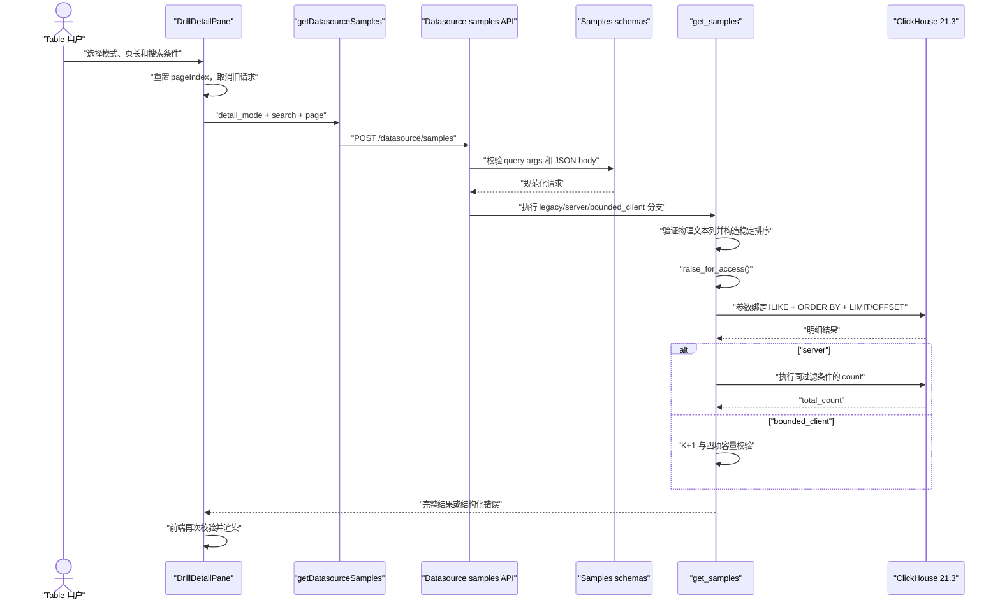
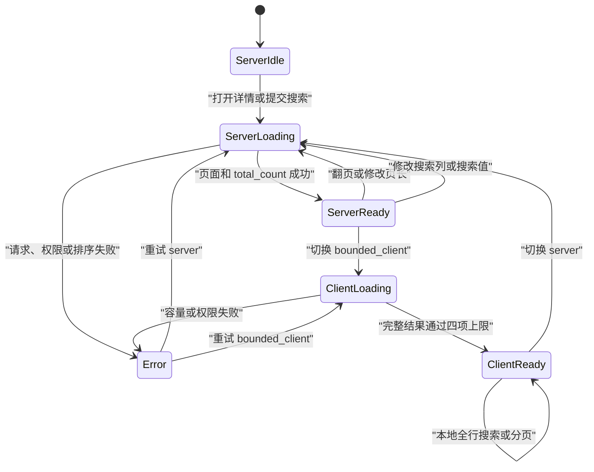
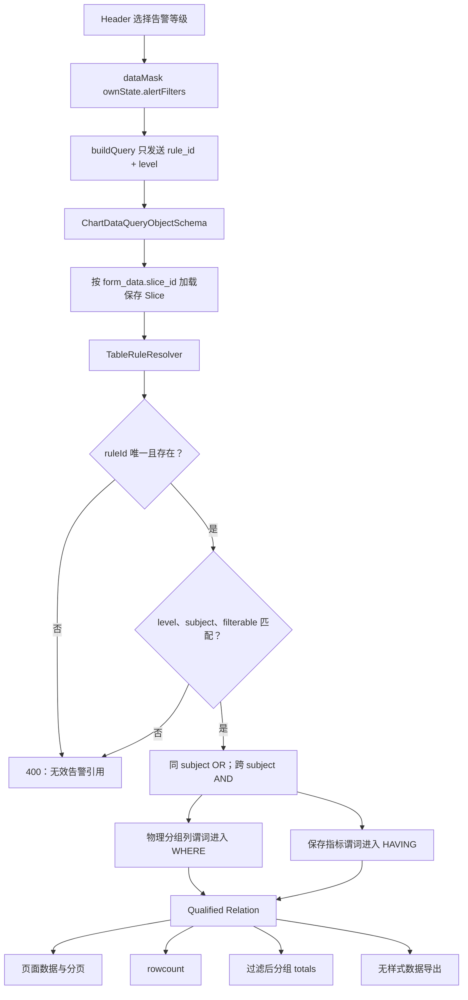
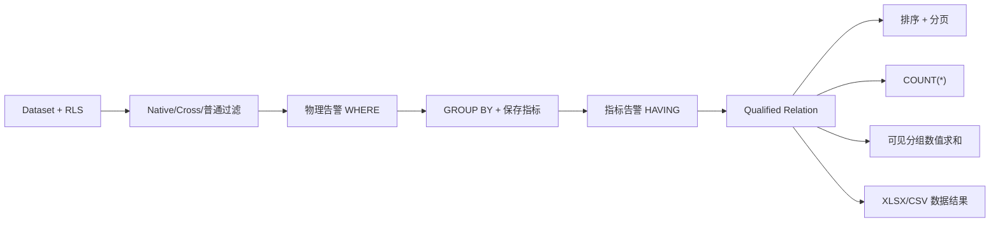
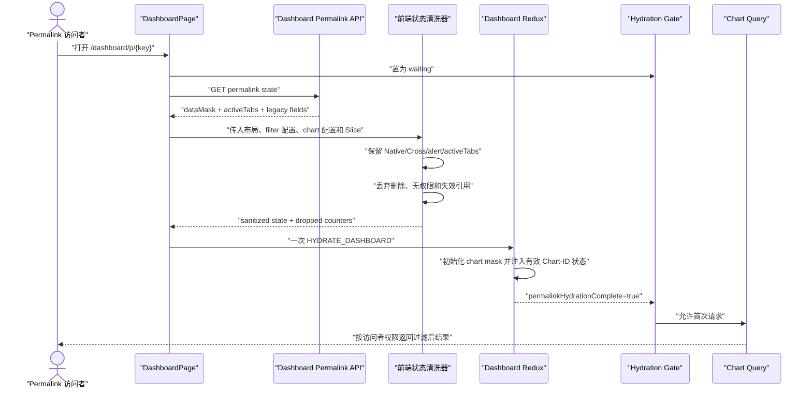
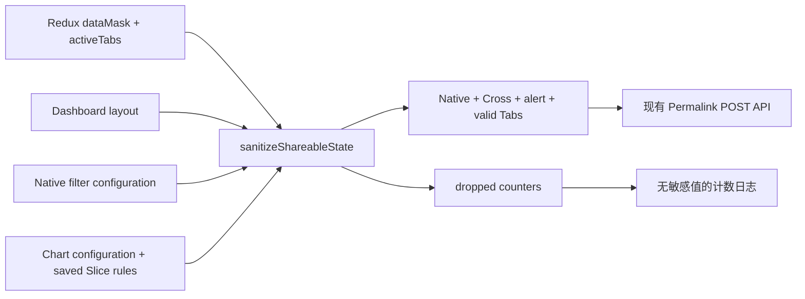
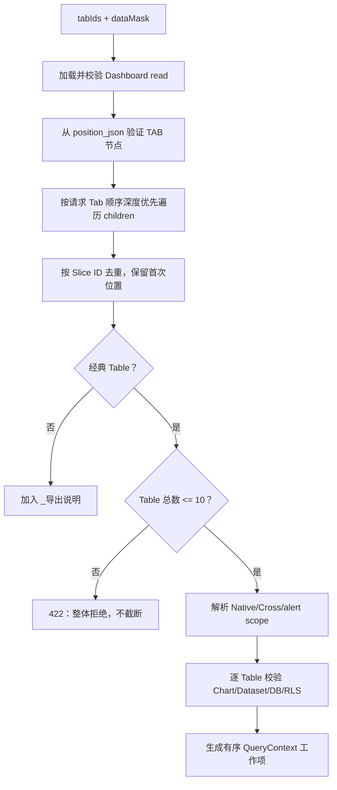
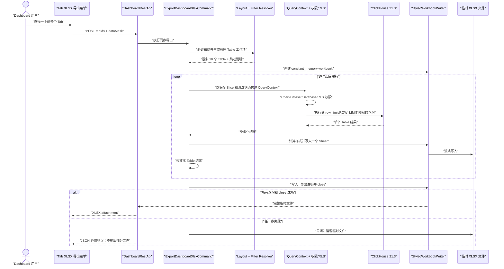
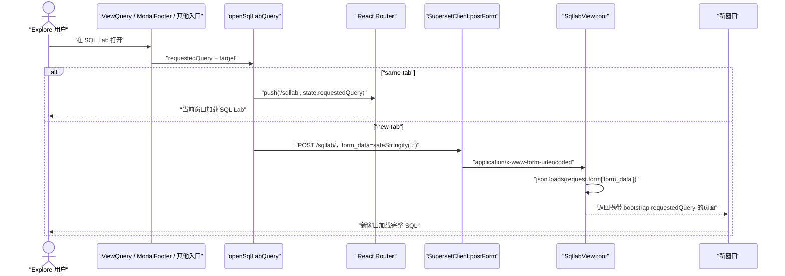
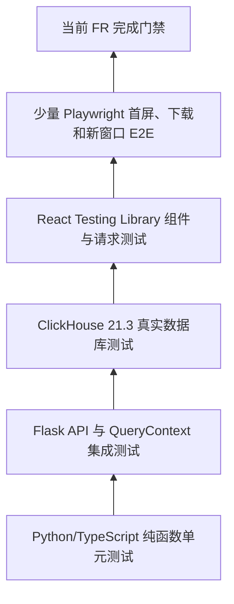

<!--
Licensed to the Apache Software Foundation (ASF) under one
or more contributor license agreements.  See the NOTICE file
distributed with this work for additional information
regarding copyright ownership.  The ASF licenses this file
to you under the Apache License, Version 2.0 (the
"License"); you may not use this file except in compliance
with the License.  You may obtain a copy of the License at

  http://www.apache.org/licenses/LICENSE-2.0

Unless required by applicable law or agreed to in writing,
software distributed under the License is distributed on an
"AS IS" BASIS, WITHOUT WARRANTIES OR CONDITIONS OF ANY
KIND, either express or implied.  See the License for the
specific language governing permissions and limitations
under the License.
-->

# Superset 数据质量 BI 增强实施计划

| 属性          | 值                                                                                                          |
| ------------- | ----------------------------------------------------------------------------------------------------------- |
| 文档版本      | V1.4                                                                                                        |
| 文档状态      | Implemented（验收持续补充）                                                                                 |
| 日期          | 2026-08-24                                                                                                  |
| 需求输入      | 数据质量 BI 增强需求 V1.4                                                                                   |
| 详细设计      | [数据质量 BI 增强详细设计](./superset-data-quality-bi-detailed-design.md) V1.4                              |
| 补充设计      | [ClickHouse 21.3 兼容与 Drill Detail 表格对齐](./superset-clickhouse-21-3-drill-detail-alignment-design.md) |
| 原始实现基线  | `dev/6.1`，`c83fb2bb1dcf`（Superset 6.1.0 RC3）                                                             |
| 增量审计基线  | `dev/6.1`，`5f4c1760262a`                                                                                   |
| As-built 基线 | `dev/6.1`，`ac5b40bb36`                                                                                     |
| 数据库基线    | ClickHouse `21.3.20.1`                                                                                      |
| 文档目标      | 规定 FR-01～FR-05 的严格实施顺序、代码内容和逐项验收门禁                                                    |
| 功能代码状态  | FR-01～FR-05 已提交；CH-13/UI-DTD-01 为 `c18ed1fd02`；Header 色块化由 `ac5b40bb36` 实现并验证               |

## 1. 计划结论

实施必须严格按照 `FR-01 → FR-02 → FR-03 → FR-04 → FR-05` 顺序进行。一个 FR
未完成编码、自动化测试和验收门禁前，不得开始下一个 FR，也不得以“公共基础能力”名义
提前实现后续 FR 才会使用的组件。

公共能力按“首个实际消费者”归属：

| 能力                                     | 首次允许实现的 FR | 约束                                                             |
| ---------------------------------------- | ----------------- | ---------------------------------------------------------------- |
| Drill Detail 请求模型和容量检查          | FR-01             | 只服务 Drill Detail，不抽象为通用 Table 查询框架                 |
| `TableRuleResolver` 查询规则解析         | FR-02             | FR-02 只实现告警验证、过滤和缓存指纹，不提前实现 XLSX 样式       |
| 前端 `ShareableDashboardState` 清洗器    | FR-03             | 只实现 Permalink 保存与恢复所需能力                              |
| 服务端 Dashboard 状态解析器              | FR-04             | 到 Dashboard XLSX 实际需要时才实现；复用 FR-03 契约 fixtures     |
| `TableRuleResolver` 的 XLSX 样式求值扩展 | FR-04             | 在 FR-02 已完成的可信规则模型上增量实现                          |
| `StyledWorkbookWriter`                   | FR-04             | 不在 FR-02 条件格式开发时提前创建                                |
| SQL Lab 统一导航帮助函数                 | FR-05             | 不与前四项公共化或提前迁移                                       |
| Feature Flag                             | 各自 FR           | 只在开始对应 FR 时加入该 FR 所需 Flag，不一次性提前加入六个 Flag |

Sparkline、多级下钻、异步 Dashboard 导出和数据库迁移不在本计划范围内。

## 2. 严格顺序和门禁模型

### 2.1 总体实施流


“门禁通过”同时要求：

1. 当前 FR 的实现内容全部完成；
2. 当前 FR 新增单元测试和集成测试通过；
3. Feature Flag 关闭时旧行为回归通过；
4. 当前 FR 的 ClickHouse 21.3 用例通过；
5. 权限、安全、日志和错误信息检查通过；
6. 当前 FR 的变更已完成代码评审，且没有遗留阻塞缺陷；
7. 目标文件 pre-commit 和 `git diff --check` 通过。

Superset 应用未启动时，只能完成纯函数单元测试和静态检查，API、UI 或 E2E 门禁不能
被标记为通过。As-built 阶段已恢复 `localhost:8088` 和前端 `localhost:9001`，并完成
本机 Drill Detail 增量验收；未执行的跨平台场景仍需单独标记。

### 2.2 每个 FR 的提交边界

每个 FR 使用独立、可回退的提交序列。建议一个 FR 内按以下顺序提交：

1. 契约和 Feature Flag；
2. 后端实现与后端测试；
3. 前端实现与前端测试；
4. ClickHouse 21.3 集成验证；
5. 文档、可观测性和最终回归修正。

上述顺序是单个 FR 内部顺序，不授权提前提交下一 FR 的类型、Flag、空模块或接口桩。

### 2.3 Feature Flag 增量加入顺序

| FR    | 本阶段新增 Flag                    | 默认值  | 依赖                      |
| ----- | ---------------------------------- | ------- | ------------------------- |
| FR-01 | `DRILL_DETAIL_CONFIGURABLE_TABLE`  | `false` | 无                        |
| FR-02 | `TABLE_ALERT_FILTERS`              | `false` | 无                        |
| FR-03 | `DASHBOARD_CROSS_FILTER_PERMALINK` | `false` | 无                        |
| FR-04 | `STYLED_XLSX_EXPORT`               | `false` | 无                        |
| FR-04 | `DASHBOARD_TAB_XLSX_EXPORT`        | `false` | `STYLED_XLSX_EXPORT=true` |
| FR-05 | `LONG_SQL_POST_NAVIGATION`         | `false` | 无                        |

后端 Flag 加入 `superset/config.py`，前端枚举按字母顺序加入
`superset-frontend/packages/superset-ui-core/src/utils/featureFlags.ts`。Flag 关闭时前端不得
发送新字段，后端必须保留旧请求路径和旧响应语义。

## 3. 实施准备和事实基线

### 3.1 已完成的准备资产

以下内容是实施输入，不属于功能实现：

- 详细设计：`docs/designs/superset-data-quality-bi-detailed-design.md`；
- ClickHouse 建数脚本：`tests/testdata/clickhouse_21_3/seed.sql`；
- ClickHouse 数据门禁：`tests/testdata/clickhouse_21_3/validate.sql`；
- 一键脚本：`scripts/tests/seed_clickhouse_21_3.sh`；
- 本机测试库：8 张物理表、1 个视图、92,000 行；
- 完整测试设计：详细设计第 18 章中的 61 个测试用例。

设计阶段本机 Superset 尚未启动；实施阶段已恢复 `localhost:8088` 与前端
`localhost:9001`。该事实不自动代表所有 API/UI/E2E 用例均已执行，具体证据仍按每项
完成记录判断。

### 3.2 每个 FR 开始前的固定检查

```bash
curl -f http://localhost:8088/health
scripts/tests/seed_clickhouse_21_3.sh
git status --short
```

预期 ClickHouse SQLAlchemy URI 为：

```text
clickhousedb+connect://default:@127.0.0.1:8123/superset_quality_21_3
```

本机访问必须确保 `127.0.0.1` 和 `localhost` 位于 `NO_PROXY`。版本门禁必须确认服务端为
`21.3.x`，不能用本机较新版本 client 的版本替代 server 版本。

### 3.3 不得修改的既有语义

- Dataset、Database、Dashboard、Chart、RLS 和 Guest Token 权限继续走既有流程；
- 旧 Slice 无新增 `form_data` 字段时保持旧行为；
- 旧 `/datasource/samples` 调用保持兼容；
- 旧 Permalink 仍可打开；
- 未请求样式的旧 XLSX 保持原结果；
- Dataset PUT JSON 保存和 SQL Lab execute POST JSON 不做无关重构；
- 不记录 SQL 正文、筛选值、阈值或数据库异常堆栈。

## 4. FR-01：下钻详情分页与搜索

### 4.1 实现目标和边界

FR-01 只改造聚合模式经典 Table 的 Drill Detail。主 Table 已有分页和搜索能力不重写，
FR-02 的告警规则、FR-03 的 Permalink、FR-04 的 XLSX 和 FR-05 的导航均不得在本阶段
修改。

新增 `form_data` 字段：

| 字段                              | 默认值  | 校验           |
| --------------------------------- | ------- | -------------- |
| `drill_detail_server_pagination`  | `true`  | boolean        |
| `drill_detail_server_page_length` | `50`    | integer 1～200 |
| `drill_detail_client_page_length` | `50`    | integer 1～200 |
| `drill_detail_include_search`     | `false` | boolean        |

本 FR 同时加入 `DRILL_DETAIL_CONFIGURABLE_TABLE`，不得加入其余五个 Flag。

### 4.2 代码范围

| 层次       | 主要文件                                                                | 实现内容                                 |
| ---------- | ----------------------------------------------------------------------- | ---------------------------------------- |
| 类型       | `plugins/plugin-chart-table/src/types.ts`                               | 四个可选 `form_data` 字段                |
| Explore    | `plugins/plugin-chart-table/src/controlPanel.tsx`                       | 聚合 Table 专属控件、显示条件和校验      |
| Drill UI   | `src/components/Chart/DrillDetail/DrillDetailPane.tsx`                  | 两种模式、搜索、分页和状态重置           |
| Drill 工具 | `src/components/Chart/DrillDetail/utils.ts`                             | FR-01 专属请求参数和前端容量检查         |
| API 调用   | `src/components/Chart/chartAction.ts`                                   | 类型化 `detailMode`、`search` 和分页参数 |
| Schema     | `superset/views/datasource/schemas.py`                                  | `detail_mode` 和嵌套 `search` 校验       |
| View       | `superset/views/datasource/views.py`                                    | 向 `get_samples` 传递新参数              |
| 查询       | `superset/views/datasource/utils.py`                                    | legacy/server/bounded_client 三分支      |
| 后端测试   | `tests/integration_tests/datasource/`、相关 unit test                   | 协议、权限、排序和容量边界               |
| 前端测试   | `DrillDetailPane.test.tsx`、`chartAction` 测试、Table controlPanel 测试 | 控件、请求和交互状态                     |

若实现过程中需要拆分后端函数，只能创建 Drill Detail 专属模块，例如
`superset/views/datasource/drill_detail.py`；不得创建声称为 FR-02～FR-04 服务的通用查询框架。

### 4.3 后端实现设计

`SamplesRequestSchema` 增加可选 `detail_mode`：

- 未传：进入现有 legacy 分支；
- `server`：要求合法 `page` 和 `per_page`，页长最大 200；
- `bounded_client`：忽略分页位置，查询固定使用 K+1，即 1001 行。

`SamplesPayloadSchema` 增加：

```json
{
  "search": {
    "column": "customer_name",
    "value": "Acme"
  }
}
```

后端执行顺序固定为：

1. Marshmallow 校验 mode、page、per-page、search 长度；
2. 加载 Dataset 并执行现有 Dashboard Guest 访问校验；
3. 验证搜索列是当前 Dataset 可见的物理文本字段；
4. 将搜索转换为参数绑定的前缀 `ILIKE` 标准 filter；
5. 从返回投影中生成确定性物理标量排序；
6. `server` 模式执行 count 和当前页查询；
7. `bounded_client` 模式执行 K+1，不执行独立 count；
8. 执行 `raise_for_access()` 后读取结果；
9. 计算行、单元格、UTF-8 JSON 总字节和最大单元格字节；
10. 任一上限失败则返回对应 422，不返回部分结果。

容量上限：

| 维度       | 上限   | 错误码                                |
| ---------- | ------ | ------------------------------------- |
| 行数       | 1,000  | `DRILL_DETAIL_ROW_LIMIT_EXCEEDED`     |
| 单元格     | 50,000 | `DRILL_DETAIL_CELL_LIMIT_EXCEEDED`    |
| 总载荷     | 8 MiB  | `DRILL_DETAIL_PAYLOAD_LIMIT_EXCEEDED` |
| 单个单元格 | 1 MiB  | `DRILL_DETAIL_CELL_SIZE_EXCEEDED`     |

完全没有可排序标量字段时返回
`DRILL_DETAIL_STABLE_ORDER_UNAVAILABLE`（422）。ClickHouse Nullable 排序显式生成
`isNull(column), column`，不依赖 MergeTree 物理顺序。

### 4.4 请求和查询时序



### 4.5 前端状态设计



前端实现要求：

- 使用 `AbortController` 取消模式切换前的未完成请求；
- Server 模式搜索显示文本字段选择器，Client 模式复用 DataTable 全行匹配；
- 模式、页长、搜索列或搜索值改变时回到第一页；
- `drill_detail_include_search=false` 时不渲染 Select/Input 或隐藏 DOM；
- 错误保留 Drawer 和用户配置，不自动退回截断结果；
- 不使用 `any`，请求和响应建立明确 TypeScript 类型。

### 4.6 实施步骤

| 步骤   | 实现内容                                          | 完成证据                             |
| ------ | ------------------------------------------------- | ------------------------------------ |
| FR1-01 | 只加入 FR-01 Flag，并补充前后端 Flag 关闭测试     | Flag 默认 false，旧请求不带新字段    |
| FR1-02 | 增加 Table `form_data` 类型和 Explore 控件        | aggregate Table 显示，其他模式不显示 |
| FR1-03 | 扩展 `getDatasourceSamples` 类型、参数和兼容调用  | legacy 调用序列化结果不变            |
| FR1-04 | 扩展 Marshmallow schema 和错误响应                | mode、页长、搜索字段边界测试通过     |
| FR1-05 | 实现 Server 模式前缀搜索、稳定排序、分页和 count  | ClickHouse 第 1、2、50 页结果稳定    |
| FR1-06 | 实现 bounded client K+1 与四项服务端容量检查      | 四类边界均拒绝且不静默截断           |
| FR1-07 | 实现 Drill UI 两种状态机、取消请求和搜索 DOM 控制 | RTL 交互测试通过                     |
| FR1-08 | 实现前端容量复核、错误展示和本地搜索              | 成功、超限、重试测试通过             |
| FR1-09 | 完成 Dataset/RLS/Guest 权限集成测试               | 无权请求不能读取 count 或 sample     |
| FR1-10 | 执行 FR-01 全部回归和 ClickHouse 21.3 验收        | FR-01 门禁签字后才允许开始 FR-02     |

### 4.7 测试和完成定义

必须覆盖详细设计中的 FR1-T01～FR1-T12。ClickHouse 重点使用：

- `dim_customer` 验证 `Acme%` 的 2,500 行前缀搜索；
- `fact_events` 验证重复排序键和稳定翻页；
- `drill_wide_flat` 验证 50,000 单元格边界；
- `export_edge_cases` 验证 8 MiB 和 1 MiB 边界。

FR-01 完成定义：四个字段可保存和恢复；两种模式均工作；所有容量错误明确；旧 Slice 和
旧 Samples 请求不变；权限测试通过；Flag 关闭回归通过；FR-01 无阻塞缺陷。

## 5. FR-02：Table 告警颜色筛选

### 5.1 启动条件和阶段边界

只有 FR-01 完成定义全部满足后才能开始 FR-02。本阶段首次创建
`TableRuleResolver`，但只实现告警筛选所需的规则加载、验证、谓词编译和缓存指纹。
不得在本阶段实现 Excel 格式、Workbook、Dashboard Tab 或服务端 Dashboard 状态清洗。

本 FR 只加入 `TABLE_ALERT_FILTERS`。

### 5.2 规则契约

扩展既有 `ConditionalFormattingConfig`：

```ts
type AlertLevel = 'RED' | 'YELLOW' | 'GREEN';

type AlertSubjectRef =
  | { kind: 'physical_column'; key: string }
  | { kind: 'saved_metric'; key: string };

interface AlertRuleExtension {
  ruleId?: string;
  subjectRef?: AlertSubjectRef;
  alertLevel?: AlertLevel;
  filterable?: boolean;
}
```

旧规则继续显示样式，但缺少扩展字段时不能参与筛选。只有确定性数值规则允许
`filterable=true`；渐变、字符串、adhoc metric、后处理结果和 `CELL_BAR` 不得成为告警
筛选谓词。

客户端状态只保存引用：

```json
{
  "ownState": {
    "alertFilters": [{ "ruleId": "ecb91a4e-...", "level": "RED" }]
  }
}
```

Table Header 运行时筛选菜单使用无方向性颜色块，而不是直接显示 `RED/YELLOW/GREEN` 或状态图标：

> FR-02 原提交仍显示原始枚举文字；V1.3 follow-up `0da4a89de1` 将文字替换为可访问状态图标；
> V1.4 follow-up `ac5b40bb36` 再将状态图标替换为统一的颜色块。两次修改都只调整运行时菜单
> 展示与可访问语义，不修改协议或 Explore 条件格式编辑器。

| 内部等级 | 可见色块           | 主题色               | 可访问名称 |
| -------- | ------------------ | -------------------- | ---------- |
| `RED`    | `AlertLevelSwatch` | `theme.colorError`   | 严重告警   |
| `YELLOW` | `AlertLevelSwatch` | `theme.colorWarning` | 警告告警   |
| `GREEN`  | `AlertLevelSwatch` | `theme.colorSuccess` | 正常状态   |

三个等级使用相同的 16×16 px 圆角方块和主题语义色，不使用 Stop、Warning、CheckCircle 等
带状态导向的 glyph。色块 `aria-hidden`；Tooltip、本地化隐藏文本、`menuitemcheckbox`、
选中勾、`aria-checked`、disabled 和键盘操作确保语义与选中状态不只依赖颜色。Explore
条件格式编辑器继续显示本地化文字；DataMask、QueryObject、Permalink 和服务端协议仍使用
原枚举，不因色块化发生变化。

### 5.3 代码范围

| 层次                        | 主要文件或新增模块                                                      | 实现内容                                   |
| --------------------------- | ----------------------------------------------------------------------- | ------------------------------------------ |
| 公共类型                    | `packages/superset-ui-chart-controls/src/types.ts`                      | 稳定规则 ID、subject、level、filterable    |
| 控件类型                    | `src/explore/components/controls/ConditionalFormattingControl/types.ts` | 编辑器类型同步                             |
| 条件格式 UI                 | `ConditionalFormattingControl` 相关 TSX                                 | 创建 UUID、过滤资格校验、复制生成新 ID     |
| Table UI                    | `plugins/plugin-chart-table/src/TableChart.tsx`                         | Header 等级多选和 ownState 更新            |
| UI Follow-up 01（As-built） | `plugins/plugin-chart-table/src/TableChart.tsx`                         | `0da4a89de1`：图标、Tooltip、a11y 和主题色 |
| UI Follow-up 02（As-built） | `plugins/plugin-chart-table/src/TableChart.tsx`                         | `ac5b40bb36`：统一无方向性色块并保留 a11y  |
| Query 构造                  | `plugins/plugin-chart-table/src/buildQuery.ts`                          | data、rowcount、totals、download 传引用    |
| Schema                      | `superset/charts/schemas.py`                                            | 严格嵌套 `alert_filters`                   |
| 规则服务                    | 新增 `superset/common/table_alerts.py`                                  | 保存 Slice 规则验证、谓词、指纹            |
| 查询关系                    | QueryObject/SQLA 查询构建相关模块                                       | WHERE、HAVING、Qualified Relation          |
| 后端测试                    | `tests/unit_tests/common/`、Chart Data 集成测试                         | 伪造规则、SQL 位置、缓存和一致性           |
| 前端测试                    | Table、buildQuery、条件格式控件测试                                     | 规则生命周期、Header、布尔组合             |

### 5.4 可信边界和查询设计



客户端不能提交 operator、阈值、颜色或 SQL。`TableRuleResolver` 必须从保存的 Slice
`form_data["conditional_formatting"]` 重新加载这些值，并验证 subject 属于保存 Slice 的
Dataset。

同一 subject 的选中规则按 OR，不同 subject 按 AND。物理分组列进入 WHERE，保存指标
进入 HAVING。所有值通过 SQLAlchemy 和数据库驱动参数绑定，标识符通过 dialect quote。

### 5.5 Qualified Relation 和缓存

告警筛选激活后，页面、rowcount、totals 和 download 必须从同一个逻辑关系派生：



缓存键增加：

1. 规范化 WHERE/HAVING；
2. 保存规则的 SHA-256 指纹；
3. 去重并排序后的规则引用语义。

指纹只能由服务端生成。阈值或规则保存顺序变化后不得命中旧缓存；客户端选择顺序不同
但语义相同时应命中同一缓存。

### 5.6 实施步骤

| 步骤               | 实现内容                                                  | 完成证据                                     |
| ------------------ | --------------------------------------------------------- | -------------------------------------------- |
| FR2-01             | 只加入 FR-02 Flag 和关闭态回归                            | Flag 关闭不发送 `alert_filters`              |
| FR2-02             | 扩展条件格式 TypeScript 类型和编辑器                      | 新规则 UUID 稳定，复制生成新 UUID            |
| FR2-03             | 实现可筛选资格校验和旧规则兼容                            | 不支持规则不能选为 filterable                |
| FR2-04             | 实现 Table Header 等级多选和 ownState                     | 同列多选稳定，Cell Bar 不参与                |
| FR2-05             | 扩展 buildQuery 和 Marshmallow schema                     | 只发送最多 50 个唯一引用                     |
| FR2-06             | 创建 FR-02 范围的 `TableRuleResolver`                     | 伪造、过期、level 不符均返回 400             |
| FR2-07             | 编译同 subject OR、跨 subject AND 和 WHERE/HAVING         | 与直接 ClickHouse SQL 结果一致               |
| FR2-08             | 构建 Qualified Relation 并统一 data/count/totals/download | 四类结果集合语义一致                         |
| FR2-09             | 将规则指纹和标准谓词加入缓存键                            | 阈值更新不复用旧缓存                         |
| FR2-10             | 完成样式优先级、NULL、Decimal 和重叠规则前端回归          | 屏幕样式不因筛选实现而退化                   |
| FR2-11             | 完成权限、RLS、ClickHouse 21.3 和组合测试                 | FR-02 门禁签字后才允许开始 FR-03             |
| FR2-UI-FOLLOWUP-01 | 将等级文字替换为图标并补齐 a11y                           | `0da4a89de1`；110 项目标 Jest 与本机 UI 通过 |
| FR2-UI-FOLLOWUP-02 | 将等级状态图标替换为无方向性颜色块并保留 a11y             | `ac5b40bb36`；110 项目标 Jest 与本机 UI 通过 |

### 5.7 测试和完成定义

As-built 覆盖详细设计中的 TC-FR02-01～TC-FR02-12：Header 等级多选与 disabled/键盘状态、
同列 OR、跨列 AND、WHERE/HAVING、伪造规则、旧规则、缓存键、分页/计数/totals/download
一致性和 Cell Bar 独立性。`FR2-UI-FOLLOWUP-01/02` 另外覆盖无方向性颜色块、Tooltip、
可访问名称、主题色、选中勾、Feature Flag、不显示原始枚举文字和不渲染旧状态 glyph；
三个目标测试文件 `110/110` 通过，
`npm run type`、目标 pre-commit 以及 Dashboard 3 鼠标/Enter 的 `97 → 48 → 97` 验收通过。

ClickHouse 使用 `fact_sales` 的 RED 207、YELLOW 5,937、GREEN 13,856 基线，并额外覆盖
Decimal scale、Nullable 和 UInt64。FR-02 完成前不得实现任何 styled XLSX 写入代码。

## 6. FR-03：分享链接携带筛选状态

### 6.1 启动条件和阶段边界

只有 FR-02 完成后才能开始。本阶段实现 Permalink 所需的前端状态清洗器和 hydrate
修正，不实现 Dashboard XLSX API、服务端 Dashboard 导出解析器或 Workbook。

本 FR 只加入 `DASHBOARD_CROSS_FILTER_PERMALINK`。

### 6.2 状态白名单

允许保存和恢复的状态只有：

- 当前 Dashboard 存在的 Native Filter；
- 当前布局和 Chart Configuration 中有效的 Chart-ID Cross Filter；
- 通过 FR-02 保存规则验证的 `ownState.alertFilters`；
- 当前布局中存在的 `activeTabs`。

明确删除分页、页长、Table 搜索、排序、查询结果、loading、cache key 和临时 UI 状态。
前端契约建议放入 Dashboard permalink/state 相关目录，不创建通用应用状态框架。

### 6.3 代码范围

| 层次     | 主要文件或新增模块                                               | 实现内容                         |
| -------- | ---------------------------------------------------------------- | -------------------------------- |
| 类型     | `superset-frontend/src/dashboard/types.ts` 或 permalink 专属类型 | `ShareableDashboardState`        |
| 清洗器   | Dashboard permalink 目录新增 `sanitizeShareableState.ts`         | 保存前和 hydrate 前白名单        |
| 分享入口 | `dashboard/components/menu/ShareMenuItems/` 等现有入口           | POST 前调用清洗器                |
| 初始化   | `dashboard/containers/DashboardPage.tsx`                         | 明确 Permalink Hydration 阶段    |
| Action   | `dashboard/actions/hydrate.ts`                                   | 传递已清洗的完整 DataMask        |
| Reducer  | `src/dataMask/reducer.ts`                                        | 恢复有效 Chart-ID Cross/ownState |
| 契约测试 | Dashboard fixtures 和 sanitizer tests                            | 删除、无效、旧状态和权限相关场景 |
| UI/E2E   | Dashboard 首屏请求测试                                           | 首次 Chart 请求已经带恢复状态    |

### 6.4 首屏恢复时序



必须保证首次 Chart 请求已经携带恢复状态，禁止先请求无筛选结果再二次刷新。清洗失败的
单个引用静默丢弃；Permalink API 整体失败则按现有错误策略处理，不使用未验证状态。

### 6.5 保存路径设计



保存和恢复使用同一清洗函数。恢复时额外考虑访问者可见对象集合；失效规则通过 FR-02
规则契约验证，但不能将阈值或筛选值写入日志。

### 6.6 实施步骤

| 步骤   | 实现内容                                        | 完成证据                                     |
| ------ | ----------------------------------------------- | -------------------------------------------- |
| FR3-01 | 只加入 FR-03 Flag 和关闭态回归                  | 旧 Permalink hydrate 行为不变                |
| FR3-02 | 定义 `ShareableDashboardState` 和 JSON fixtures | 类型不包含分页、搜索、排序或结果             |
| FR3-03 | 实现保存前 sanitizer                            | payload 只含白名单状态                       |
| FR3-04 | 实现恢复前 sanitizer 和 dropped counters        | 失效对象被静默删除，不记录值                 |
| FR3-05 | 修正 `HYDRATE_DASHBOARD` 的 DataMask 恢复       | Native、Cross、alert ownState 同时进入 Redux |
| FR3-06 | 增加 hydration gate                             | 首次请求前 `permalinkHydrationComplete`      |
| FR3-07 | 覆盖删除 Chart/Filter/Tab、旧链接、无权限对象   | 页面可用且没有二次闪烁                       |
| FR3-08 | 使用 ClickHouse 验证组合状态实际 SQL 结果       | 不只断言 Redux；结果与直接 SQL 相等          |
| FR3-09 | 完成 FR-03 全部回归                             | 门禁签字后才允许开始 FR-04                   |

### 6.7 测试和完成定义

必须覆盖详细设计中的 FR3-T01～FR3-T08。重点断言首次 Chart 请求体，而不是只断言最终 UI；
访问者权限、RLS 和 Guest Token 必须重新执行。Permalink 中不得保存 ClickHouse URI、SQL、
结果数据或服务端解析后的阈值。

## 7. FR-04：带格式 XLSX 与 Tab 多 Sheet 导出

### 7.1 启动条件和阶段边界

只有 FR-03 完成后才能开始。本阶段才允许：

- 扩展 FR-02 `TableRuleResolver`，增加静态样式求值；
- 根据 FR-03 共享契约实现服务端 Dashboard 状态解析器；
- 创建 styled workbook writer；
- 新增 Dashboard Tab XLSX API 和 UI。

本阶段加入 `STYLED_XLSX_EXPORT` 和 `DASHBOARD_TAB_XLSX_EXPORT`。后者必须依赖前者，
两者默认关闭。

### 7.2 单 Table 接口和实现

Chart Data QueryContext 顶层增加：

```json
{
  "result_format": "xlsx",
  "result_type": "full",
  "result_format_options": {
    "styled": true
  }
}
```

`styled` 默认 false。只有 Flag 开启、请求 XLSX、显式 styled、保存 Slice 可访问且
`viz_type=table` 时进入样式路径。样式必须从保存 Slice 读取；请求内携带的
`conditional_formatting` 不可信。普通 XLSX 继续走现有 `df_to_excel`。

### 7.3 Dashboard Tab API 和代码范围

新增：

```http
POST /api/v1/dashboard/{id}/export_xlsx/
Content-Type: application/json
```

```json
{
  "tabIds": ["TAB-a1b2"],
  "dataMask": {}
}
```

| 层次         | 主要文件或新增模块                                | 实现内容                            |
| ------------ | ------------------------------------------------- | ----------------------------------- |
| Chart schema | `superset/charts/schemas.py`                      | 顶层 `result_format_options`        |
| Chart 导出   | `superset/common/query_context_processor.py`      | 单 Table styled 路径                |
| 样式工具     | 扩展 `superset/common/table_alerts.py`            | 前端一致的静态样式求值              |
| Excel 工具   | 新增 `superset/utils/styled_excel.py`             | constant-memory、多 Sheet、安全写入 |
| API schema   | `superset/dashboards/schemas.py`                  | `tabIds`、`dataMask` 严格 schema    |
| API          | `superset/dashboards/api.py`                      | `POST /{id}/export_xlsx/`           |
| Command      | 新增 `superset/commands/dashboard/export_xlsx.py` | 布局、权限、查询和 Workbook 编排    |
| 状态解析     | Dashboard 导出 command 的专属 resolver            | Native/Cross/alert scope            |
| Dashboard UI | Header 导出菜单相关组件                           | Tab 选择、下载和错误展示            |
| 测试         | Excel unit、Dashboard API/command、前端菜单测试   | 样式、顺序、权限、原子性和资源上限  |

### 7.4 Tab 解析和状态作用域



服务端不接受客户端提供 Chart 清单或 scope。Native Filter scope、Cross Filter source 和
target 均从保存 Dashboard 配置推导；告警引用再次通过 `TableRuleResolver` 验证。

### 7.5 Workbook 原子写入时序



### 7.6 样式和安全写入设计

`TableRuleResolver` 在本 FR 增加样式求值接口，但继续只读取保存规则。求值顺序必须与
Table 前端一致：规则按保存顺序执行，同一样式维度最后一个命中规则生效；Cell Bar 与
告警等级筛选独立。

Workbook 写入要求：

- XlsxWriter 使用 `constant_memory` 和显式临时文件；
- 同时只保留一个 Chart 查询结果；
- Date、DateTime、Decimal、Nullable、LowCardinality 和 UInt64 显式归一化；
- 超过 15 位整数按文本写入，禁止经过 JavaScript Number 或 Python float；
- `=`, `+`, `-`, `@`、tab、carriage return 前缀执行公式注入防护；
- 清理 Excel 禁止的控制字符，保留合法 Unicode 和换行；
- Cell Bar 使用 Excel 原生 Data Bar；
- Sheet 名替换非法字符、限制 31 字符并使用稳定冲突后缀；
- 任一查询或 Workbook close 失败都清理临时文件并返回 JSON 错误。

### 7.7 实施步骤

| 步骤   | 实现内容                                               | 完成证据                             |
| ------ | ------------------------------------------------------ | ------------------------------------ |
| FR4-01 | 加入两个 FR-04 Flag、依赖校验和关闭态回归              | Tab Flag 不可脱离 Styled Flag 生效   |
| FR4-02 | 扩展 Chart Data 顶层 schema 和单 Table styled 分支     | 旧 XLSX 字节语义不受请求缺省影响     |
| FR4-03 | 扩展 FR-02 resolver 的样式求值，不改变过滤语义         | 前后端边界 fixtures 一致             |
| FR4-04 | 实现安全单 Sheet writer                                | 公式、长整数、控制字符和样式测试通过 |
| FR4-05 | 增加 Dashboard API schema、权限装饰器和错误映射        | 400/403/404/422 契约通过             |
| FR4-06 | 实现 position_json Tab 验证、DFS、去重和 10 Table 上限 | 嵌套 Tab 和重复 Slice 顺序稳定       |
| FR4-07 | 实现服务端 Dashboard Native/Cross/alert 状态解析       | 与 FR-03 JSON fixtures 契约一致      |
| FR4-08 | 实现逐 Table QueryContext、Chart/Dataset/DB/RLS 校验   | 任一无权时整体失败                   |
| FR4-09 | 实现 constant-memory 多 Sheet writer 和 `_导出说明`    | 串行执行，单表结果及时释放           |
| FR4-10 | 实现临时文件生命周期和响应完成后的清理                 | 查询、close、客户端断开路径无残留    |
| FR4-11 | 实现 Dashboard Tab 选择菜单、下载和通用错误反馈        | UI 不暴露 SQL、筛选值或数据库详情    |
| FR4-12 | 完成 ClickHouse 类型、内存、原子失败和权限回归         | FR-04 门禁签字后才允许开始 FR-05     |

### 7.8 测试和完成定义

必须覆盖详细设计中的 FR4-T01～FR4-T14。除文件存在外，还必须解析生成的 XLSX，断言：

- Sheet 顺序、名称和去重结果；
- 单元格值、类型、背景色、文字色和 Data Bar；
- `_导出说明` 内容不泄露敏感信息；
- 公式前缀被保护、UInt64 数字完整；
- 失败请求没有返回 XLSX magic bytes，也没有遗留临时文件；
- 峰值内存符合“单 Chart 结果 + constant-memory workbook”的设计上界。

## 8. FR-05：复杂 SQL 可靠传输

### 8.1 启动条件和阶段边界

只有 FR-04 完成后才能开始。FR-05 不修改 Dataset PUT 保存或 SQL Lab execute API，只
修复 Explore/SQL Lab 导航时把 SQL 放入 URL或使用错误表单协议的问题。

本 FR 加入最后一个 Flag：`LONG_SQL_POST_NAVIGATION`。

### 8.2 统一导航契约

新增：

```text
superset-frontend/src/SqlLab/utils/openSqlLabQuery.ts
```

建议接口：

```ts
interface OpenSqlLabQueryOptions {
  requestedQuery: RequestedQuery;
  target: 'same-tab' | 'new-tab';
  navigate?: (location: SqlLabLocation) => void;
}

export async function openSqlLabQuery(
  options: OpenSqlLabQueryOptions,
): Promise<void>;
```

行为：

- same-tab：React Router location state 携带 `requestedQuery`，URL 只有 `/sqllab`；
- new-tab：`SupersetClient.postForm(ensureAppRoot('/sqllab/'),
{form_data: safeStringify(requestedQuery)})`；
- POST 失败显示 toast，不降级成携带 SQL 的 GET；
- 日志只记录字符数、UTF-8 字节数、SHA-256 前 12 位和结果状态。

### 8.3 导航时序



### 8.4 代码范围

| 文件或模块                                                                   | 实现内容                              |
| ---------------------------------------------------------------------------- | ------------------------------------- |
| `superset-frontend/src/SqlLab/utils/openSqlLabQuery.ts`                      | 类型化统一帮助函数                    |
| `superset-frontend/src/explore/components/controls/ViewQuery.tsx`            | 删除 `window.open(...&sql=...)`       |
| `superset-frontend/src/explore/components/controls/ViewQueryModalFooter.tsx` | 修正 `postForm` 后端协议              |
| `DatasourceControl/index.tsx` 和 Chart action 中相关新窗口入口               | 复用帮助函数，不重复序列化            |
| 对应 Jest/RTL 测试                                                           | URL、form body、错误和 Unicode 完整性 |
| SQL Lab view 集成测试                                                        | `form_data` 解析和 bootstrap 完整性   |

Saved Query ID、query ID 等不包含 SQL 正文的 URL 不在替换范围内。

### 8.5 实施步骤

| 步骤   | 实现内容                                            | 完成证据                            |
| ------ | --------------------------------------------------- | ----------------------------------- |
| FR5-01 | 加入 FR-05 Flag 和关闭态回归                        | 关闭时保持原兼容路径                |
| FR5-02 | 定义 `RequestedQuery` 导航类型和统一帮助函数        | 无 `any`，same/new tab 单元测试通过 |
| FR5-03 | 迁移 `ViewQuery`                                    | 新窗口 URL 不含 SQL                 |
| FR5-04 | 迁移 `ViewQueryModalFooter` 并修正 `form_data` 包装 | 后端收到可解析 JSON                 |
| FR5-05 | 迁移其他携带 SQL 正文的新窗口入口                   | 全仓搜索无新增 `?sql=` 路径         |
| FR5-06 | 增加 300 行、至少 12,000 Unicode 字符逐字节测试     | CJK、emoji、换行、tab、引号均一致   |
| FR5-07 | 验证日志、错误提示、URL、Referer 和浏览器历史       | 均不出现 SQL 正文                   |
| FR5-08 | 完成 ClickHouse 21.3 执行型长 SQL 和最终回归        | FR-05 门禁通过                      |

### 8.6 测试和完成定义

必须覆盖详细设计中的 FR5-T01～FR5-T07。传输型长 SQL 验证完整恢复，不要求整段可执行；
执行型 fixture 使用 300 行注释加 ClickHouse 21.3 支持的 SELECT，同时验证 SQL Lab submit、
query record 和成功状态。网络或代理 502 必须标记为 Environment Blocked，不能误报为 SQL
兼容失败。

## 9. 分 FR 测试执行计划

### 9.1 自动化层级



测试优先级为单元测试高于集成测试，集成测试高于 E2E。E2E 仅覆盖必须依赖浏览器行为的
首屏 hydration、文件下载和新窗口 POST；不使用新增 Cypress 测试。

### 9.2 每项 FR 的最低测试命令

实际文件名在实现时确定，命令模板如下：

```bash
# 后端目标测试
pytest tests/unit_tests/<fr-target>/
pytest tests/integration_tests/<fr-target>/

# 前端目标测试
npm run test -- <fr-target>.test.ts
npm run test -- <fr-target>.test.tsx

# ClickHouse 数据门禁
scripts/tests/seed_clickhouse_21_3.sh

# 改动文件检查
pre-commit run --files <changed-files>
git diff --check
```

每个 FR 结束时再运行其影响范围的既有回归。只有准备 push 时才执行仓库强制要求的：

```bash
pre-commit run --all-files
```

### 9.3 Feature Flag 组合矩阵

| 场景                | 预期                                             |
| ------------------- | ------------------------------------------------ |
| 所有 Flag 关闭      | Superset 6.1 既有行为，前端不发送任何新字段      |
| 仅当前 FR Flag 开启 | 只出现当前已完成 FR 的能力                       |
| 已完成 FR 累积开启  | 已完成能力可以组合，页面/查询/导出结果一致       |
| 后续 FR Flag        | 在其实现之前配置中不存在，不创建空 Flag 或空入口 |
| Tab XLSX 单独开启   | 不生效并报告配置依赖，必须同时开启 Styled XLSX   |

### 9.4 ClickHouse 21.3 分阶段数据映射

| FR    | 主要 fixture                                     | 验证目标                                |
| ----- | ------------------------------------------------ | --------------------------------------- |
| FR-01 | `dim_customer`、`fact_events`、`drill_wide_flat` | 搜索、稳定页、行/列/字节容量            |
| FR-02 | `fact_sales`、`fact_inventory`                   | 告警分布、Decimal、WHERE/HAVING、totals |
| FR-03 | `fact_sales`、维表                               | Native/Cross/alert/RLS 组合结果         |
| FR-04 | `export_edge_cases`、各事实表                    | 类型、样式、长整数、多 Sheet 和原子失败 |
| FR-05 | `complex_sql_cases`                              | 300 行长 SQL 的传输和 21.3 执行型查询   |

任何一个 FR 开始前 `validate.sql` 25 项检查必须全部通过。测试数据失败时先重新 seed 或修复
fixture，不得继续 UI/API 测试。

## 10. 安全、性能和可观测性实施要求

### 10.1 安全

- 所有查询继续执行现有访问控制和 RLS；
- 搜索值和告警阈值使用参数绑定；
- 告警客户端只提交规则 ID 和 level；
- Dashboard export 不接受客户端 Chart 清单或 scope；
- XLSX 防止公式注入并清除非法控制字符；
- SQL 不进入 URL、Referer、历史、toast 或日志；
- API 错误不包含 SQL、筛选值、阈值、数据库错误详情或 stack trace。

### 10.2 性能

- FR-01 使用页长、K+1 和四项容量限制；
- FR-02 只生成一次规范 Qualified Relation 语义，并保证 cache key 正确；
- FR-03 hydration 完成前不重复请求 Chart；
- FR-04 最多 10 个 Table、串行查询、constant-memory 写入；
- FR-05 表单体至少支持 256 KiB，不增加 SQL 持久化副本。

### 10.3 可观测性

每个 FR 只记录维度和计数：

| FR    | 允许记录                                                   | 禁止记录                      |
| ----- | ---------------------------------------------------------- | ----------------------------- |
| FR-01 | mode、页长、结果行数、容量失败类型、耗时                   | 搜索值、结果数据              |
| FR-02 | 规则数量、subject kind、WHERE/HAVING 数量、缓存命中        | 阈值、过滤值、SQL             |
| FR-03 | 恢复/丢弃 Native/Cross/alert/Tab 数量、hydration 耗时      | DataMask 值                   |
| FR-04 | Table/Sheet 数量、跳过原因计数、字节数、耗时、失败阶段     | 单元格值、SQL、数据库异常详情 |
| FR-05 | 字符数、UTF-8 字节数、哈希前 12 位、same/new tab、结果状态 | SQL 正文                      |

## 11. 发布和回滚计划

### 11.1 发布顺序

发布开启顺序必须与实施顺序一致。每次只开启一个新 Flag，观察错误率、查询耗时、缓存命中、
导出失败和 hydration 丢弃计数后再推进。不得因为所有代码已合并而一次性开启全部 Flag。

### 11.2 回滚单位

- 功能回滚首选关闭当前 FR Feature Flag；
- 代码回滚按 FR 独立提交回退；
- FR-04 Tab 导出异常时先关闭 `DASHBOARD_TAB_XLSX_EXPORT`，单 Table styled 可独立保留；
- 所有新配置均在 JSON/form_data 中，不需要数据库 downgrade；
- 旧 Slice、旧 Permalink 和旧 XLSX 路径必须在回滚后继续可用。

### 11.3 停止条件

出现以下任一情况时停止推进下一个 FR：

- 当前 FR 存在权限绕过、RLS 不一致或敏感信息泄露；
- 页面、count、totals、download 对同一过滤状态结果不一致；
- ClickHouse 21.3 真实数据库用例失败；
- Feature Flag 关闭仍改变旧行为；
- Superset 应用未运行导致 API/UI/E2E 门禁未执行；
- pre-commit、类型检查或目标回归未通过。

## 12. 预计文件变更索引

| FR    | 后端主要范围                                                                                    | 前端主要范围                                                                                  |
| ----- | ----------------------------------------------------------------------------------------------- | --------------------------------------------------------------------------------------------- |
| FR-01 | `superset/views/datasource/{schemas,views,utils}.py`                                            | Table `types/controlPanel`、`DrillDetailPane`、`chartAction`                                  |
| FR-02 | `superset/charts/schemas.py`、`superset/common/table_alerts.py`、查询构建和缓存相关模块         | chart-controls 类型、ConditionalFormattingControl、TableChart、buildQuery                     |
| FR-03 | 现有 Permalink API 仅做兼容验证，原则上不新增后端解析模块                                       | Dashboard sanitizer、share menu、DashboardPage、hydrate action、dataMask reducer              |
| FR-04 | Chart Data schema/processor、Dashboard API/schema/command、`styled_excel.py`、扩展 table_alerts | Dashboard export menu、下载请求和错误反馈                                                     |
| FR-05 | SQL Lab view 仅增加协议回归测试，原则上不新增 endpoint                                          | `SqlLab/utils/openSqlLabQuery.ts`、ViewQuery、ViewQueryModalFooter、其他携带 SQL 的新窗口入口 |

实现时如果实际调用链要求增加文件，必须在当前 FR 的变更说明中记录理由；不得借机修改后续 FR
目录或进行无关重构。

## 13. 原始实施门禁模板

以下清单保留原计划的逐 FR 门禁结构，不表示 As-built 功能尚未实现。实际提交、已执行
验证和待补门禁分别以本文元数据、详细设计追踪矩阵及补充设计第 7 节为准。

### FR-01 完成后

- [ ] 两种 Drill Detail 模式、搜索和四项容量保护可用；
- [ ] ClickHouse 21.3 搜索、稳定页和容量边界通过；
- [ ] FR-01 Flag 关闭回归通过；
- [ ] 尚未出现 FR-02～FR-05 的组件、Flag 或空接口。

### FR-02 完成后

- [ ] 告警规则可信解析、WHERE/HAVING 和四类结果一致；
- [ ] 缓存指纹和前端样式回归通过；
- [ ] `TableRuleResolver` 尚不包含 XLSX writer 或 Dashboard 导出代码；
- [ ] 尚未开始 FR-03。

### FR-03 完成后

- [ ] Permalink 首次请求已携带 Native/Cross/alert/Tab 状态；
- [ ] 无效状态清洗和权限重查通过；
- [ ] 尚未创建 Dashboard XLSX API、服务端导出 resolver 或 Workbook；
- [ ] 尚未开始 FR-04。

### FR-04 完成后

- [ ] 单 Table styled XLSX 和 Dashboard Tab 多 Sheet 可用；
- [ ] 权限、原子失败、内存、类型和安全写入测试通过；
- [ ] 服务端状态解析与 FR-03 fixtures 一致；
- [ ] 尚未开始 FR-05。

### FR-05 和整体完成后

- [ ] 同窗口 state 和新窗口 POST 均保持长 SQL 完整；
- [ ] URL、日志和错误信息不含 SQL；
- [ ] 61 个详细测试用例均已有自动化实现或明确的人工验收记录；
- [ ] 所有 Flag 关闭回归通过；
- [ ] 已完成逐项开启和累计开启组合回归；
- [ ] `pre-commit run --all-files` 在 push 前通过；
- [ ] `git diff --check` 通过；
- [ ] 设计文档、实施计划、代码和测试追踪矩阵一致。
