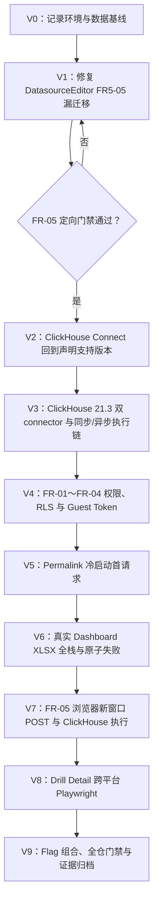
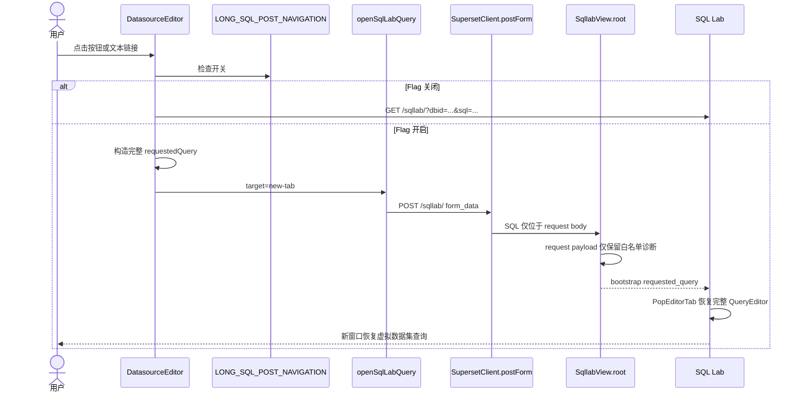

<!--
Licensed to the Apache Software Foundation (ASF) under one
or more contributor license agreements.  See the NOTICE file
distributed with this work for additional information
regarding copyright ownership.  The ASF licenses this file
to you under the Apache License, Version 2.0 (the
"License"); you may not use this file except in compliance
with the License.  You may obtain a copy of the License at

  http://www.apache.org/licenses/LICENSE-2.0

Unless required by applicable law or agreed to in writing,
software distributed under the License is distributed on an
"AS IS" BASIS, WITHOUT WARRANTIES OR CONDITIONS OF ANY
KIND, either express or implied.  See the License for the
specific language governing permissions and limitations
under the License.
-->

# Superset 数据质量 BI 增强补漏与验证执行计划

| 属性         | 值                                                                                                  |
| ------------ | --------------------------------------------------------------------------------------------------- |
| 文档版本     | V1.1                                                                                                |
| 文档状态     | Executing                                                                                           |
| 日期         | 2026-08-24                                                                                          |
| 代码分支     | `dev/6.1`                                                                                           |
| 起始基线     | `4b2b732ecf`                                                                                        |
| 关联设计     | [详细设计](./superset-data-quality-bi-detailed-design.md)                                           |
| 关联计划     | [FR-01～FR-05 实施计划](./superset-data-quality-bi-implementation-plan.md)                          |
| 关联补充设计 | [ClickHouse 21.3 与 Drill Detail 对齐](./superset-clickhouse-21-3-drill-detail-alignment-design.md) |
| 执行原则     | 先关闭 FR-05 明确漏项，再按驱动、执行链、权限/数据一致性、浏览器和跨平台顺序逐项验证                |

## 1. 结论与范围

本计划处理两类事项：

1. 修复 FR5-05 遗漏的虚拟数据集编辑器 `Open in SQL Lab` 新窗口入口；
2. 对已经实现但尚未形成发布级证据的场景逐项验证。`PENDING` 只表示尚未执行；开始执行
   后，完成态只能记录为 `PASS`、`FAIL` 或 `BLOCKED`，不得以单元测试替代真实数据库、
   浏览器或权限链路。

已确认仅为显示问题的经典 Table 服务端分页页长 `0` 不在本计划范围内。FR-01～FR-04
不重新设计功能；验证发现缺陷时，建立独立修复步骤和提交，不借验证进行无关重构。

## 2. 严格执行顺序



每个阶段必须先记录环境和命令，再执行测试，最后更新本文状态。前一阶段出现数据错误、
权限绕过、敏感 SQL 泄露或无法解释的回归时，停止后续阶段；纯环境缺失记录为
`BLOCKED`，不把它写成功能失败。

## 3. V1：FR5-05 DatasourceEditor 补漏方案

### 3.1 现状和影响

`DatasourceEditor.getSQLLabUrl()` 把虚拟数据集的 `datasource.sql` 放入查询字符串；顶部
新窗口按钮和结果/错误提示中的文本链接复用该 URL。即使
`LONG_SQL_POST_NAVIGATION=true`，该入口仍可能遇到 URL 长度限制，并让 SQL 进入浏览器
历史或 Referer。这是原 6.1 路径在 FR5-05 迁移时的遗漏，不是分页、告警颜色或 Drill
Detail 修复引入的回归。

### 3.2 实现设计

1. 扩展 `SqlLabRequestedQuery` 类型，除 `datasourceKey/sql` 外允许虚拟数据集入口需要的
   `dbid`、`name`、`catalog`、`schema`、`autorun` 和 `isDataset`；不使用 `any`。
2. `DatasourceEditor` 增加唯一的 requested-query 构造方法，按钮和文本链接不得各自拼装。
3. Flag 关闭：保留现有 `URLSearchParams`、`window.open` 和 `<a href>` 兼容行为。
4. Flag 开启：两类入口都调用 `openSqlLabQuery({target: 'new-tab'})`，由
   `SupersetClient.postForm('/sqllab/', {form_data})` 打开新窗口；链接的 `href` 只能是
   不含 SQL 的 `/sqllab/` 安全回退地址。
5. 隐藏表单构造、认证或 `submit()` 抛错时调用既有 danger toast；禁止回退为携带 SQL 的
   GET，也禁止在 toast 或日志中带出 SQL 正文。`postForm` resolve 不代表目标页 HTTP
   成功，403/500 必须在新标签页单独验证。
6. SQL Lab bootstrap 必须恢复数据库、catalog、schema、名称、SQL、autorun 和 dataset
   上下文；不得只验证请求已发出。
7. `PopEditorTab` 将 POST boolean 和旧 URL string 规范化后写入 `QueryEditor.autorun` 与
   `QueryEditor.isDataset`，确保虚拟数据集提示和编辑器布局不丢失。
8. helper 直接向 `SupersetClient.postForm` 传 `/sqllab/`，由客户端统一追加一次
   `appRoot`；禁止入口先调用 `ensureAppRoot`。
9. `SqllabView.root` 的 POST 事件日志中，由 request 派生的 payload 使用端点级白名单，
   只保留 path、载荷状态、字符数、UTF-8 字节数和 SHA-256 前 12 位；日志框架仍可加入
   `object_ref` 及 action/user/duration/referrer envelope，但不得记录 SQL、`form_data`、
   CSRF/Guest Token 或额外 form/query 字段。其他端点和 SQL Lab GET 不改变。



### 3.3 测试门禁

| ID       | 层级     | 场景                                    | 通过标准                                                                 |
| -------- | -------- | --------------------------------------- | ------------------------------------------------------------------------ |
| `V1-T01` | Jest/RTL | Flag 开启，顶部按钮                     | helper 收到完整 dataset payload；`window.open` 未调用                    |
| `V1-T02` | Jest/RTL | Flag 开启，文本链接                     | `preventDefault`；POST payload 完整；href 不含 SQL                       |
| `V1-T03` | Jest/RTL | Flag 关闭，按钮和链接                   | 原 URL 参数、目标窗口和交互保持兼容                                      |
| `V1-T04` | Jest/RTL | 300 行、至少 12,000 Unicode 字符        | CJK、emoji、换行逐字节一致；URL 不含 SQL                                 |
| `V1-T05` | Jest/RTL | 表单构造、认证或 submit reject          | danger toast；无 GET/URL 降级；toast 不含 SQL                            |
| `V1-T06` | Flask    | `/sqllab/` 接收 dataset requested query | bootstrap JSON 保留全部字段                                              |
| `V1-T07` | Jest/RTL | `PopEditorTab` 消费 POST bootstrap      | 完整 `QueryEditor` 含 `isDataset=true`                                   |
| `V1-T08` | Python   | SQL Lab POST 事件日志                   | request payload 仅含白名单诊断；框架 envelope 可存在；SQL/Token 均不存在 |
| `V1-T09` | Jest     | `APPLICATION_ROOT=/prefix` 契约         | 最终 form action 只有一个 `/prefix`                                      |
| `V1-T10` | 浏览器   | 本地虚拟数据集编辑器按钮和文本链接      | 新窗口 200；地址栏、Referer 与事件日志无 SQL；完整上下文及结果恢复       |

定向命令：

```bash
cd superset-frontend
npm run test -- src/SqlLab/utils/openSqlLabQuery.test.ts
npm run test -- src/SqlLab/components/PopEditorTab/PopEditorTab.test.tsx
npm run test -- src/components/Datasource/components/DatasourceEditor/tests/DatasourceEditor.test.tsx
npm run test -- packages/superset-ui-core/test/connection/SupersetClientClass.test.ts
npm run type
cd ..
pytest tests/unit_tests/utils/log_tests.py
pytest tests/integration_tests/sqllab_tests.py \
  -k test_sqllab_post_preserves_long_unicode_requested_query
git diff --check
```

V1 的阻断门禁是上述新增/受影响测试、类型检查和浏览器恢复链路。完整
`tests/integration_tests/sqllab_tests.py` 另作为本机基线债务执行：若失败只来自已经定位的
integration metadata/权限 fixture，记录 `V1-BASELINE BLOCKED` 后可进入 V2，但必须在 V9
前初始化标准 test metadata 并重跑通过；如果失败触及本次 POST、bootstrap 或日志分支，则
视为 V1 失败并停止。环境债务获准继续不等于发布级通过。

## 4. V2～V3：ClickHouse 21.3 驱动与执行链

### 4.1 环境转换策略

仓库声明 `clickhouse-connect>=0.13.0,<1.0`，而起始本机 venv 为 `1.3.0`，其结果不能作为
声明支持范围的发布证据。执行时先记录完整 freeze，再按以下顺序转换：

1. 在 `/private/tmp` 独立 `--target` 目录安装 `0.15.1`，通过 `PYTHONPATH` 验证导入、
   EngineSpec、SQLGlot、自有 dialect 和真实 21.3 查询，主 venv 暂不修改；
2. 先把 `validate.sql` 扩展为恰好 26 项并修正 seed gate：输出协议固定为
   `TabSeparatedRaw` 四列 `check_order,check_name,observed,status`。解析器必须断言恰好
   26 行、顺序严格为 1..26、名称非空且唯一、每行恰好四列且 status 全为 `PASS`，不能只
   依赖 SQL 客户端退出码；第 26 项覆盖 minute/hour/day/week/month/quarter/year 七粒度，
   week 对照 `toMonday`，每个 mismatch 均为 0；
3. shadow `0.15.1` 通过后，主 venv 固定到 `0.15.1`，执行 `pip check` 并重启 Flask；
4. 执行 26/26 数据门禁、真实 connector、SQL Lab、Chart/Data API 和浏览器链路；
5. 在第二个 shadow 目录安装下界 `0.13.0`，重复 connector/dialect 最小矩阵；不得把下界
   留在主 venv；
6. legacy `clickhouse-sqlalchemy==0.2.9` 只在第三个一次性 target/venv 中验证，以约束文件
   固定 `SQLAlchemy==1.4.54`，先 dry-run 并保存 freeze；禁止其传递依赖改写主 venv 的
   SQLAlchemy。`0.3.2` 要求 SQLAlchemy 2，不属于本仓库 1.4.54 基线；
7. 结束时主 venv 恢复 `0.15.1`，执行 `pip check`、重启、`/health` 和版本断言。

shadow 环境命令模板如下；两个版本必须使用不同目录，代理变量全部清除，本机地址显式进入
`NO_PROXY`：

```bash
CH0151_SHADOW="$(mktemp -d /private/tmp/superset-clickhouse-connect-0.15.1.XXXXXX)"
env -u HTTP_PROXY -u HTTPS_PROXY -u ALL_PROXY \
  -u http_proxy -u https_proxy -u all_proxy \
  NO_PROXY=127.0.0.1,localhost no_proxy=127.0.0.1,localhost \
  venv/bin/python -m pip install --disable-pip-version-check --no-cache-dir \
  --no-deps --target "$CH0151_SHADOW" 'clickhouse-connect==0.15.1'
PYTHONPATH="$CH0151_SHADOW" venv/bin/python -c \
  'from importlib.metadata import version; assert version("clickhouse-connect") == "0.15.1"'

CH0130_SHADOW="$(mktemp -d /private/tmp/superset-clickhouse-connect-0.13.0.XXXXXX)"
env -u HTTP_PROXY -u HTTPS_PROXY -u ALL_PROXY \
  -u http_proxy -u https_proxy -u all_proxy \
  NO_PROXY=127.0.0.1,localhost no_proxy=127.0.0.1,localhost \
  venv/bin/python -m pip install --disable-pip-version-check --no-cache-dir \
  --no-deps --target "$CH0130_SHADOW" 'clickhouse-connect==0.13.0'

LEGACY_SHADOW="$(mktemp -d /private/tmp/superset-clickhouse-sqlalchemy-0.2.9.XXXXXX)"
env -u HTTP_PROXY -u HTTPS_PROXY -u ALL_PROXY \
  -u http_proxy -u https_proxy -u all_proxy \
  venv/bin/python -m pip install --dry-run --ignore-installed \
  --constraint requirements/base.txt 'clickhouse-sqlalchemy==0.2.9'
env -u HTTP_PROXY -u HTTPS_PROXY -u ALL_PROXY \
  -u http_proxy -u https_proxy -u all_proxy \
  venv/bin/python -m pip install --disable-pip-version-check --no-cache-dir \
  --target "$LEGACY_SHADOW" \
  --constraint requirements/base.txt 'clickhouse-sqlalchemy==0.2.9'
PYTHONPATH="$LEGACY_SHADOW" venv/bin/python -c \
  'import sqlalchemy; assert sqlalchemy.__version__ == "1.4.54"'
venv/bin/python - <<'PY'
import socket
with socket.create_connection(("127.0.0.1", 9000), timeout=2):
    pass
PY
PYTHONPATH="$LEGACY_SHADOW" venv/bin/python - <<'PY'
from sqlalchemy import create_engine, text
engine = create_engine(
    "clickhouse+native://default:@127.0.0.1:9000/superset_quality_21_3"
)
with engine.connect() as connection:
    assert str(connection.execute(text("SELECT version()")).scalar()).startswith("21.3.")
PY

# 只有 shadow 0.15.1 与 26/26 gate 通过后才允许执行主 venv 回退。
env -u HTTP_PROXY -u HTTPS_PROXY -u ALL_PROXY \
  -u http_proxy -u https_proxy -u all_proxy \
  venv/bin/python -m pip install --disable-pip-version-check --no-cache-dir \
  --no-deps --force-reinstall 'clickhouse-connect==0.15.1'
```

版本转换后必须重启 Flask；仅执行 `pip show` 不算验证。前端 dev server无需因 Python
driver 变更重启。legacy 真实连接固定为
`clickhouse+native://default:@127.0.0.1:9000/superset_quality_21_3`；若 native 9000 未暴露，
`V3-T01` 记为 `BLOCKED`，并在环境/证据列记录 `reason=ENVIRONMENT`，不得用 HTTP
connector 代替。安装前后都要断言主 venv 的 SQLAlchemy 仍为 1.4.54，并保存 shadow
freeze。

### 4.2 Seed、异步环境与失败语义

`scripts/tests/seed_clickhouse_21_3.sh` 必须把结果解析拆成可从 stdin 或文件注入的函数。
脚本单测分别输入 25 行、27 行、任一 `FAIL`、重复/乱序 order、重复/空名称、三列或五列，
均应非零退出；只允许满足上述四列协议的 26 行通过。`--validate-only` 只执行版本检查和
`validate.sql`：执行前后采集目标表的 `database,name,uuid,metadata_modification_time`，并
断言完全一致，以证明没有运行 DROP/CREATE。第 26 项在恰好 12,000 行 `fact_events` 上
逐粒度输出 `mismatch=0`，不得把七个结果压成无法定位的单一布尔值。

真实异步链路需要临时 Redis、`RESULTS_BACKEND`、Celery broker/result backend、worker，
以及测试 Database 的 `allow_run_async=1`。每次执行使用唯一 `RUN_ID`，以该 ID 命名 Docker
Redis 容器、队列和临时 Superset config；启动 worker 后先用 ping 验证，再提交单/多
statement 异步 SQL，并比对 cursor SQL 与 `executed_sql`。结束时仅按 RUN_ID 停止 worker、
删除容器和临时配置，并恢复 `allow_run_async`。如果 Docker/worker 无法启动，真实异步项记
为 `BLOCKED`，并在环境/证据列记录 `reason=ENVIRONMENT`；Mock/单元测试可单独 PASS，但
不得替代真实项。该环境阻塞允许继续 V4～V8，V9 必须标记“非发布级完成”，不得宣称全
通过。

### 4.3 验证矩阵

| ID       | 范围                         | 关键检查                                                                  |
| -------- | ---------------------------- | ------------------------------------------------------------------------- |
| `V2-T01` | 服务与数据基线               | Superset health、CH `21.3.x`、8 表+1 view、92k 行、26/26 门禁             |
| `V2-T02` | Connect `0.15.1`             | 七种 dateTrunc 小写、真实查询、Chart/Data API                             |
| `V2-T03` | Connect `0.13.0`             | 最低声明版本可导入、连接、执行七粒度                                      |
| `V2-T04` | MySQL/PostgreSQL/YQL 回归    | dialect 映射和 SQL 输出不变                                               |
| `V2-T05` | seed gate 自检               | 四列协议、26 行/顺序/唯一名称/PASS；负例非零；validate-only 元数据不变    |
| `V2-T06` | relation 分类与安装边界      | connect 0.13/0.15 均归一化为 8 table+1 view；API/UI 正确；metadata `<1.0` |
| `V3-T01` | legacy clickhouse-sqlalchemy | `0.2.9` + SQLAlchemy `1.4.54`；native 9000；真实 21.3 查询与错误分类      |
| `V3-T02` | SQL Lab 同步                 | cursor SQL 和 `executed_sql` 都使用小写静态粒度                           |
| `V3-T03` | SQL Lab 异步/Celery runtime  | 唯一 Redis/Celery runtime；单/多 statement 解析与最终 SQL 一致；精确清理  |
| `V3-T04` | raw connector Code 36        | 直接发送大写 unit 时 21.3 受控失败                                        |
| `V3-T05` | Superset 正常链路            | 静态 unit 被转小写并成功；`executed_sql` 与 cursor 一致                   |
| `V3-T06` | 受控错误脱敏                 | 独立无敏感值失败不向 API/日志泄露 SQL                                     |

## 5. V4～V8：功能与浏览器验证

### 5.1 共用前置条件与回滚

- V2 的 26/26 数据门禁必须为 PASS；ClickHouse 连接固定为
  `clickhousedb+connect://default:@127.0.0.1:8123/superset_quality_21_3`，证据中不复制密码。
- 本机 metadata 变更前创建
  `RUN_ID="$(date +%Y%m%dT%H%M%S)-$$"` 和
  `EVIDENCE_DIR="$(mktemp -d /private/tmp/superset-dq-validation-${RUN_ID}.XXXXXX)"`；使用
  `sqlite3 superset_home/superset.db ".backup '$EVIDENCE_DIR/superset.db'"` 取得在线一致快照，
  对备份执行 `PRAGMA integrity_check` 后 `chmod 400`。把源文件及备份 SHA-256、起始提交和
  环境版本写入 manifest。所有新建对象使用 `dqv_${RUN_ID}_` 前缀，并把 Dashboard、Slice、
  Dataset、RLS、Role 和 Permalink 精确 ID 写入同一 run 的 `manifest.json`，不得覆盖历史
  run 的备份或证据。
- 身份固定为 admin、仅获指定 Dataset/Dashboard 的 `dqv_${RUN_ID}_gamma`、
  `dqv_${RUN_ID}_apac`、`dqv_${RUN_ID}_emea` RLS 用户和受限 Guest Token。每个 deny case
  使用独立身份，不复用 admin session。
- 每阶段完成后只按 manifest 中精确 ID 删除本阶段对象；不得按通配符删除。失败时保留备份和
  脱敏证据，不用备份覆盖当前 metadata，除非用户另行确认恢复。
- 自动化优先使用 pytest/Jest 的事务 fixture；只有浏览器特有行为才使用本机 8088/9001。

### 5.2 V4：权限、RLS 与数据一致性

| ID       | 操作/命令                                                                                                   | 断言                                                                                                                           | 清理/证据                |
| -------- | ----------------------------------------------------------------------------------------------------------- | ------------------------------------------------------------------------------------------------------------------------------ | ------------------------ |
| `V4-T01` | `pytest tests/integration_tests/datasource_tests.py tests/integration_tests/datasets/api_tests.py`          | FR-01 server/bounded 模式、搜索、稳定排序、Dataset deny、RLS 后 count/data 一致                                                | pytest 回滚；JUnit 日志  |
| `V4-T02` | `pytest tests/unit_tests/common/test_table_alerts.py tests/unit_tests/common/test_query_context_factory.py` | 同 subject OR、跨 subject AND、WHERE/HAVING、伪造规则、缓存指纹、totals/export 一致                                            | 无 metadata；测试日志    |
| `V4-T03` | 使用本次 RUN_ID 的 Gamma 和 APAC/EMEA 身份调用 Chart Data、Samples、Dashboard XLSX API                      | 有对象权限且命中 RLS 的身份返回 200，但行集仅含授权区域；无 Dataset、Dashboard 或 `can_csv` 权限的独立身份返回 403；错误无 SQL | manifest + 脱敏响应摘要  |
| `V4-T04` | 使用受限 Guest Token 重复 Native/Cross/alert 组合查询                                                       | Guest 只看到授权 Dashboard/Dataset 与 RLS 行；不继承链接创建者权限                                                             | 撤销 token；记录行数哈希 |
| `V4-T05` | 对同一筛选依次取页面数据、total count、totals、单表 XLSX 和 Tab XLSX                                        | 五个消费者基于同一过滤关系；行数、聚合总计和导出数据一致                                                                       | 删除导出临时文件         |

### 5.3 V5：Permalink 冷启动

| ID       | 操作/命令                                                                                                                | 断言                                                                                                                                                          | 清理/证据                |
| -------- | ------------------------------------------------------------------------------------------------------------------------ | ------------------------------------------------------------------------------------------------------------------------------------------------------------- | ------------------------ |
| `V5-T01` | `npm run test -- src/dashboard/containers/DashboardPage.test.tsx src/dashboard/permalink/sanitizeShareableState.test.ts` | hydrate gate 在状态清洗和注入前阻止 Chart 请求；Redux 恢复 Chart-ID mask                                                                                      | Jest 日志                |
| `V5-T02` | 浏览器新建含 Native、Cross、alert、active Tab 的 permalink，使用无缓存新标签页打开并捕获首批 Chart Data 请求             | Native、Cross 与 alert 已进入相应首个 Chart Data 请求；`activeTabs` 已在请求调度前恢复并只触发活动 Tab 下的首批 Chart；没有无筛选请求、二次闪烁或数据结果复用 | 截图 + 脱敏 request keys |
| `V5-T03` | 删除副本中的一个 Chart、Filter、Tab 和告警规则后再次访问旧链接                                                           | stale 项静默丢弃；计数日志无值；其余状态仍生效                                                                                                                | 删除副本与 permalink key |
| `V5-T04` | 以受限 Gamma/Guest 打开 admin 创建的链接并回归旧 Native-only permalink                                                   | 访问者实时 Dashboard/Dataset/RLS 权限生效；旧链接无额外请求                                                                                                   | session 隔离截图/日志    |

### 5.4 V6：真实 Dashboard XLSX

| ID       | 操作/命令                                                                                                                                                         | 断言                                                                         | 清理/证据              |
| -------- | ----------------------------------------------------------------------------------------------------------------------------------------------------------------- | ---------------------------------------------------------------------------- | ---------------------- |
| `V6-T01` | `pytest tests/unit_tests/commands/dashboard/export_xlsx_test.py tests/unit_tests/utils/styled_excel_test.py tests/integration_tests/dashboards/xlsx_api_tests.py` | 样式、Data Bar、Sheet 名、公式注入、长整数、10 表限制、权限和原子失败        | pytest 回滚            |
| `V6-T02` | 在本机 Dashboard 副本选择父/子嵌套 Tab，下载真实 ClickHouse workbook；用 `openpyxl` 只读检查                                                                      | Sheet 深度优先顺序、Slice 去重、背景/文字色、Data Bar、屏幕/导出筛选数据一致 | 保存脱敏结构摘要后删除 |
| `V6-T03` | 分别导出 10 个和 11 个经典 Table，并混入非 Table Chart                                                                                                            | 10 个成功；11 个整体 422 且不截断；非 Table 写入 `_导出说明`                 | 删除临时 Dashboard     |
| `V6-T04` | 在第 N 个 Chart 注入受控查询失败和 Workbook close 失败                                                                                                            | 返回 JSON 错误，不发送 XLSX 前缀；临时文件计数回到基线；错误无 SQL/筛选值    | 解除 fault injection   |

### 5.5 V7：FR-05 浏览器与 ClickHouse 执行

| ID       | 操作/命令                                                                                           | 断言                                                                                                                                           | 清理/证据          |
| -------- | --------------------------------------------------------------------------------------------------- | ---------------------------------------------------------------------------------------------------------------------------------------------- | ------------------ |
| `V7-T01` | 在虚拟数据集编辑器填入 300 行、至少 12,000 Unicode 字符，分别点击顶部按钮和结果文本链接             | 两次均以隐藏 form POST 打开新窗口；action 正确追加一次 appRoot；地址栏/history 无 SQL                                                          | 关闭新标签页；截图 |
| `V7-T02` | 在新 SQL Lab 检查数据库、catalog、schema、名称、SQL、autorun、dataset warning，并执行可运行 fixture | 字节/换行/CJK/emoji 完整；`QueryEditor.isDataset=true`；ClickHouse 21.3 query success                                                          | 删除 Query 记录    |
| `V7-T03` | 查询浏览器 Referer、Flask access/event log 与 metadata `Log.json`                                   | request-derived payload 仅含 path/status/counts/hash；框架 `object_ref` 与列 envelope 可存在；SQL marker、form_data、CSRF/Guest Token 均不存在 | 归档脱敏字段清单   |
| `V7-T04` | Flag 关闭后重复按钮和链接；再恢复开启                                                               | 关闭态保持旧兼容 URL；开启态恢复 POST；切换不改变其他 SQL Lab 入口                                                                             | 恢复 config 并重启 |

### 5.6 V8：Drill Detail 跨平台几何

| ID       | 操作/命令                                                                                                                                        | 断言                                                                                      | 清理/证据              |
| -------- | ------------------------------------------------------------------------------------------------------------------------------------------------ | ----------------------------------------------------------------------------------------- | ---------------------- |
| `V8-T01` | `npm run test -- packages/superset-ui-core/src/components/Table/VirtualTable.test.tsx src/components/Chart/DrillDetail/DrillDetailPane.test.tsx` | 唯一列布局驱动 header/body；分页可达；1/3/52 列与首次滚动宽度一致                         | Jest 日志              |
| `V8-T02` | Playwright 在本机 overlay scrollbar 下测试 100%/200% zoom、窄/宽 pane、dark mode、横纵滚动、键盘焦点                                             | 每列 header/body 左边界误差不超过 1 px；最后一行和分页控件可见；无 `100vw`/padding 偏差   | 截图和几何 JSON        |
| `V8-T03` | 使用参数化 scrollbar occupied width 做组件几何测试；请求 Windows/Linux classic-scrollbar runner                                                  | 组件断言通过；若本机无法产生 classic scrollbar，仅外部 runner 项记 `BLOCKED`，不误报 PASS | 保留 runner 请求与日志 |

V4～V8 不新增 Cypress。任何阶段产生新功能修复时立即停止后续验证，补测试、代码审查、独立提交并
push 后，才从该阶段第一项重新执行。

## 6. V9：组合回归、提交与证据格式

组合顺序为全 Flag 关闭、逐项开启、累积开启，最后执行
`alert + Permalink + Tab XLSX + APAC RLS`。V1 功能修复结束形成一个 code review → tests →
commit → push 边界；V2/V3 环境和数据门禁、V4～V8 缺陷修复及最终证据各自形成独立边界。
**每一次 push 前**都必须完成以下闭环；`<allowlist...>` 只能列出本次提交所属文件：

```bash
git diff --check
git add -- <allowlist...>
git diff --cached --name-only
# 断言 staged names 不包含 .gitignore、.codex/、superset_home/ 或非本提交文件
pre-commit run --all-files
# 如 hook 自动修改文件：只重新 stage allowlist，commit/amend 后再运行全仓门禁
git add -- <allowlist...>
git diff --cached --check
pre-commit run --all-files
git diff --cached --check
git diff --check
```

最后一次 `pre-commit run --all-files` 必须返回 0 且不再产生修改；若在它之后执行
`git commit --amend` 纳入 autofix，必须再跑一次相同门禁，然后才能 push。push 前再次检查
`git diff --cached --name-only`（提交前）或 `git show --name-only`（提交后）的 allowlist。

每项结果按以下格式追加到第 7 节：

```text
ID | PASS/FAIL/BLOCKED | 环境/版本 | 命令或操作 | 关键断言 | 日志/截图/文件位置
```

测试日志不得包含 SQL 正文、筛选值、阈值、凭据或数据库异常详情。失败产生功能修复时，代码
和测试同一提交；纯证据归档使用单独文档提交。不得触碰用户已有 `.gitignore`、`.codex/`
和 `superset_home/`。

## 7. 执行记录

| ID            | 状态    | 环境/版本                                   | 证据                                                                                                                                                                                                                                                     |
| ------------- | ------- | ------------------------------------------- | -------------------------------------------------------------------------------------------------------------------------------------------------------------------------------------------------------------------------------------------------------- |
| `V0-T01`      | PASS    | Superset `8088`、frontend `9001`，18:07 CST | `curl /health=200`；浏览器 Dataset 编辑器可交互；Flask session `35214`                                                                                                                                                                                   |
| `V0-T02`      | PASS    | Git `dev/6.1@4b2b732ecf`，2026-08-24        | `git rev-parse HEAD`；`git status --short --branch`，用户路径未纳入改动                                                                                                                                                                                  |
| `V1-T01～T05` | PASS    | Jest，Node 22                               | DatasourceEditor 与 helper 正向、负向和关闭态兼容用例通过                                                                                                                                                                                                |
| `V1-T06～T08` | PASS    | Jest + pytest，Node 22 / Python 3.11        | bootstrap、PopEditor hydration、事件日志白名单用例通过                                                                                                                                                                                                   |
| `V1-T09`      | PASS    | Jest，`appRoot=''` 与 `/prefix`             | SupersetClient form action 契约通过                                                                                                                                                                                                                      |
| `V1-T10`      | PASS    | 本机浏览器 + ClickHouse 21.3                | 按钮/文本链接均打开 clean `/sqllab`；dataset 提示、schema、查询和结果恢复；`Log.referrer` 为不含 SQL 的 Dataset list URL                                                                                                                                 |
| `V1-LOG`      | PASS    | metadata `Log.id=3643`                      | request payload 仅含 path/accepted/长度/字节/哈希和框架 `object_ref`；SQL、form_data、Token 命中均为 0                                                                                                                                                   |
| `V1-BASELINE` | PASS    | 唯一 `/private/tmp` SQLite + 标准 test init | 先确认旧 integration metadata 因缺 `can_read SQLLab`、`can_execute_sql_query SQLLab` 与 `can_post TabStateView` 得到 13 passed/12 skipped/5 failed；隔离执行 db upgrade → init → load-test-users 后为 18 passed/12 skipped/0 failed，未修改现有 metadata |
| `V2-T01`      | PASS    | ClickHouse `21.3.20.1`                      | 8 张物理表 + 1 个 View、92,000 行；严格四列 26/26 gate PASS；第 26 项 12,000 行且七粒度 mismatch 全 0                                                                                                                                                    |
| `V2-T02`      | PASS    | shadow + active Connect `0.15.1`            | 120 个 dialect/EngineSpec/seed 测试通过；真实 21.3 连接、七粒度、12,000 行和 View 10,000 行通过；主 venv `pip check`；18:58 CST 重开 Dashboard 2 后 Chart Data POST 200，Table 渲染 4 个 segment、各 250 行；SQL Lab execute 200 并显示 1K 行结果              |
| `V2-T03`      | PASS    | shadow Connect `0.13.0`                     | 120 个测试、真实 21.3 连接、七粒度和 12,000 行通过；raw inspector 9/0，Superset EngineSpec 归一化为 8/1，View 10,000 行查询通过                                                                                                                          |
| `V2-T04`      | PASS    | SQLGlot `28.10.0`                           | 双 ClickHouse key 使用自有 dialect；MySQL/PostgreSQL/YQL 与 stock ClickHouse 生成结果保持不变                                                                                                                                                            |
| `V2-T05`      | PASS    | seed gate unit + 真实容器                   | 12 个 parser/validate-only 测试通过；25/27/FAIL/乱序 order/重复 order/重复 name/空 name/列数错误均拒绝；真实 validate-only 前后均为 9 个对象，UUID/mtime SHA-256 均为 `852e7e9cbbf9...`                                                                  |
| `V2-T06`      | PASS    | active 0.15.1 + Flask/API/Browser           | tables API `200/count=9`、8 table+1 view、无重复；SQL Lab 用 function 图标展示 `drill_wide_flat` 并成功展开 52 列；5 处 metadata、`version_requirements` 与 pyproject 均锁定 `<1.0`                                                                      |
| `V2-ENV`      | PASS    | active Connect `0.15.1`                     | 起始 freeze 285 包、SHA-256 `71513b5276ff...`; 清除失效代理并设置 localhost NO_PROXY 后 schema/function API 与 SQL Lab 正常；主 venv 保持 SQLAlchemy 1.4.54                                                                                              |
| `V3-*`        | PENDING | —                                           | —                                                                                                                                                                                                                                                        |
| `V4-*`        | PENDING | —                                           | —                                                                                                                                                                                                                                                        |
| `V5-*`        | PENDING | —                                           | —                                                                                                                                                                                                                                                        |
| `V6-*`        | PENDING | —                                           | —                                                                                                                                                                                                                                                        |
| `V7-*`        | PENDING | —                                           | —                                                                                                                                                                                                                                                        |
| `V8-*`        | PENDING | —                                           | —                                                                                                                                                                                                                                                        |
| `V9-*`        | PENDING | —                                           | —                                                                                                                                                                                                                                                        |
